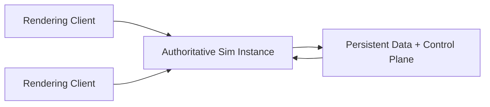

# Persistence and Control Plane Plan

> The next architecture layer after the first authoritative sim split: durable profile data and session orchestration outside disposable run instances.

## Core shape

LBH should move toward three server-side layers plus the client.

That means:
- the client renders locally and sends intent
- the sim instance owns live run truth
- the persistent/control-plane layer owns durable player and session truth

The important rule is simple:

**the sim instance should be disposable**

If a run ends or the process dies, durable player state should still exist outside it.

For the current local/private stage, that also means:

- the control plane may stay up as a lightweight helper
- the sim should not remain alive by default once all human clients leave
- persistent/hosted keep-alive behavior should be explicit, not accidental

## Why this is the right split

The sim instance and the persistent store do different jobs.

The sim instance is good at:
- fixed ticks
- entity updates
- collisions and outcomes
- combat and extraction
- authoritative event ordering

The persistent layer is good at:
- profile storage
- loadout storage
- progression and unlocks
- stored inventory outside a live run
- session registry
- later, hosted run metadata and matchmaking

If those jobs are mixed together, the database becomes part of the simulation loop. That is the wrong shape.

## Server-side layers

### 1. Persistent Data Layer

This is the durable source of player and account truth.

It should own:
- profiles
- account or player identity later if needed
- EM / currency
- unlocked upgrades
- vault or stored inventory outside a run
- saved loadouts
- long-term stats and history if desired
- reconnect/session resume metadata if added later

It should **not** own:
- live entity transforms
- live combat state
- portal state
- well state
- live AI state
- run-tick truth

### 2. Control Plane / Session Service

This is the orchestration layer.

It should own:
- creating a run instance
- assigning players to a run
- tracking which sim instance owns which run
- host assignment and transfer rules
- session profile selection
- run lifecycle state: pending, live, ended, failed
- later, private invites, lobbies, matchmaking, and hosted placement

It should not run the game simulation itself.

### 3. Authoritative Sim Instance

This is one disposable run process.

It should own:
- players in the run
- AI in the run
- all live world entities
- all live combat, extraction, pickups, and death outcomes
- authoritative clocks
- `PlayerBrain` for each joined player
- live run-only inventory mutation
- live event stream and snapshots

When the run ends, it should write back a result package and then be allowed to disappear.

### 4. Client

The client keeps the role it already has:
- render
- input
- HUD
- audio
- interpolation and prediction
- local visual reconstruction

## Data ownership model

### Durable player record

The durable player record should live outside the sim instance.

A likely first durable shape is:
- `profileId`
- `name`
- `currency` / EM
- `upgrades`
- `vaultInventory`
- `savedLoadouts`
- `stats`
- `lastKnownSessionId` if reconnect support exists later

This is the thing the persistent store owns.

### Live player runtime state

When a player joins a run, the control plane or sim instance should hydrate a live runtime object from the durable record.

That live state should include:
- the selected loadout for the run
- live cargo and dropped items
- active effects
- per-run stats and penalties
- resolved `PlayerBrain`
- alive/dead/escaped state

This is owned by the sim instance only.

### Write-back boundaries

The sim should write back to persistence only at defined boundaries.

Safe boundaries are:
- session creation bootstrap
- player join bootstrap
- extraction result
- death result
- disconnect checkpoint if reconnect is supported
- final run teardown

Unsafe boundaries are:
- every tick
- every minor movement update
- every local proximity change
- every transient combat impulse

The database should not be on the hot path for simulation.

## `PlayerBrain` in this model

`PlayerBrain` belongs inside the sim instance.

But it should be hydrated from durable profile data and selected loadout data.

That gives the right split:
- persistence owns long-term player identity and progression
- sim owns the resolved runtime brain for this run

The flow should be:
1. load durable profile
2. choose/load run loadout
3. create live runtime player object
4. build `PlayerBrain`
5. run simulation
6. write back only durable outcomes

## Run lifecycle

A run should move through explicit stages.

### `CREATED`
- control plane creates a run record
- no sim ticks yet or sim is waiting for first host action

### `BOOTING`
- sim instance starts
- map/session profile is loaded
- host/player assignments begin

### `LIVE`
- authoritative tick is running
- snapshots and events are flowing

### `ENDED`
- win/loss/extraction outcomes are finalized
- result package is written back
- run becomes read-only

### `DISPOSED`
- sim instance exits
- control plane keeps only durable result metadata

For current local runs, an empty sim should also be allowed to enter `DISPOSED` after a short idle grace window even if the control plane stays alive.

These stages matter because later hosted LBH will need them even if mini-hosted play feels simple now.

## Result package

The sim should not write back raw internal state. It should write back a result package.

A first shape could include:
- `runId`
- `profileId`
- `outcome` (`escaped`, `consumed`, `disconnect`, `abandoned`)
- `currencyDelta`
- `vaultAdds`
- `vaultRemovals`
- `loadoutChanges`
- `statsDelta`
- `duration`
- `sessionProfile`
- `mapId`
- optional event summary

That keeps the persistence boundary clean.

## Session registry

The control plane should maintain a session registry separate from the sim loop.

A first registry needs to know:
- `sessionId`
- `runId`
- `simInstanceId`
- `hostProfileId`
- `sessionProfile`
- `mapId`
- `status`
- `playerCount`
- `maxPlayers`
- `createdAt`
- `updatedAt`

Later, this same registry can support:
- invite codes
- Tailscale/LAN join routing
- private lobbies
- hosted placement

## First deployment shape

The first honest deployment can still be one machine.

That is fine.

The important thing is to keep the process and contract split even if they run on the same host:
- one persistent/control-plane process
- one or more sim instance processes
- one or more rendering clients

That gives the right architecture without premature ops complexity.

## Storage choices

The storage technology matters less than the contract.

A pragmatic first version could be:
- SQLite for durable profile and session metadata
- JSON payloads for inventory/loadout blobs if that keeps iteration fast
- one control-plane module/process wrapping the DB

Later, if hosted scale matters, the control-plane storage can change without changing sim logic.

The main thing to avoid is wiring gameplay code directly to SQL tables.

## Reconnect policy

This needs a decision before deeper implementation.

There are two reasonable modes.

### Mode A — No reconnect initially
- disconnect means the player is gone
- the run continues without them
- simplest architecture

### Mode B — Short reconnect window
- player state is checkpointed at disconnect
- control plane remembers which run they belong to
- reconnect rehydrates them into the same sim instance

My recommendation is Mode A first, Mode B later.

Do not complicate the first persistence/control-plane pass with reconnect unless you specifically need it now.

## Hosted future

Once this split exists, hosted LBH becomes much clearer.

The hosted system is not one giant persistent server. It is:
- a persistent control plane
- many disposable run instances
- clients routed into the right run

That fits the game better than a monolithic shared world.

## Immediate architecture implications

This design changes how upcoming implementation should be thought about.

### Good next implementations
- define durable profile schema outside the sim instance
- define session registry schema outside the sim instance
- define run result package shape
- make `PlayerBrain` hydrate from durable data instead of ad hoc local state

### Bad next implementations
- make the sim instance directly own long-term profiles
- make inventory persistence part of the tick loop
- let the client become the source of durable loadout truth again
- bury host/session registry logic inside the simulation loop

## Recommended implementation order

### Phase 1 — Durable profile contract
- formalize durable profile schema
- formalize vault/loadout schema
- add a persistence boundary module, even if backed by SQLite locally

### Phase 2 — Session registry contract
- formalize session metadata
- move host/session identity and lifecycle tracking into a control-plane layer

### Phase 3 — Sim bootstrap and result write-back
- make sim instances hydrate player state from the persistence layer
- make them emit result packages on end

### Phase 4 — `PlayerBrain` hydration
- build the runtime brain from durable profile + selected loadout + session profile

### Phase 5 — later hosted readiness
- invites, placement, multi-instance hosting, reconnect windows, and richer lobby behavior

## Working position

LBH should move toward:
- persistent data and control plane outside the sim
- disposable authoritative run instances
- locally rendered connected clients

That is the right shape for:
- private mini-to-MacBook play now
- hosted instanced runs later
- future engine/runtime migration without rewriting the game contract again

That is the cut that will hold.
