# Orrery Prompt: v0.3 Visual Clarity Milestone Review

> E3 creative and technical review for Orrery. Review the current playable
> implementation against Greg's locked fabric concepts and recent visual,
> movement, interaction, and UI corrections. Return one decisive memo; do not
> implement.

## Why This Review Is Worth Opus/Fable Time

This is not a per-commit code review. A large coherent vertical has landed
across LBH's two highest product pillars: **Movement Is the Game** and **Art Is
Product**. The work changes what the fabric looks like, how wells read as
landmarks, how world truth stays aligned while the camera moves, how large and
fast bodies contact pickups/exits/hazards, and whether the surrounding UI
obscures those reads. Greg now wants a high-horsepower art-and-game-design
assessment before another implementation wave.

Escalation level: **E3**. The useful question is no longer whether the code
matches individual fixtures. It is whether the combined result communicates a
coherent game at speed and preserves the strange cosmic texture that made the
v0.2 presentation compelling.

## Exact Target

- Repository: `/private/tmp/lbh-v03-ballpark-integration`
- Branch: `codex/v0.3-ballpark-roadmap`
- Implemented product checkpoint before this packet: `fbfc5c42`
- Spatial ownership contract: `82dce27c`
- Review the commit containing this prompt for the stable evidence bundle.
- This is same-version v0.3 work. Do not compare or merge v0.4 multiplayer.

## Read First

1. `docs/design/PILLARS.md`
2. `docs/design/MOVEMENT.md`
3. `docs/v0.3/OPEN-DECISIONS.md` — Moving Reference Frame through Three-Layer
   Fabric Grammar
4. `docs/v0.3/FABRIC-READABILITY-IMPLEMENTATION-PLAN.md`
5. `docs/v0.3/reviews/2026-08-01-movement-physics-fabric-redesign.md`
6. `docs/v0.3/reviews/2026-08-02-fabric-force-and-world-object-catalog.md`
7. `docs/v0.3/reviews/completions/2026-08-03-rich-current-area1.md`
8. The image gallery below.

## Product Frame

The fantasy remains: **surf across waves of spacetime between massive gravity
disturbances in a dying universe**. The game is top-down and treats forces in
2D even though the rendered ballpark has depth. The useful experiential model
is *Journey*: terrain, trail, speed, and slope relationship should teach the
movement before instrumentation does. *Interstellar* and the recent
*Fantastic Four* are tonal references for wells and cosmic scale, not a demand
for accurate orbital or fluid dynamics.

Greg has explicitly required video-game simplicity over scientific accuracy.
Gameplay-affecting outputs must be large enough to perceive—roughly a double
jump or half-speed scale, not hidden 5% modifiers. No new positional,
coordinate, wrapping, radius, projection, or contact math may be authored in a
one-off call site; shared spatial owners are now a hard project rule.

## Locked Design, Not Open Option Space

- Free flight continuously respects the fabric. There is no binary FREE/SURF
  state, lane lock, alignment gate, or bonus meter.
- Fabric carry begins at a visible `+/-20%` speed band.
- The readable grammar has only three dominant layers: broad local flow,
  persistent well distortion, and a brief source-bound event wave.
- Flow lanes must be navigable areas about 4–5 visible ship widths across, not
  pencil lines or single-character streamlines.
- Wells own localized full gravity and falloff radii; rotational current reaches
  broadly beyond gravity. Growth expands reach before strength.
- Conducted waves are source-bound, telegraphed, staggered, and apply one
  obvious 25%-of-reference-speed impulse. Anonymous periodic rings and all-well
  simultaneous pulses are retired.
- Wells must remain magical, angry, scary landmarks. The title-screen well is
  closer to the emotional target than the earlier tiny in-match treatment.
- The fabric must read as world terrain. It cannot slide with the camera or put
  a convergence center somewhere other than the well that causes it.
- Preserve rich ASCII/cosmic texture, but subordinate microtexture and animation
  to route, source, and danger readability.

## Approved Concept Gallery

These are the locked target grammar, not generic mood art.

### Broad flow lanes

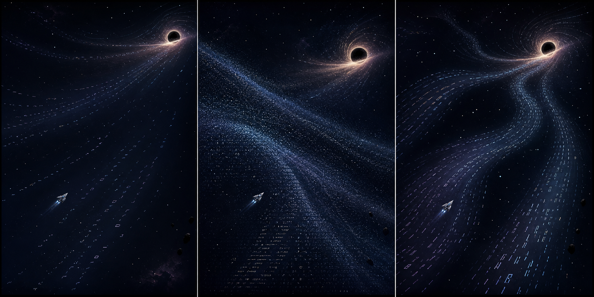

Use Panel A's calm, low-density visual rest plus Panel C's broad
bend/split/rejoin topology. Panel B's tactile grain is allowed only as
restrained texture inside the broad lanes, never as full-field density.

### Well distortion

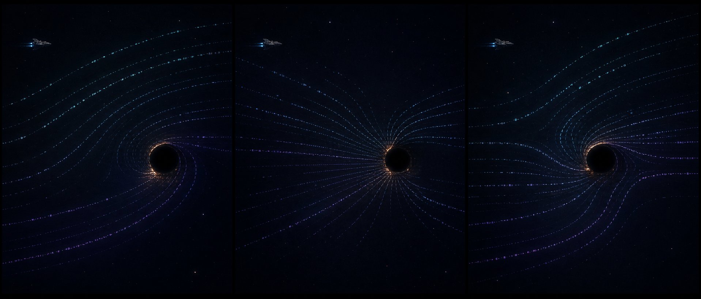

Use Panel A's restrained orbital bend plus Panel C's split/rejoin topology,
with fewer lanes and much less near-core detail. Reject Panel B's scientific
radial field-line diagram. The well body and immediate rim own danger.

### Event wave

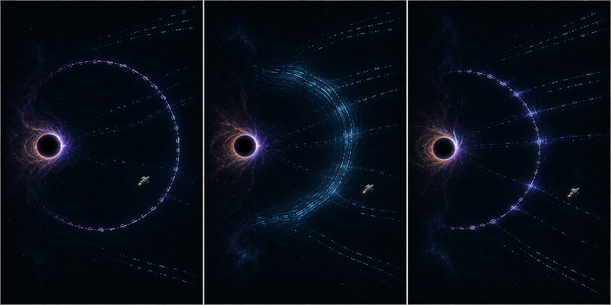

Use Panel B's fabric-native material swell plus a thinner, sparser Panel C
leading crest. Reject Panel A's detached sonar ring and Panel C's bright
intersection nodes.

## Current Evidence Gallery

These images are observations, not claims that the target has been achieved.
The ordinary-play frames predate the final August 4 coordinate/contact patches;
the alignment frame is deliberately diagnostic rather than a beauty shot.

### Ordinary Shallows and well approach

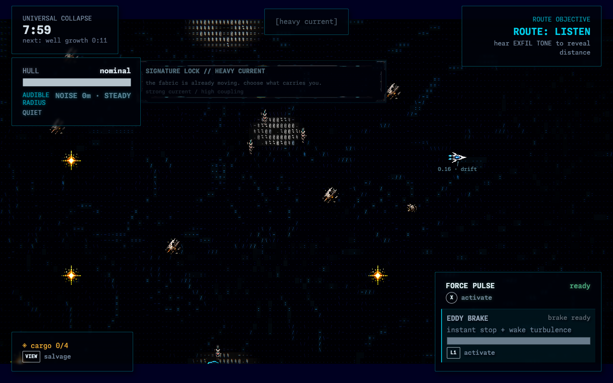

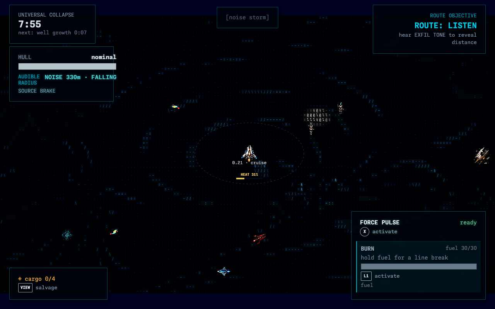

### Greg's observed fabric/well drift before the final alignment patch

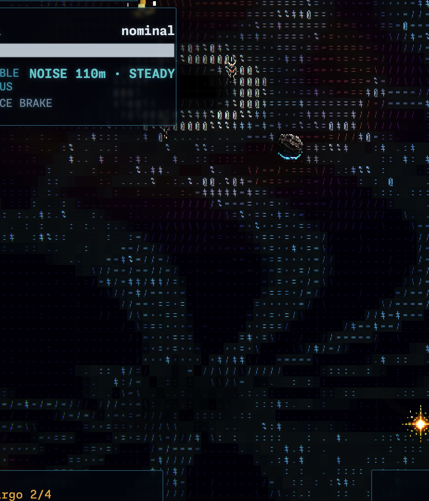

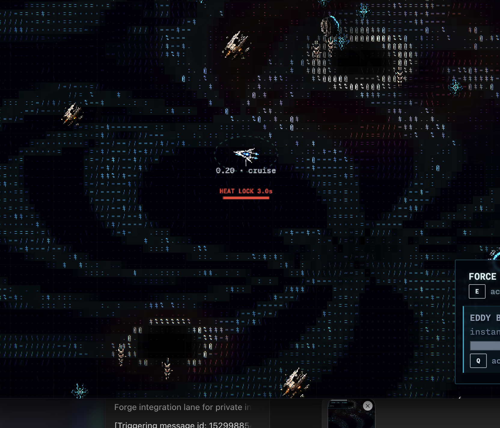

### Post-fix alignment diagnostic

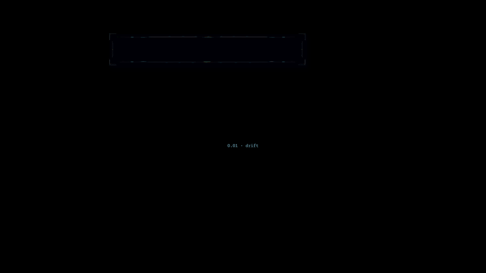

### Current UI containment evidence

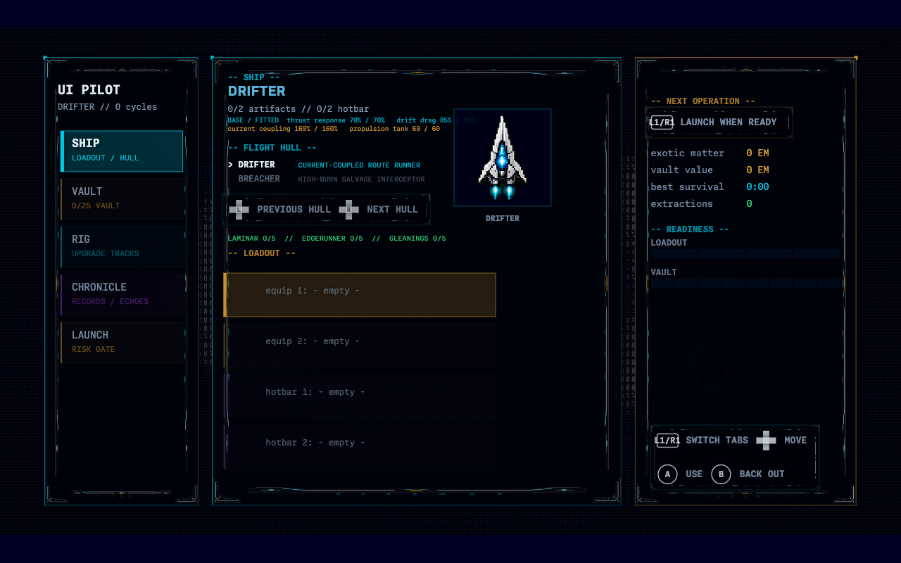

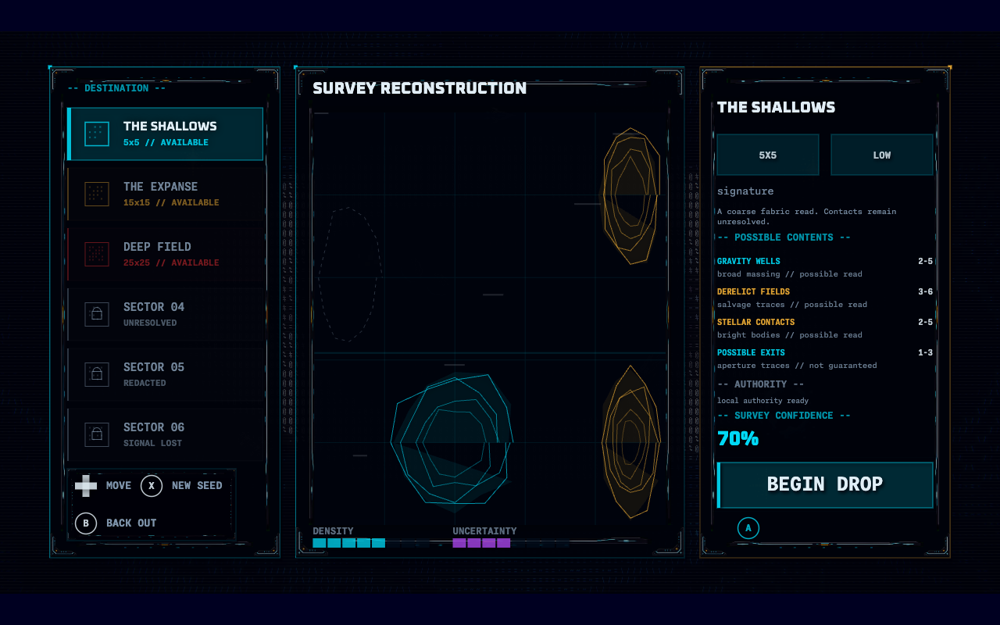

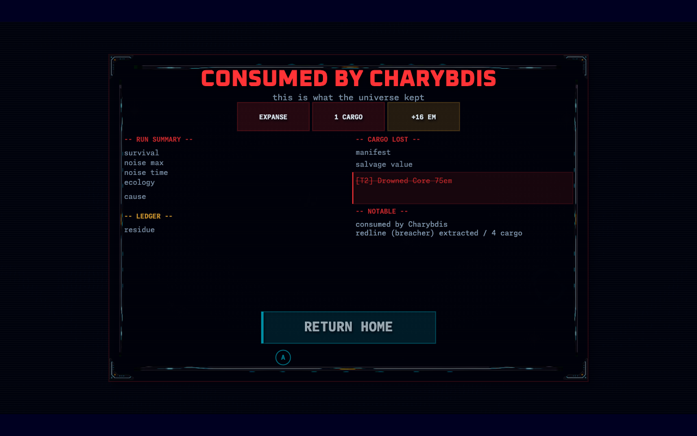

UI is secondary in this review. Judge it where it obstructs the game or breaks
hierarchy; do not turn this packet into a wholesale terminal redesign.

## What Landed Since The Fabric Plan

- `8cae16a3` through `aee7cbd8`: bounded, calmer, wider, navigable,
  world-anchored fabric channels.
- `28010e91` and `143174c2`: restored and enlarged wells as threatening fabric
  landmarks.
- `74ca5657` and `f5ee614d`: raised ordinary current texture and recorded the
  first rich-current comparison.
- `49840ab9`: contained rendered pre-launch, map-select, and result surfaces at
  Deck-oriented sizes.
- `6297c379`, `51b7c6ec`, and `a7c91dd4`: repaired local run lifecycle failures
  that caused restarts, stale sims, or missing telemetry to strand/crash play.
- `d9cffeda` and `1591c5d6`: a restart now preserves the selected map identity
  while creating a fresh authority/seed.
- `5f278119`: aligned camera/world/fluid projection so the fabric and well share
  one world position rather than scrolling or converging at different centers.
- `4f966abe`, `34277bc7`, `ccc9d74e`, and `fbfc5c42`: made pickup/exfil/hazard
  contact body-aware, swept where needed, toroidally consistent, and visually
  aligned at seams. This addresses Greg's repeated “I look close enough but the
  interaction misses” report without making renderer truth authoritative.
- `82dce27c`: made canonical spatial ownership a project-wide hard rule.

Focused machine checks are green for coordinates, fabric display, body-aware
interaction volumes, swept authority contacts, and wrapped presentation seams.
That proves contract alignment, not taste, motion readability, Deck legibility,
or whether the result matches the concepts.

## Questions To Answer

1. **Concept delta:** For each concept sheet, state what the current build has
   achieved, what it has lost, and the one largest visual delta. Distinguish a
   wrong design from an incomplete implementation.
2. **Fabric as terrain:** Does the current fabric read as a stable place a
   player can route through at speed? Diagnose lane width, calm/texture ratio,
   mark motion, world anchoring, contrast, and camera interaction. Recommend
   concrete existing shader/content knobs or narrow source seams—not a new
   renderer or a screenshot-by-screenshot guessing loop.
3. **Wells as landmarks:** Do well scale, dark body, rim/accretion, lane bend,
   compression, and animation create one scary magical cause? What should be
   larger, calmer, brighter, darker, or more source-bound? Compare directly to
   the title-screen emotional target while respecting gameplay radii.
4. **Movement affordance:** Can a player see where fabric will help, hurt, or
   bend them without binary surf states or HUD explanation? Are the 4–5 ship
   width lanes and +/-20% effect likely to read during actual traversal?
5. **Entity hierarchy:** At 1280x800 and in motion, do ships, stars, wreck
   classes, enemies, exits, wells, and inhibitors have sufficient minimum size
   and distinct silhouette? Identify only the highest-value remaining scale or
   category failures.
6. **Truth alignment:** Does the final spatial direction plausibly close the
   well/fabric/contact mismatch, or is any remaining visual layer still using a
   conflicting center, wrap, radius, or coordinate space? Cite exact source if
   you find one; do not invent a new local conversion.
7. **Texture recovery:** Greg believes v0.2 sometimes had much stronger
   thematic texture. Name what should be recovered—density variation, glyph
   character, luminance rhythm, depth, persistence, or motion—and what should
   stay retired because it harmed legibility.
8. **UI obstruction:** Do the repaired loadout, map-select, and results frames
   now preserve basic hierarchy and bounds? List only UI issues that would
   interfere with the next movement/fabric playtest.
9. **Next implementation wave:** Return at most five prioritized findings.
   Label each `blocker`, `fix-forward`, `backlog`, or `Greg decision`; cite the
   exact file/knob/contract; describe the intended visible change; and give one
   human capture or play observation that would decide it.

## Deliverable

Write one memo at:

`docs/project/reviews/2026-08-04-orrery-v03-visual-clarity-milestone-review.md`

Include:

- verdict: `ACCEPT`, `ACCEPT WITH FIX-FORWARD`, or `REWORK`;
- a concise v0.2 -> current -> recommended-next visual delta;
- concept-by-concept assessment;
- maximum five prioritized findings;
- the smallest coherent next implementation wave;
- a short Greg review checklist for motion, Deck-scale readability, well
  threat, fabric terrain, and interaction confidence.

Post one compact receipt in `#last-black-hole` with the memo path, then stop.
Primary Sol must checkpoint Greg before acting on the feedback.

## Guardrails

- Read-only review. Do not edit product source, implement, run broad tests,
  merge, push, deploy, or invoke another agent.
- Do not reopen the locked three-layer grammar, 20% carry baseline, localized
  well profile, 25% wave impulse, staggered wave cadence, or approved concept
  composites unless you identify a direct contradiction that requires Greg.
- Favor game feel, readable affordance, and bold visible output over real-world
  fluid/orbital accuracy.
- Do not propose new binary movement states, a new physics engine, a second
  renderer loop, or generalized production architecture.
- Gameplay truth stays authoritative; presentation communicates it.
- All coordinate, wrapping, projection, radius, and contact math must use or
  extend canonical spatial owners. No one-off positional math.
- Human play owns final feel and art acceptance.
