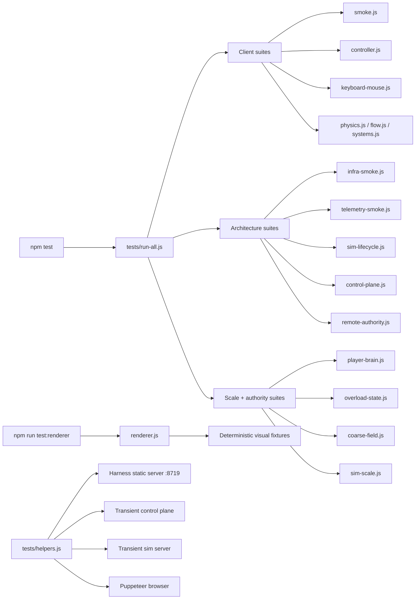

# LBH Test Harness

This is the shareable overview of how LBH test automation works today.

The harness is not one big test. It is a layered system that checks four different things:

- the client can boot and render
- the distributed stack can boot
- the authoritative sim/control-plane path behaves correctly
- the renderer still looks right on deterministic fixtures

The harness now sits beside an explicit runtime-mode model:

- `/Users/theysayheygreg/clawd/projects/last-black-hole/docs/reference/RUNTIME-MODES.md`

That keeps `test-harness` mode separate from the normal human launch paths.

## Simple Graph

## The Layers

### 1. Client canary

These tests answer: can the game page boot and run at all?

- `tests/smoke.js`
- `tests/controller.js`
- `tests/keyboard-mouse.js`
- `tests/physics.js`
- `tests/coordinates.js`
- `tests/flow.js`
- `tests/inventory.js`
- `tests/systems.js`

This layer is good for catching:

- boot failures
- JavaScript errors
- broken input wiring
- obvious gameplay regressions in the local path

This layer is **not** enough to prove the distributed architecture.

### 2. Distributed stack canary

These tests answer: can the real client/control-plane/sim stack start and behave like a stack?

- `tests/infra-smoke.js`
- `tests/telemetry-smoke.js`
- `tests/sim-lifecycle.js`
- `tests/control-plane.js`

This layer is good for catching:

- broken process startup
- bad port/pid behavior
- stale detached server leaks
- control-plane or sim boot regressions
- structured-telemetry regressions in the real stack logs
- lifecycle regressions like empty sims failing to idle or stop

### 3. Authoritative gameplay truth

These tests answer: does the remote-authority version of LBH behave honestly?

- `tests/remote-authority.js`
- `tests/player-brain.js`
- `tests/overload-state.js`
- `tests/coarse-field.js`
- `tests/sim-scale.js`

This layer is good for catching:

- client/server authority drift
- broken profile hydration
- session join/host/leave regressions
- large-map budget regressions
- overload-state and scale-model mistakes

This is the most important layer for architecture work.

### 4. Deterministic renderer harness

This is a separate command:

- `npm run test:renderer`

It runs:

- `tests/renderer.js`

This layer is for visual judgment, not gameplay truth. It captures fixed fixtures over time so renderer work can be compared honestly.

Use it for:

- black-hole readability
- ring/core behavior
- interference between wells
- `5x5` and `10x10` visual scaling

Do not treat normal smoke screenshots as renderer truth.

## Process Model the Harness Assumes

The main runtime ports are:

- dev server: `8080`
- harness static server: `8719`
- control plane: `8791`
- sim server: `8787`

The harness does **not** depend on the human dev server. It spins up its own temporary processes when needed.

The backbone is:

- `tests/helpers.js`

That file is responsible for:

- starting the temporary static server
- starting transient control-plane and sim processes
- launching Puppeteer
- cleaning up detached children
- isolating ports and pid files so test runs do not stomp on each other

## What to Run

For normal verification:

- `npm test`

For targeted runtime-telemetry verification:

- `npm run test:telemetry`

For visual/renderer verification:

- `npm run test:renderer`

For build-health verification:

- `node scripts/build-health.js verify`

That writes the tracked result to:

- `docs/project/BUILD-HEALTH.json`

## What Chrome DevTools MCP Is For

Chrome DevTools MCP is useful, but it does not replace this harness.

Use the split this way:

- Puppeteer harness = deterministic pass/fail truth
- Chrome DevTools MCP = live inspection, console, screenshots, perf traces

That keeps CI and nightly validation honest while still giving agents good browser eyes.

## Practical Rule

Use the right test for the right question.

- “Does the client boot?” → `tests/smoke.js`
- “Does the distributed stack come up?” → `tests/infra-smoke.js`
- “Are runtime telemetry events still emitted the way the operator tooling expects?” → `tests/telemetry-smoke.js`
- “Does remote authority still work?” → `tests/remote-authority.js`
- “Does the renderer still look right?” → `npm run test:renderer`
- “Is this commit actually verified?” → `node scripts/build-health.js status`

That is the current shape of LBH test automation.
