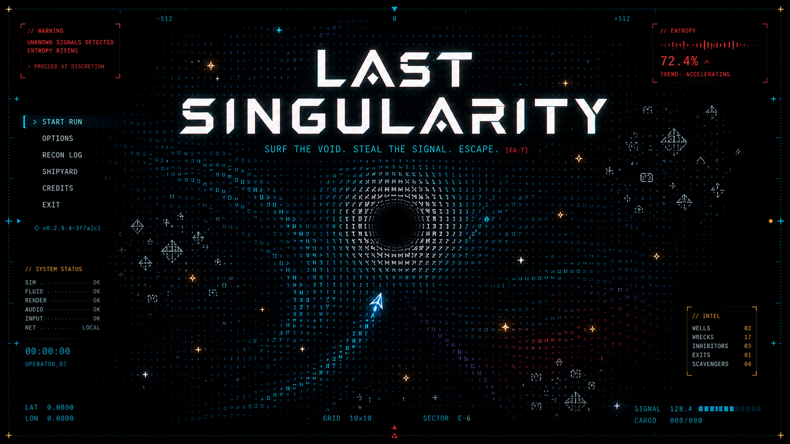
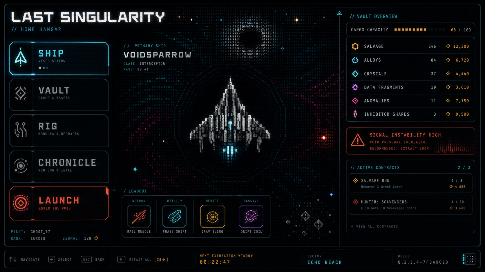
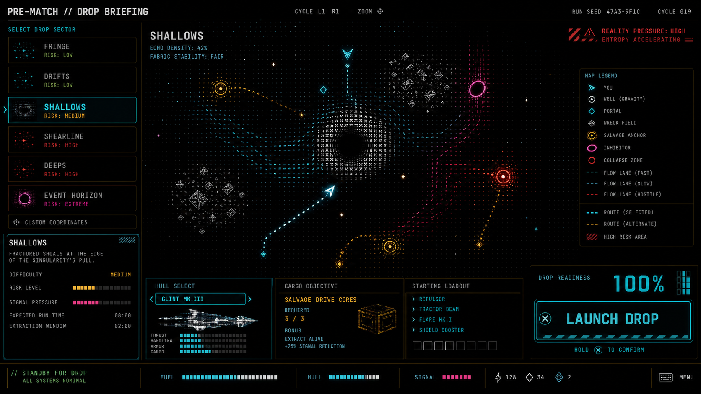
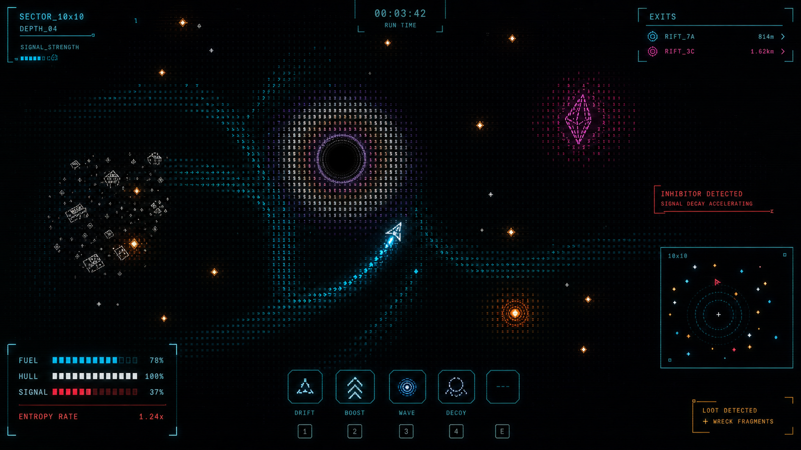
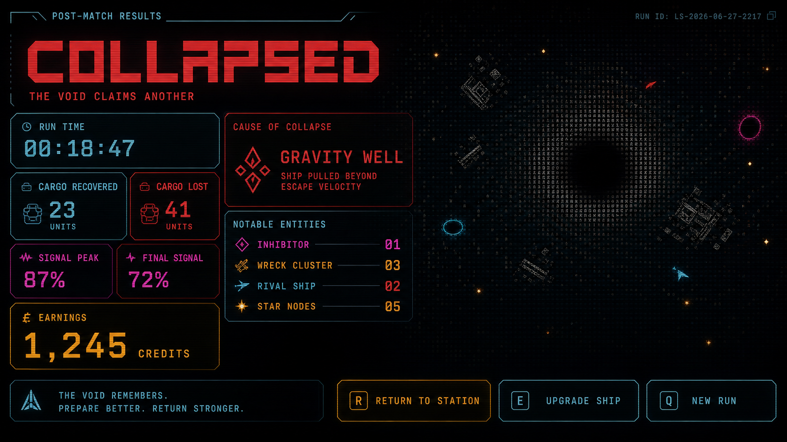

# UI Target Visuals - 2026-06-28

> **v0.2 status:** Generated concept images for the UI visual pass. These are
> mood, composition, contrast, and hierarchy references, not exact UI specs.

## Files

- `title-screen.png` - title screen over a live ASCII/fluid field.
- `main-menu-home.png` - home/main menu with ship, vault, contracts, and launch
  hierarchy.
- `pre-match-drop-briefing.png` - map-select/drop briefing with route preview.
- `in-match-hud.png` - active play HUD with edge instrumentation.
- `post-match-results.png` - run-results/death report hierarchy.

## Preview

## Notes

Generated concept art is allowed to invent non-canon labels. Implementation
should use the real game language from the design docs and code. What matters
here is:

- high contrast over black;
- strong selected-action read;
- role-bound cyan, amber, red, magenta, and bone-white palette;
- translucent instrument panels rather than opaque cards;
- legibility at Steam Deck and couch distance.
