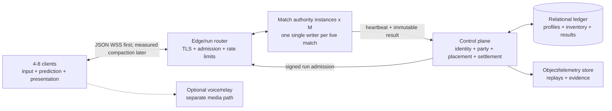

# v0.4 Multiplayer Architecture

> Status: integrated research recommendation for
> `codex/v0.4-multiplayer-architecture`. This is the target design and
> falsification plan, not a claim that public multiplayer is implemented.

## Implementation Checkpoint

Phase 0 trust closure is now partially implemented on this branch. Current
HTTP diagnostics prove 1/4/8 shared-run truth, server-issued membership and
connection epochs, reconnect fencing, owner-private projection, public-only
history, and authenticated idempotent settlement. At eight humans, the latest
local run measured a 42,474-byte public snapshot p95 and 43,761-byte owner
snapshot p95; that full-state shape would still fan out roughly 5.25 MB/s at
15 snapshots/s. This is why Phase 1 keeps JSON for truth but Phase 4 must earn
compact deltas before production. See
[`research/phase0-multiplayer-baseline.md`](research/phase0-multiplayer-baseline.md).

## Decision

Last Singularity v0.4 should use **one logical single-writer authority instance
per live 4–8-player match**.

This is a horizontally multiplied unit, not one global server. If `M` matches
are live, `M` independent match authorities are live. A regional fleet
scheduler packs those authorities onto `H` compute hosts according to measured
run density, where roughly `H = ceil(M / safeAuthoritiesPerHost)` plus warm and
failure headroom. One authority may be an isolated process, worker, actor, or
Durable Object. Many authorities may share a VM/container/node, but no two
authorities may write the same match and no match is split across authorities.

- The control plane authenticates players, proves entitlement, creates party
  and run membership, places the run, and owns durable progression.
- The run authority owns movement, coarse current, Ballpark bodies, contacts,
  loot, signal, abilities, death, extraction, events, and result facts.
- The client samples input, predicts only its own movement, interpolates remote
  bodies, and reconstructs the high-resolution ASCII fluid locally.
- The first multiplayer transport is JSON WebSocket/WSS at the existing map
  clocks. The message model stays transport-neutral. Binary encoding,
  recipient deltas, AOI, prediction, higher clocks, or WebTransport/QUIC must
  each earn adoption through packet/feel evidence.
- Verified/public play uses dedicated authority. Trusted private play may use
  relay-assisted player-hosted authority, but it is explicitly unverified and
  is not called true P2P.
- True no-authority P2P, deterministic lockstep, full-world rollback, and
  per-object distributed authority are rejected for the production path.

This is not an MMO shared world. The EVE-inspired part is the authority and
operations discipline: one run is one coarse causal unit; derived player state
is boxed; events invalidate state; overload is explicit and fair; durable data
is separate from the hot simulation.

## Why This Wins

The current v0.3 architecture already paid for the hard boundary:

- persistent Ballpark ids and lifecycle;
- sim-owned movement, contacts, outcomes, and coarse flow;
- protocol-v2 run/player identity, command credentials, independent command
  and input sequences, event privacy, gap recovery, and snapshot rebase;
- separate control-plane, sim, and presentation processes;
- bounded histories and explicit overload/time scale;
- measured authority tick, snapshot, heap, and Ballpark costs.

Central authority therefore extends current truth. Authority-free P2P would
replace it with cross-target deterministic simulation, all-pairs networking,
membership consensus, adversarial conflict resolution, peer-visible secrets,
and a new durable-settlement trust problem. At four to eight players, the
hosting savings are too small to buy that risk.

## Product Envelope

- Supported human seats: minimum 4, maximum 8 for the v0.4 multiplayer mode.
- One session/party may survive between runs; every reset creates a new
  `run_id` and authority epoch.
- AI may fill empty seats only if the game mode explicitly permits it. AI does
  not change the human seat or identity model.
- First public surface: invite/join-code party sessions, not anonymous global
  matchmaking.
- Local/offline single-player remains functional and keeps a separate local
  progression lineage.
- Public verified progression is Steam-authenticated for MVP.

## Target Topology



The edge/gateway may initially be a module inside each sim worker. Socket reads
enqueue bounded validated intents; only the fixed-step sim mutates gameplay.

## Fleet Scaling And Isolation

The production control plane allocates one `authority_instance_id` and lease
for each `run_id`. A fleet supervisor starts or assigns an isolated match
worker in the chosen region. The routing layer maps every member of that run to
that worker for the run epoch.

```text
concurrent match authorities = live matches
live matches ~= player CCU / average occupied human seats
compute hosts = ceil(live matches / measured safe authorities per host)
               + warm/failure reserve
```

Example: 2,000 concurrent four-to-eight-player groups mean 2,000 logical
authorities. If soak tests prove 40 authorities fit safely on one host, the
steady fleet is about 50 hosts before regional fragmentation and reserve—not
2,000 hosts and not one shared simulation.

Isolation requirements:

- unique run, authority-instance, lease, epoch, inbox, event journal, snapshot
  history, resource budget, and result outbox per match;
- per-match CPU/time/heap/queue ceilings so one hot match cannot starve peers;
- fencing tokens so a restarted or duplicated worker cannot settle the same
  match epoch;
- placement and drain controls that move future matches without sharding a
  live causal chain;
- fleet metrics reported both per match and per physical host.

## Authority And Presentation

### Authority owns

- run/session clock and overload mode;
- public Ballpark body ids, private generation handles, lifecycle, relevance,
  transforms, and contacts;
- player brains, hull/rig/effect coefficients, input acceptance, movement,
  slingshot, and abilities;
- analytic sources and versioned coarse current field;
- stamped wave/disturbance descriptors and gameplay affordance zones;
- loot, inventory, signal, threats, death, portal residence, extraction, and
  result facts;
- global and recipient-private events and snapshot/delta watermarks.

### Client owns

- 60 Hz input sampling and immediate local control presentation;
- local-player movement prediction against the exact authority field revision;
- remote interpolation and bounded short extrapolation;
- high-resolution fluid texture, turbulence, glyphs, shimmer, camera, Three,
  UI, VFX, and audio;
- correction presentation and diagnostics.

The client never predicts an irreversible consequence. Pickup, death,
extraction, portal confirmation, signal thresholds, inventory, and progression
remain authority events.

## Clocks And Network Contract

The first transport slice keeps the current v0.3 map clocks: Shallows 15 Hz,
Expanse 12 Hz, and Deep Field 10 Hz before overload adjustment. Swept contact,
immediate local input presentation, and interpolation get measured first.
Only then does a blind 15/20/30 Hz experiment decide whether one higher shared
movement/contact clock is worth its new multi-rate physics cost. Thirty hertz
is a candidate, not the baseline architecture.

| Contract | Target |
|---|---:|
| input sample | 60 Hz |
| latest input transmit | current authority cadence initially; compare 20/30 Hz later |
| player/contact authority | existing 15/12/10 Hz first; falsify 15/20/30 only after WAN evidence |
| coarse field/waves | 10–15 Hz |
| AI steering | 10 Hz |
| macro AI/spawn/growth | 1–5 Hz |
| recipient state delta | 15 Hz |
| projected full keyframe | about 1 Hz and on recovery |
| remote interpolation | adaptive 80–150 ms |
| extrapolation ceiling | 250 ms, then freeze/fade uncertainty |

### Message classes

1. **Latest intent:** movement, thrust, brake, held slingshot. Newest
   `input_seq` replaces older state.
2. **Reliable action:** slingshot edge, pulse, extract confirm, consume,
   inventory. Idempotent action id and cached original result.
3. **Authoritative state:** projected baseline, dependent deltas, despawns,
   field revision, input/action acknowledgements.
4. **Semantic event:** loot, death, extraction, signal crossing, overload;
   reliable and recipient-filtered.

Never serialize all mutations behind one promise/request tail. Continuous
input, reliable actions, state, and events need independent bounded queues.

### Recipient projection

Owner/public separation is mandatory before untrusted play. The first slice may
send the complete public world to all four/eight clients; spatial AOI is not a
security requirement and adds lifecycle semantics. Every client receives:

- global static manifest/hash and globally observable run facts;
- relevant neighborhood transforms/lifecycles selected through Ballpark;
- exact private state only for its own membership;
- explicitly observable rival state;
- create, leave-interest, re-enter, and true-despawn semantics;
- baseline, event watermark, field revision, overload mode, and acknowledged
  input/action ids.

Other players' exact cargo, loadout, consumables, delta-v, hidden cooldowns,
private signal, and portal confirmation do not enter a shared snapshot.

## Network Budgets

The production target is compact recipient deltas, but the first playable
slice deliberately uses JSON and measures the complete public world. The table
below is a falsification envelope, not an implemented codec claim.

| Direction/class | Expected budget |
|---|---:|
| input on wire | 3.5 KB/s/client |
| state delta | 3 KiB at 15 Hz |
| projected keyframe | 16 KiB at 1 Hz |
| events/control | 2 KB/s/client average |
| total downlink | 64 KiB/s/client average product target |
| eight-client authority egress | about 4.2 Mbit/s payload |
| 45-minute eight-player run | about 1.32 GiB payload |

Prototype gates:

- after compaction, expected delta <=3 KiB p50 and <=6 KiB p95;
- after compaction, projected keyframe <=32 KiB p95;
- gameplay downlink <=64 KiB/s/client average in the hosted spike;
- no owner-private field outside its schema lane;
- no unbounded socket or reliable-event queue.

The accepted per-recipient queue contract is a 512 KiB application cap,
including a 256 KiB reliable-event subset. Transport backpressure uses
256 KiB/64 KiB high/low hysteresis: high-water pauses sends and coalesces
replaceable state until low-water. Rebase remains a separate application
enqueue decision. Two seconds continuously transport-backpressured disconnects
that recipient without delaying the writer or another socket. The general
runtime timer also applies while the bounded application queue remains at its
limit; T2 isolates and proves the transport-high cause specifically.

The canonical product target is 64 KiB/s average/player across deltas,
keyframes, events, and reconnect amortization. The 144 KiB/s representative
row is sensitivity analysis and 288 KiB/s is a heavy rejection envelope;
neither is an achieved codec rate or supported product budget.

The v0.3 107.88 KiB p95 full snapshot remains a recovery/debug baseline. At
nominal Deep Field 6 Hz it is about 0.663 MB/s for one recipient, and at 10 Hz
about 1.105 MB/s. The historical 0.33 MB/s observation ran below nominal
cadence. None may become the public hot-loop protocol.

## Identity And Durable Data

### MVP identity

- Steam ticket proves the platform subject; the backend separately records
  entitlement.
- The backend maps provider identity to an internal `account_id` and issues a
  short access session plus rotating refresh family.
- `profile_id` owns hosted pilot progression.
- `session_id` is the party/lobby container.
- `run_id` is one simulation epoch.
- `membership_id` binds an account/profile to one run seat.
- `player_id` is a random run-scoped public alias.
- `connection_id` rotates per transport connection.
- `authority_epoch` and a short-lived grant rotate on reconnect or lobby-role
  change.
- `incarnation_id` prevents a retired body generation from becoming live
  again through stale traffic.

An id locates a record; it never grants permission. The streaming endpoint
derives membership/player/run from the verified authority grant rather than
trusting body ids.

### Local and cloud lineages

Offline profiles remain fully playable and explicitly `LOCAL`. Linking to
Steam creates/selects a `CLOUD` profile. Name, settings, and accessibility may
copy; currency, vault, upgrades, competitive stats, and settlements do not
silently merge from a client-controlled save.

### Settlement

The sim submits one immutable versioned result authenticated as the authority
assigned to that run. A relational transaction:

1. validates sim lease, run, membership, schema, and result hash;
2. inserts one unique `(run_id, membership_id)` result;
3. creates one settlement;
4. posts ledger and inventory entries referencing that settlement;
5. updates materialized profile state and Chronicle;
6. commits once and returns the existing result on retry.

If storage is unavailable, the result remains pending in a bounded durable
outbox. The client never temporarily mints cloud currency.

## Reconnect, Host Roles, And Failure

- A disconnected body remains sim-owned for a recommended 60–120 seconds.
  Thrust and one-shots release; inertia, current, hazards, and consequences
  continue under a declared rule.
- Reconnect authenticates normally, consumes a single-use resume ticket,
  rotates connection/grant/epoch, and receives a fresh recipient baseline.
- “Host” is renamed conceptually to lobby leader. It can choose lobby/run
  controls, not physics, inventory, or settlement.
- Lobby-leader migration is a versioned membership-role update. Gameplay
  authority does not migrate to a client.
- If the dedicated sim dies in v0.4 MVP, the run fails closed. Already-final
  results settle once; incomplete outcomes are interrupted/void under explicit
  product rules. Live transparent failover waits for signed checkpoints and
  replay evidence.

## Overload Ladder

One run-wide state machine preserves fairness:

1. `NORMAL`
2. `SHED_VISUAL` — coalesce presentation/debug/telemetry
3. `SHED_BACKGROUND` — lower distant AI/spawn/growth/field work
4. `REDUCE_REPLICATION` — 15 to 10 Hz deltas and tighter AOI
5. `DILATED` — reduce one shared `timeScale`
6. `ABORT` — interrupt cleanly instead of corrupting causality

No overload mode changes movement/contact rules asymmetrically by player.

## Vertical Match Scaling: 24, 48, And 96 Clients

The logical authority boundary survives higher participant counts. Its
physical implementation gets heavier:

| Match size | Authority implementation | Mandatory shape |
|---:|---|---|
| 4–8 | one process, one writer thread | owner/public projection and bounded queues |
| 24 | one isolated process, one writer | static manifest, deltas, multirate sim, spatial-query cleanup, AOI-ready lanes |
| 48 | one isolated match service, one writer; optional projection/job workers | AOI, dirty state, replication priorities, explicit CPU quota, overload ladder |
| 96 | one isolated multi-threaded service, one canonical writer plus fixed deterministic workers | AOI/LOD, multi-rate binary replication, worker barriers/fencing, dedicated CPU allocation |

At 96, “multi-threaded” does not mean multiple authorities. The writer alone
orders inputs and commits movement, contacts, loot, death, extraction, events,
and results. Workers consume immutable tick inputs and may return field tiles,
AI sensing, broad-phase candidates, recipient projections, or encoded packets
tagged with tick/revision. Late or wrong-revision results are discarded.

### Measured current baseline

A short current-code Deep Field diagnostic joined 4/8/24/48/96 humans, retained
the three existing AI pilots, sent about 10 Hz HTTP input rounds, and fired one
simultaneous pulse round. It is not a production benchmark, but it anchors the
forecast:

| Humans | Effective tick target | Input-loaded observed | Full snapshot | Process heap sample |
|---:|---:|---:|---:|---:|
| 4 | 8 Hz | 7.97 Hz | 116.80 KiB | 11.64 MiB |
| 8 | 8 Hz | 8.74 Hz | 125.82 KiB | 9.74 MiB |
| 24 | 8 Hz | 8.32 Hz | 158.32 KiB | 11.34 MiB |
| 48 | 8 Hz | 8.09 Hz | 194.23 KiB | 13.16 MiB |
| 96 | 8 Hz | 8.10 Hz | 265.62 KiB | 17.10 MiB |

All cases were `DILATED`. Current overload input counts AI pilots inside alive
players but divides by the human admission cap, so the effective 8 Hz is partly
a pressure-model artifact. The test also kept the same capped world and did
not encode/send distinct recipient payloads, run a long soak, or scale ecology.

### Current full-snapshot fan-out ceiling

If the measured full body were sent uncompressed at six snapshots/second to
every human, fan-out would be:

| Humans | Authority egress | Egress/hour | 45-minute match |
|---:|---:|---:|---:|
| 4 | 2.87 MB/s | 10.33 GB | 7.75 GB |
| 8 | 6.18 MB/s | 22.26 GB | 16.70 GB |
| 24 | 23.35 MB/s | 84.04 GB | 63.03 GB |
| 48 | 57.28 MB/s | 206.21 GB | 154.66 GB |
| 96 | 156.67 MB/s / 1.253 Gbit/s | 564.01 GB | 423.01 GB |

This is a deliberately naïve ceiling. It exposes a player-squared replication
term: the full body grows with players and is then copied to every player.

The compact design target keeps average downlink at 64 KiB/s/client:

| Humans | Compact authority egress | 45-minute match |
|---:|---:|---:|
| 24 | 1.57 MB/s | 3.96 GiB |
| 48 | 3.15 MB/s | 7.91 GiB |
| 96 | 6.29 MB/s | 15.82 GiB |

At 24, deltas and shared public encoding are mandatory. At 48, spatial AOI and
multi-rate far lanes are mandatory. At 96, AOI, dirty-component masks, binary
quantization, priority accumulation, shared encoded public fragments, and
owner-private overlays are mandatory. A full-rate all-player detail lane is
rejected; global facts become low-rate summaries/events.

Normal-mode egress at every population must meet the canonical <=64 KiB/s per
client average target. At 96 this is about 6 MiB/s match average; 8 MB/s
sustained remains a rejection threshold until economics explicitly approve
more. Short-window percentiles are reported separately rather than substituted
for the average product budget.

Heavier simulations need separate delta envelopes rather than pretending
player count alone determines traffic:

| Envelope | Meaning | Per-client | Match payload at 24 / 48 / 96 |
|---|---|---:|---:|
| product average | acceptance target to prove | 64 KiB/s | 12.6 / 25.2 / 50.3 Mbit/s |
| representative sensitivity | planning stress, not achieved | 144 KiB/s | 28.3 / 56.6 / 113.2 Mbit/s |
| heavy rejection | adverse normal-operation failure | 288 KiB/s | 56.6 / 113.2 / 226.5 Mbit/s |

These are application-payload models. TLS/WebSocket/IP framing, ACKs, loss,
retransmission, voice, and reconnect bursts remain separately measured terms.

### Server CPU forecast and writer feasibility

Simulation-size forecasts must expose the work that actually ran instead of
using player count as a proxy:

```text
writer_p95 = base + f(players) + f(bodies_updated) + f(candidates)
             + f(contacts) + f(events) + f(AI_due) + f(field_tiles_due)
             + f(world_jobs_due) + GC_pause_p95

mean_billable_cores = sum(mean_lane_cpu_ms * lane_hz) / 1000
```

Writer p95/p99 is the serial feasibility gate. Mean billable CPU sizes the
reservation, host packing, and invoice. A low mean cannot rescue an over-budget
writer, and p95 wall time must never be divided into host cores. No factorial
fixture has fitted the factorized coefficients, so this architecture assigns
no invented replacement milliseconds.

The legacy player-only sensitivity
`Heavy(P) = 8.0 + 0.350P + 0.0045P^2` ms at 20 Hz yields 83.07 ms at 96. It is
superseded and is retained only as a warning: it is not a measurement or a
current Heavy96 forecast. Heavy 96 cannot be made feasible merely by assigning
8 or 12 vCPU; writer work must fall or pure work must move behind deterministic
barriers while one writer retains commit ownership. The honest seat verdicts
remain 24 plausible, 48 engineered, and 96 R&D.

Projection/packing is also factorized: shared dirty packing, per-recipient
selection/private merge/delta encoding, changed-byte compression, and keyframe
compression are separate CPU and allocation terms. Report mean CPU for billing
and p95/p99 barrier completion for latency.

### Heavier simulation envelopes

Player count and simulation weight are separate axes:

| Envelope | Humans | Dynamic/interactive bodies | Expensive AI | Field |
|---|---:|---:|---:|---|
| `H24` | 24 | 400 | 48 | coarse <=4 Hz |
| `H48` | 48 | 900 | 96 | tiled coarse <=6 Hz |
| `H96` | 96 | 1,800 | 192 | tiled coarse <=6 Hz |
| `X96` | 96 | 3,000 | 384 | disturbance-heavy overload probe |

These are benchmark envelopes, not content promises. Every run reports
inbox, Ballpark/index, movement/flow, broad phase, consequence resolution, AI,
field, projection, encoding, socket queues, GC, tick debt, and total p50/p95/
p99. `H24/H48/H96` must pass normal mode without TiDi. `X96` proves fair,
visible, bounded degradation.

Do not shard a 96-player match across independently writable servers merely to
gain cores. Reopen sharding only if the optimized worker-backed `H96` still
misses, traces show gameplay work is stably spatially partitionable, >=95% of
interactions remain within a region for ten seconds, handoff correctness is
proven, and a prototype beats the single-authority service by at least 2x.

### Safe host starting envelopes

These are capacity-test starting points, not vendor SKU forecasts:

| Humans | Representative start | Heavy start |
|---:|---|---|
| 4 | 1 vCPU / 512 MiB / 100 Mbit/s | 1 vCPU / 1 GiB / 100 Mbit/s |
| 8 | 1 vCPU / 512 MiB / 100 Mbit/s | 2 vCPU / 1 GiB / 250 Mbit/s |
| 24 | 2 vCPU / 1 GiB / 250 Mbit/s | 2 vCPU / 2 GiB / 500 Mbit/s |
| 48 | 2 vCPU / 1 GiB / 500 Mbit/s | 4 vCPU / 2 GiB / 1 Gbit/s |
| 96 | 4 vCPU / 2 GiB / 1 Gbit/s | 8 vCPU / 4 GiB / 2.5 Gbit/s after optimization |

At 48/96, reserve one physical/core-equivalent lane for the writer. Other
cores serve I/O, projection, encoding, field/AI jobs, telemetry, and result
outbox work. Fleet packing uses the measured match profile: a host that safely
packs forty light 4-player authorities may pack only one heavy 96-player
authority.

Memory placement is auditable rather than a per-player guess:

```text
M_match = M_world_runtime + M_shared_canonical_history
        + sum_clients(M_socket + M_baseline + M_private
                    + M_app_queue + M_transport_observed + M_inbound)
```

At 96, the 512 KiB application cap contributes at most 48 MiB; its 256 KiB
reliable subset is included, not additive. Observing every transport at the
256 KiB high-water threshold contributes another 24 MiB, but high-water is not
a hard transport cap. Socket/runtime overhead, baselines, private recovery,
inbound buffers, shared history, peaks above high-water, and GC/RSS margin all
remain measured terms. The prior 192 MiB representative envelope remains a
modeled placement envelope pending measurement.

Host density is the minimum of isolated writer lanes, reserved mean-billable
CPU, RAM, egress, encode throughput, packet rate, process caps, and
failure-domain policy. At 64 KiB/s and an illustrative 1,200-byte payload,
modeled aggregate traffic is roughly 2.5k/5.1k/10.2k PPS at 24/48/96 after
inputs and 25% control/ACK margin. Capture production TLS/gateway traffic
before treating those PPS values or any packing density as achieved.

### High-count hosting cost forecast

At the 64 KiB/s target, state egress alone is 5.66/11.32/22.65 GB per
match-hour for 24/48/96 players. The named-stack S1 forecast below includes
illustrative compute, 30% reserve where modeled, and marginal egress, but not
database/auth/logs/support/voice:

| Vendor scenario | 24 total $/match-h | 48 | 96 | 96 $/player-h |
|---|---:|---:|---:|---:|
| Fly performance fleet, NA/EU, forecast packing | $0.2206 | $0.4412 | $0.8824 | $0.0092 |
| Railway resource-rate forecast | $0.3370 | $0.6691 | $1.3284 | $0.0138 |
| Render listed instances + marginal bandwidth | $0.8836 | $1.8151 | $3.6371 | $0.0379 |

The population-specific measured-shape full-snapshot sensitivity changes the
96-player cost to about $0.1220/player-hour on Fly, $0.2958 on Railway, and
$0.8838 on Render. Its payload alone is modeled at 564.009 GB/match-hour and
1.253 Gbit/s before framing, events, recovery, or retransmission.

Heavier-sim compute before reserve and network:

| Match/tier | Forecast vCPU/GiB | Railway $/match-h | Cloud Run compute $/match-h | CF Container marginal $/match-h |
|---|---:|---:|---:|---:|
| 24 S1 / S2 / S3 | 0.75/1.25; 1.5/2.25; 3/4 | $0.0377 / $0.0719 / $0.1370 | $0.0576 / $0.1134 / $0.2232 | ~$0.0663 / $0.1293 / $0.2530 |
| 48 S1 / S2 / S3 | 1.5/2.25; 3/4; 6/8 | $0.0719 / $0.1370 / $0.2740 | $0.1134 / $0.2232 / $0.4464 | ~$0.1293 / $0.2530 / $0.5050 |
| 96 S1 / S2 / S3 | 3/4; 6/8; 12/16 | $0.1370 / $0.2740 / $0.5479 | $0.2232 / $0.4464 / $0.8928 | ~$0.2530 / $0.5050 / $1.0090 |

These mean-billable compute sensitivities size invoices; they do not pass the
writer p95/p99 gate. In particular, 96 S3/Heavy96 is infeasible until serial
writer work falls or deterministic worker offload lands. Add 1.25–1.67x
capacity factor, regional fragmentation, egress, gateway/DO/Worker charges,
fixed services, and support.

Cloudflare Durable Object billing arithmetic is much lower—about
$0.0155/$0.0252/$0.0446 per active match-hour at 24/48/96 for duration plus
15 Hz input requests after allowances—but runtime fit is entirely unproven.
Durable Objects remain a 4–8-player experiment. A 128 MiB object is a 96-player
non-fit only under the pending 192 MiB representative envelope; the auditable
memory formula has not derived that total.

## Hosting Position

- **First benchmark:** regional Node-compatible container/process host. Pack
  multiple isolated match workers per host and measure safe density. Fly
  Machines is the lead spike because its lifecycle resembles today's runtime
  and NA/EU egress is inexpensive.
- **High-upside experiment:** one Cloudflare Durable Object per run. Its
  single-writer and WebSocket model fits conceptually, but it is a runtime port
  that must prove 15/30 Hz scheduling, CPU, restart, and recovery.
- **Comparisons:** Cloudflare Containers, Railway, Render, Cloud Run, later AWS
  GameLift/fleet hosting.
- **Not recommended for live authority:** Vercel's current official docs
  conflict on WebSocket support. Its newer guidance describes bounded-duration
  pinned WebSockets, while its limits page still says Functions cannot be
  WebSocket servers. Either way, bounded lifetime, non-sticky reconnect, and
  externalized room state are a poor fit pending vendor confirmation and a
  stateful-run proof. Vercel remains usable for web/control surfaces.

The base compact-delta 4–8 experiment target is now $0.0143/player-hour, or about
$0.172 for a 12-hour buyer. That is a variable-service target, not the whole
business and must not be blended with high-count event economics. High-count
costs use their own mode hours, observed occupancy, authority shapes, and
vector packing; the flat modeled S1 $0.0092/player-hour at full 24/48/96
occupancy is an artifact of proportional forecast resources, not a scaling
result. The calendar stack floors are modeled separately at $162/month for
an owner-operated service, $803/month for a recommended production posture,
and $20,300/month for a contracted scale posture. With explicit 3/12/40-hour
cohorts, 12/36/84-month service terms, loaded operations labor, and a 45-day
payout lag, the $4.99 price can fund compact authoritative hosting but does not
automatically fund an indefinite live-service organization. The viable product
needs a deliberately lean support tail, a finite online-service promise,
additional revenue, or an offline/player-hosted continuity plan.

## Private Player-Hosted Fallback

Private fallback keeps one player-hosted authority and uses Steam Datagram
Relay or a transport-equivalent relay to hide addresses and cross NAT. It must
state:

- the host is trusted and has latency advantage;
- host loss may pause/end the run until checkpoint migration is proven;
- progression is local or visibly unverified;
- a host-signed result is not proof that the host was honest;
- browser clients are not preferred authority candidates because background
  lifecycle and suspension are hostile to stable hosting.

This preserves long-tail/private play without weakening verified sessions.

## Research Basis

- [Ballpark multiplayer architecture](research/ballpark-multiplayer-architecture.md)
- [Identity and data model](research/multiplayer-identity-data-model.md)
- [P2P history and network budgets](research/p2p-history-network-budgets.md)
- [Hosted costs and unit economics](research/hosted-costs-unit-economics.md)
- [Hosted cost audit](research/hosted-costs-unit-economics-audit.md)
- [Fixed stack and cohort unit economics](research/fixed-stack-cohort-unit-economics.md)
- [Architecture red team](research/architecture-red-team.md)
- [High-count synthetic baseline](research/2026-07-10-high-player-count-synthetic-baseline.md)
- [High-count performance model](research/high-player-count-performance-model.md)
- [High-count architecture review](research/high-player-count-architecture-review.md)
- [High-count hosting cost model](research/high-player-count-hosting-cost-model.md)
- [Phase 0 multiplayer authority baseline](research/phase0-multiplayer-baseline.md)
- [Phase 1 same-process JSON WSS adapter plan](phase1-json-wss-adapter-plan.md)
- `docs/project/EVE-ARCHITECTURE-RESEARCH.md`
- `docs/project/LOCAL-PROTOCOL.md`
