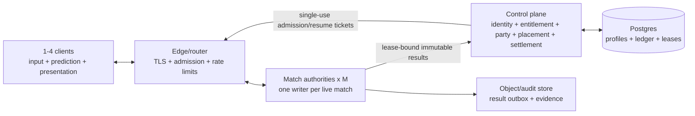

# v0.4 Multiplayer Architecture

> Final architecture recommendation for
> `codex/v0.4-multiplayer-architecture`. This is a target design backed by
> local evidence, not a claim that public hosted multiplayer ships today.

## Decision

Last Singularity v0.4 uses **one dedicated logical single-writer gameplay
authority per live match/group**. Concurrent matches multiply that unit: `M`
live matches mean `M` independently fenced match authorities. Measured
placement may pack several authority instances on one host; this does not mean
one VM per match, and it never means one global authority for the game.

The admitted v0.4 product envelope is one through four humans. Four is the
multiplayer target. Eight is closed after S23, S23P, and the final
split-fragment terminal negative missed their gates. S20 negotiated
Brotli-q1 state-pair compression remains the admitted replication path.

Verified/public play uses hosted dedicated authority. Relay-assisted
player-hosted authority is retained as a trusted private or long-tail fallback
with local/unverified progression. True no-authority public P2P, deterministic
lockstep, full-world rollback mesh, and per-object distributed authority are
rejected for v0.4 production.

## Why This Fits LBH

The v0.3 Ballpark and EVE-inspired split already establishes the important
boundary: the sim owns causal gameplay truth and presentation consumes it.
The match authority owns movement, coarse current, Ballpark lifecycles,
contacts, AI, loot, signal, abilities, death, extraction, events, and result
facts. Clients sample input, predict only local movement, interpolate remote
bodies, and reconstruct high-resolution ASCII fluid and presentation locally.

The EVE inspiration is operational rather than a shared-world promise: one run
is one coarse causal unit, derived player state is boxed, events invalidate
state, overload is explicit and fair, and durable data is outside the hot sim.

Authority-free P2P would replace these assets with cross-target determinism,
all-pairs route quality, peer-visible secrets, partition consensus, adversarial
conflict resolution, and a new settlement trust problem. The detailed historic
comparison is in
[`research/p2p-history-network-budgets.md`](research/p2p-history-network-budgets.md).

## Topology



The first edge/control-plane deployment uses Cloudflare edge services and
Postgres. The first authority benchmark uses a regional Node-compatible Fly
Machine with performance CPU. Hetzner CCX is the operational fallback.
Cloudflare Containers, one Durable Object per match, and an ordinary container
such as DigitalOcean are measured comparator lanes. Vercel remains suitable
for web/control surfaces, not live match truth.

## Fleet Scaling And Isolation

The control plane creates one `authority_instance_id` assignment and one
monotonic writer lease for each `run_id`. Routing sends all members of that run
to the current authority lease.

```text
live authorities = live matches
live matches ~= player CCU / measured average occupied seats
safeAuthoritiesPerHost = floor(measuredAuthoritiesPerHost * safetyFactor)
hosts = ceil(live matches / safeAuthoritiesPerHost) + warm/failure reserve
```

`safeAuthoritiesPerHost` is a Phase 6 measurement, not a rate-card assumption.
Until counterbalanced noisy-neighbor soaks prove packing, cost forecasts take
no density credit.

Every match has a unique run, placement, active lease, epoch, inbox, event
journal, snapshot/ACK history, queue budget, result outbox, and resource
budget. Stale heartbeat, route, ticket, checkpoint, and result work is fenced
by the lease epoch. Drain moves future matches; it does not shard a live run.

## Authority And Presentation

### Authority owns

- run clock, overload mode, and input/action ordering;
- Ballpark ids, generations, lifecycles, transforms, contacts, and relevance;
- player brains, movement, slingshot, abilities, AI, and coarse current;
- loot, inventory-in-run, signal, threats, death, portal residence,
  extraction, events, and immutable result facts;
- recipient-private projection, public projection, baselines, ACK/rebase,
  event watermarks, and retransmit records.

### Client owns

- 60 Hz input sampling and immediate local control presentation;
- local-player prediction against the exact authority field revision;
- remote interpolation and bounded short extrapolation;
- high-resolution fluid texture, turbulence, glyphs, camera, Three, UI, VFX,
  audio, correction presentation, and diagnostics.

The client never finalizes pickup, inventory, signal threshold, death,
extraction, portal confirmation, or durable progression.

## Transport, Clocks, And Budgets

S20 sends JSON state-pair messages with negotiated Brotli quality 1. Sessions
without the capability use the exact uncompressed positional fallback. Binary,
AOI, higher clocks, WebTransport/QUIC, or another representation requires new
packet and feel evidence.

Message classes remain independently bounded:

1. latest intent, where newer movement state supersedes older state;
2. reliable idempotent action and cached original result;
3. authoritative state baseline/delta with ACK/base lineage;
4. reliable, recipient-filtered semantic events.

Start with existing 15/12/10 Hz Shallows/Expanse/Deep Field clocks. Immediate
local input presentation and interpolation protect feel. A blind 15/20/30 Hz
WAN comparison may occur only after the selected hosted path passes its
baseline; 30 Hz is not the architecture default.

### Admitted and target budgets

| Measure | Gate or current evidence |
|---|---:|
| S20 four-player cadence | 9.80–9.85 Hz, `NORMAL` |
| S20 four-player application downlink | 30,203–31,018 B/s/client measured mean; 32,361–32,766 B/s p95 |
| S20 four-player projection p95 | 54.65–55.04 ms in its evidence profile |
| S20 four-player authority CPU | 0.585–0.589 core |
| future compact product average | <=64 KiB/s/client across state, events, and reconnect amortization |
| projected keyframe | <=32 KiB p95 after any future compaction |
| application queue | <=512 KiB/client, including <=256 KiB reliable subset |
| transport pressure | 256 KiB/64 KiB high/low hysteresis |
| persistent high pressure | disconnect affected recipient after 2 s without delaying writer/healthy peers |
| representative writer utilization | p95 <50% and p99 <70% of the selected authority frame budget |

These are application-layer bytes. Hosted evidence must separately report
WebSocket/TLS/IP framing, ACKs, loss/retransmit, reconnect bursts, on-wire PPS,
and regional egress.

## Identity And Durable Data

The complete contract is
[`HOSTED-IDENTITY-PLACEMENT-DECISION.md`](HOSTED-IDENTITY-PLACEMENT-DECISION.md).

- Platform proof authenticates a provider subject; entitlement is separate.
  The backend maps both to internal account and cloud profile ids.
- Local `LOCAL` save lineages and hosted `CLOUD` pilot lineages remain
  economically separate. Safe import copies only name/settings/accessibility
  and safe cosmetics.
- Session membership is the lobby role. Every rematch creates a fresh run,
  immutable run membership, seat, public player alias, placement, lease epoch,
  event lineage, and result scope.
- Process, client incarnation, connection, connection epoch, command grant,
  body incarnation, authority instance, lease, result, and settlement ids are
  distinct fences. An id locates a record; it never authorizes access.
- Admission/resume tickets are opaque, single-use, short-lived, and bound to
  audience, account/profile/session/run membership, public player, seat,
  authority lease, client incarnation, wire capability, and manifest.
- Public state and replay use run-scoped aliases. Provider/account/device/cloud
  profile ids, lease/workload ids, tickets, grants, raw IP, and moderation
  records stay outside the gameplay/public privacy boundary.

### Settlement

The current-lease workload submits one immutable versioned result. One
relational transaction validates the lease and result hash, inserts one unique
run/member result, creates one settlement, posts ledger/inventory provenance,
updates profile/Chronicle, and commits. Identical retries return the existing
settlement. A conflicting hash quarantines. A bounded encrypted authority
outbox retries storage failure; the client never receives speculative cloud
credit.

## Reconnect And Failure

- Reconnect authenticates normally, consumes one resume ticket, rotates
  connection/grant/epoch, fences old control, and sends a fresh recipient
  baseline.
- The recommended disconnected-body policy is 90 seconds: release thrust and
  one-shots; preserve inertia, flow, hazards, and consequences.
- “Host” is lobby leader. Leader changes are session-role CAS operations and
  never move gameplay authority.
- v0.4 dedicated-authority loss fails closed. Already final results settle
  once; incomplete outcomes become interrupted under the chosen product rule.
  Client snapshots are never canonical recovery.
- Transparent restore waits for signed checkpoints, event/input watermarks,
  deterministic replay/parity, a new fenced lease, and route-switch proof.

## Overload Ladder

All players share one fair run state machine:

1. `NORMAL`
2. `SHED_VISUAL`
3. `SHED_BACKGROUND`
4. `REDUCE_REPLICATION`
5. `DILATED`
6. `ABORT`

Normal product admission does not rely on TiDi. No mode changes movement or
contact rules asymmetrically by player.

## Eight-Player Closure

- S20 admits one through four and rejects eight at 5.00/4.90 Hz `DILATED`.
- S23 public body reaches eight at 9.00/9.10 Hz `NORMAL`, but 88.58/88.33 ms
  p95 and 95.05/94.63 ms p99 fail its gates; one-player cost also regresses.
- S23P reaches 9.75/9.70 Hz `NORMAL` and improves median S23 p95 18.1%, but
  71.05/69.76 ms p95 and 75.04/72.69 ms p99 still fail; one and four violate
  the S20 non-regression envelope.
- The final split-fragment screen reaches 9.6667 Hz, 0.510 core, and about
  49.4 KB/s/client, but 55.9045 ms projection/publish p95 crosses the
  pre-screen `>55 ms` abort. Red-team also found unresolved prototype risks in
  retention, mutable buffers, schema/privacy validation, and recovery. The
  implementation was fully reverted.

S23 and S23P remain executable default-off research paths. Split-fragment is
historical only and absent from live source. No further v0.4 eight-player
optimization is selected.

## High-Count Single-Match Architecture

The logical authority boundary does not change at 24/48/96. One canonical
writer alone orders inputs and commits movement, contacts, loot, death,
extraction, events, and results. From 48/96, internal workers may compute pure
AI sensing, field tiles, broad-phase candidates, projections, or encoding from
immutable tick inputs behind deterministic barriers. Late or wrong-revision
results are discarded; workers are not gameplay authorities.

| Vector | Evidence class | writer | B/s/client | match traffic | Status |
|---|---|---:|---:|---:|---|
| H24 representative | measured synthetic | 0.828/1.417 ms p95/p99 | 13,468 | 2.586 Mbit/s | component screen only |
| H24 dense | measured synthetic sensitivity | 3.417/4.333 ms p95/p99 | same schema assumption | same schema assumption | pileup sensitivity |
| H48 base | far extrapolation | 1.207 ms | 26,354 | 10.120 Mbit/s | not capacity |
| H96 base | far extrapolation | 2.646 ms | 50,150 | 38.515 Mbit/s | not capacity |
| X96 base | modeled rejection | 86.769 ms | 118,219 | 90.792 Mbit/s | writer/network fail |

The synthetic S24 fixture uses production Ballpark indexing and Brotli but not
the paced live sim, real sockets, actual CPU scheduling, queues, TLS, or WAN.
The live 24-client cohort never admitted; two guarded eligibility attempts
failed at first-client state-pair admission and the raw command never started.
H48/H96 extend 2.25x/4.5x beyond measured bodies and 2x/4x beyond measured
recipients. They are sensitivity models, not capacity claims.

Do not reopen multi-writer spatial sharding from these results. First prove a
live H24 workload. Only consider sharding after an optimized one-writer H96
fails, traces show stable spatial partitionability, handoff correctness is
proved, and a prototype beats the single-writer design materially.

## Provider Position And Economics

Official-source pricing and runtime constraints are dated 2026-07-14 in
[`research/2026-07-14-hosted-provider-source-ledger.md`](research/2026-07-14-hosted-provider-source-ledger.md).
The primary four-player Fly envelope is $0.0590/$0.0693/$0.0903 per
authority-hour best/base/worst, or $0.014750/$0.017325/$0.022575 per occupied
player-hour. Central cohort break-even is 614/11,598/none. The worst case is
structurally loss-making because $2.816 receipts/copy are below $3.646
variable operations/copy before its 84-month fixed service tail.

See [`MULTIPLAYER-UNIT-ECONOMICS.md`](MULTIPLAYER-UNIT-ECONOMICS.md) for every
1K/10K/100K/1M central/hybrid/local contribution row and assumptions. The
model excludes unmeasured packing and high-count modes.

## Private Player-Hosted Fallback

Private fallback runs one visible player-hosted authority through Steam
Datagram Relay or a transport-equivalent relay. It must disclose host trust and
latency advantage; keep progression local/unverified; hide player addresses;
measure host CPU/uplink/suspend risk; and treat host loss as run-ending until
canonical checkpoint migration is proved. A host-signed result does not prove
an honest host. Browser clients are poor host candidates because lifecycle and
background suspension are hostile to stable authority.

## Research Basis

- [Decision packet](MULTIPLAYER-DECISION-PACKET.md)
- [Identity and placement decision](HOSTED-IDENTITY-PLACEMENT-DECISION.md)
- [P2P history and network budgets](research/p2p-history-network-budgets.md)
- [Identity data model](research/multiplayer-identity-data-model.md)
- [Hosted provider ledger](research/2026-07-14-hosted-provider-source-ledger.md)
- [Hosted authority provider fit](research/hosted-costs-unit-economics.md)
- [Unit economics](MULTIPLAYER-UNIT-ECONOMICS.md)
- [S20 compression](MULTIPLAYER-STATE-PAIR-S20-COMPRESSION.md)
- [S23 public body](MULTIPLAYER-STATE-PAIR-S23-PUBLIC-BODY.md)
- [S23P prepared source](MULTIPLAYER-STATE-PAIR-S23P-PREPARED-PUBLIC-SOURCE.md)
- [Split-fragment terminal negative](MULTIPLAYER-STATE-PAIR-SPLIT-PUBLIC-FRAGMENT.md)
- [S24 synthetic preflight](evidence/s24-factorial-preflight/README.md)
- [S24 live terminal negative](evidence/s24-live-loopback/README.md)
