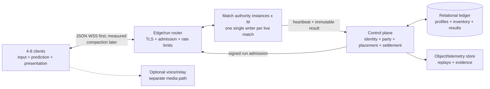

# v0.4 Multiplayer Architecture

> Status: integrated research recommendation for
> `codex/v0.4-multiplayer-architecture`. This is the target design and
> falsification plan, not a claim that public multiplayer is implemented.

## Decision

Last Singularity v0.4 should use **one logical single-writer authority instance
per live 4–8-player match**.

This is a horizontally multiplied unit, not one global server. If `M` matches
are live, `M` independent match authorities are live. A regional fleet
scheduler packs those authorities onto `H` compute hosts according to measured
run density, where roughly `H = ceil(M / safeAuthoritiesPerHost)` plus warm and
failure headroom. One authority may be an isolated process, worker, actor, or
Durable Object. Many authorities may share a VM/container/node, but no two
authorities may write the same match and no match is split across authorities.

- The control plane authenticates players, proves entitlement, creates party
  and run membership, places the run, and owns durable progression.
- The run authority owns movement, coarse current, Ballpark bodies, contacts,
  loot, signal, abilities, death, extraction, events, and result facts.
- The client samples input, predicts only its own movement, interpolates remote
  bodies, and reconstructs the high-resolution ASCII fluid locally.
- The first multiplayer transport is JSON WebSocket/WSS at the existing map
  clocks. The message model stays transport-neutral. Binary encoding,
  recipient deltas, AOI, prediction, higher clocks, or WebTransport/QUIC must
  each earn adoption through packet/feel evidence.
- Verified/public play uses dedicated authority. Trusted private play may use
  relay-assisted player-hosted authority, but it is explicitly unverified and
  is not called true P2P.
- True no-authority P2P, deterministic lockstep, full-world rollback, and
  per-object distributed authority are rejected for the production path.

This is not an MMO shared world. The EVE-inspired part is the authority and
operations discipline: one run is one coarse causal unit; derived player state
is boxed; events invalidate state; overload is explicit and fair; durable data
is separate from the hot simulation.

## Why This Wins

The current v0.3 architecture already paid for the hard boundary:

- persistent Ballpark ids and lifecycle;
- sim-owned movement, contacts, outcomes, and coarse flow;
- protocol-v2 run/player identity, command credentials, independent command
  and input sequences, event privacy, gap recovery, and snapshot rebase;
- separate control-plane, sim, and presentation processes;
- bounded histories and explicit overload/time scale;
- measured authority tick, snapshot, heap, and Ballpark costs.

Central authority therefore extends current truth. Authority-free P2P would
replace it with cross-target deterministic simulation, all-pairs networking,
membership consensus, adversarial conflict resolution, peer-visible secrets,
and a new durable-settlement trust problem. At four to eight players, the
hosting savings are too small to buy that risk.

## Product Envelope

- Supported human seats: minimum 4, maximum 8 for the v0.4 multiplayer mode.
- One session/party may survive between runs; every reset creates a new
  `run_id` and authority epoch.
- AI may fill empty seats only if the game mode explicitly permits it. AI does
  not change the human seat or identity model.
- First public surface: invite/join-code party sessions, not anonymous global
  matchmaking.
- Local/offline single-player remains functional and keeps a separate local
  progression lineage.
- Public verified progression is Steam-authenticated for MVP.

## Target Topology



The edge/gateway may initially be a module inside each sim worker. Socket reads
enqueue bounded validated intents; only the fixed-step sim mutates gameplay.

## Fleet Scaling And Isolation

The production control plane allocates one `authority_instance_id` and lease
for each `run_id`. A fleet supervisor starts or assigns an isolated match
worker in the chosen region. The routing layer maps every member of that run to
that worker for the run epoch.

```text
concurrent match authorities = live matches
live matches ~= player CCU / average occupied human seats
compute hosts = ceil(live matches / measured safe authorities per host)
               + warm/failure reserve
```

Example: 2,000 concurrent four-to-eight-player groups mean 2,000 logical
authorities. If soak tests prove 40 authorities fit safely on one host, the
steady fleet is about 50 hosts before regional fragmentation and reserve—not
2,000 hosts and not one shared simulation.

Isolation requirements:

- unique run, authority-instance, lease, epoch, inbox, event journal, snapshot
  history, resource budget, and result outbox per match;
- per-match CPU/time/heap/queue ceilings so one hot match cannot starve peers;
- fencing tokens so a restarted or duplicated worker cannot settle the same
  match epoch;
- placement and drain controls that move future matches without sharding a
  live causal chain;
- fleet metrics reported both per match and per physical host.

## Authority And Presentation

### Authority owns

- run/session clock and overload mode;
- public Ballpark body ids, private generation handles, lifecycle, relevance,
  transforms, and contacts;
- player brains, hull/rig/effect coefficients, input acceptance, movement,
  slingshot, and abilities;
- analytic sources and versioned coarse current field;
- stamped wave/disturbance descriptors and gameplay affordance zones;
- loot, inventory, signal, threats, death, portal residence, extraction, and
  result facts;
- global and recipient-private events and snapshot/delta watermarks.

### Client owns

- 60 Hz input sampling and immediate local control presentation;
- local-player movement prediction against the exact authority field revision;
- remote interpolation and bounded short extrapolation;
- high-resolution fluid texture, turbulence, glyphs, shimmer, camera, Three,
  UI, VFX, and audio;
- correction presentation and diagnostics.

The client never predicts an irreversible consequence. Pickup, death,
extraction, portal confirmation, signal thresholds, inventory, and progression
remain authority events.

## Clocks And Network Contract

The first transport slice keeps the current v0.3 map clocks: Shallows 15 Hz,
Expanse 12 Hz, and Deep Field 10 Hz before overload adjustment. Swept contact,
immediate local input presentation, and interpolation get measured first.
Only then does a blind 15/20/30 Hz experiment decide whether one higher shared
movement/contact clock is worth its new multi-rate physics cost. Thirty hertz
is a candidate, not the baseline architecture.

| Contract | Target |
|---|---:|
| input sample | 60 Hz |
| latest input transmit | current authority cadence initially; compare 20/30 Hz later |
| player/contact authority | existing 15/12/10 Hz first; falsify 15/20/30 only after WAN evidence |
| coarse field/waves | 10–15 Hz |
| AI steering | 10 Hz |
| macro AI/spawn/growth | 1–5 Hz |
| recipient state delta | 15 Hz |
| projected full keyframe | about 1 Hz and on recovery |
| remote interpolation | adaptive 80–150 ms |
| extrapolation ceiling | 250 ms, then freeze/fade uncertainty |

### Message classes

1. **Latest intent:** movement, thrust, brake, held slingshot. Newest
   `input_seq` replaces older state.
2. **Reliable action:** slingshot edge, pulse, extract confirm, consume,
   inventory. Idempotent action id and cached original result.
3. **Authoritative state:** projected baseline, dependent deltas, despawns,
   field revision, input/action acknowledgements.
4. **Semantic event:** loot, death, extraction, signal crossing, overload;
   reliable and recipient-filtered.

Never serialize all mutations behind one promise/request tail. Continuous
input, reliable actions, state, and events need independent bounded queues.

### Recipient projection

Owner/public separation is mandatory before untrusted play. The first slice may
send the complete public world to all four/eight clients; spatial AOI is not a
security requirement and adds lifecycle semantics. Every client receives:

- global static manifest/hash and globally observable run facts;
- relevant neighborhood transforms/lifecycles selected through Ballpark;
- exact private state only for its own membership;
- explicitly observable rival state;
- create, leave-interest, re-enter, and true-despawn semantics;
- baseline, event watermark, field revision, overload mode, and acknowledged
  input/action ids.

Other players' exact cargo, loadout, consumables, delta-v, hidden cooldowns,
private signal, and portal confirmation do not enter a shared snapshot.

## Network Budgets

The production target is compact recipient deltas, but the first playable
slice deliberately uses JSON and measures the complete public world. The table
below is a falsification envelope, not an implemented codec claim.

| Direction/class | Expected budget |
|---|---:|
| input on wire | 3.5 KB/s/client |
| state delta | 3 KiB at 15 Hz |
| projected keyframe | 16 KiB at 1 Hz |
| events/control | 2 KB/s/client average |
| total downlink | about 65 KB/s/client |
| eight-client authority egress | about 520 KB/s |
| 45-minute eight-player run | about 1.40 GB egress |

Prototype gates:

- after compaction, expected delta <=3 KiB p50 and <=6 KiB p95;
- after compaction, projected keyframe <=32 KiB p95;
- expected gameplay downlink <=80 KB/s/client in the hosted spike;
- no owner-private field outside its schema lane;
- no unbounded socket or reliable-event queue.

The current 107.88 KiB p95 full snapshot remains a recovery/debug baseline. At
Deep Field cadence it is about 0.33 MB/s for one recipient; at 10 Hz it is
about 1.08 MB/s. It must not become the public hot-loop protocol.

## Identity And Durable Data

### MVP identity

- Steam ticket proves the platform subject; the backend separately records
  entitlement.
- The backend maps provider identity to an internal `account_id` and issues a
  short access session plus rotating refresh family.
- `profile_id` owns hosted pilot progression.
- `session_id` is the party/lobby container.
- `run_id` is one simulation epoch.
- `membership_id` binds an account/profile to one run seat.
- `player_id` is a random run-scoped public alias.
- `connection_id` rotates per transport connection.
- `authority_epoch` and a short-lived grant rotate on reconnect or lobby-role
  change.
- `incarnation_id` prevents a retired body generation from becoming live
  again through stale traffic.

An id locates a record; it never grants permission. The streaming endpoint
derives membership/player/run from the verified authority grant rather than
trusting body ids.

### Local and cloud lineages

Offline profiles remain fully playable and explicitly `LOCAL`. Linking to
Steam creates/selects a `CLOUD` profile. Name, settings, and accessibility may
copy; currency, vault, upgrades, competitive stats, and settlements do not
silently merge from a client-controlled save.

### Settlement

The sim submits one immutable versioned result authenticated as the authority
assigned to that run. A relational transaction:

1. validates sim lease, run, membership, schema, and result hash;
2. inserts one unique `(run_id, membership_id)` result;
3. creates one settlement;
4. posts ledger and inventory entries referencing that settlement;
5. updates materialized profile state and Chronicle;
6. commits once and returns the existing result on retry.

If storage is unavailable, the result remains pending in a bounded durable
outbox. The client never temporarily mints cloud currency.

## Reconnect, Host Roles, And Failure

- A disconnected body remains sim-owned for a recommended 60–120 seconds.
  Thrust and one-shots release; inertia, current, hazards, and consequences
  continue under a declared rule.
- Reconnect authenticates normally, consumes a single-use resume ticket,
  rotates connection/grant/epoch, and receives a fresh recipient baseline.
- “Host” is renamed conceptually to lobby leader. It can choose lobby/run
  controls, not physics, inventory, or settlement.
- Lobby-leader migration is a versioned membership-role update. Gameplay
  authority does not migrate to a client.
- If the dedicated sim dies in v0.4 MVP, the run fails closed. Already-final
  results settle once; incomplete outcomes are interrupted/void under explicit
  product rules. Live transparent failover waits for signed checkpoints and
  replay evidence.

## Overload Ladder

One run-wide state machine preserves fairness:

1. `NORMAL`
2. `SHED_VISUAL` — coalesce presentation/debug/telemetry
3. `SHED_BACKGROUND` — lower distant AI/spawn/growth/field work
4. `REDUCE_REPLICATION` — 15 to 10 Hz deltas and tighter AOI
5. `DILATED` — reduce one shared `timeScale`
6. `ABORT` — interrupt cleanly instead of corrupting causality

No overload mode changes movement/contact rules asymmetrically by player.

## Vertical Match Scaling: 24, 48, And 96 Clients

The logical authority boundary survives higher participant counts. Its
physical implementation gets heavier:

| Match size | Authority implementation | Mandatory shape |
|---:|---|---|
| 4–8 | one process, one writer thread | owner/public projection and bounded queues |
| 24 | one isolated process, one writer | static manifest, deltas, multirate sim, spatial-query cleanup, AOI-ready lanes |
| 48 | one isolated match service, one writer; optional projection/job workers | AOI, dirty state, replication priorities, explicit CPU quota, overload ladder |
| 96 | one isolated multi-threaded service, one canonical writer plus fixed deterministic workers | AOI/LOD, multi-rate binary replication, worker barriers/fencing, dedicated CPU allocation |

At 96, “multi-threaded” does not mean multiple authorities. The writer alone
orders inputs and commits movement, contacts, loot, death, extraction, events,
and results. Workers consume immutable tick inputs and may return field tiles,
AI sensing, broad-phase candidates, recipient projections, or encoded packets
tagged with tick/revision. Late or wrong-revision results are discarded.

### Measured current baseline

A short current-code Deep Field diagnostic joined 4/8/24/48/96 humans, retained
the three existing AI pilots, sent about 10 Hz HTTP input rounds, and fired one
simultaneous pulse round. It is not a production benchmark, but it anchors the
forecast:

| Humans | Effective tick target | Input-loaded observed | Full snapshot | Process heap sample |
|---:|---:|---:|---:|---:|
| 4 | 8 Hz | 8.14 Hz | 112.53 KiB | 10.05 MiB |
| 8 | 8 Hz | 7.99 Hz | 122.92 KiB | 14.61 MiB |
| 24 | 8 Hz | 7.72 Hz | 152.18 KiB | 10.89 MiB |
| 48 | 8 Hz | 7.95 Hz | 188.11 KiB | 12.41 MiB |
| 96 | 8 Hz | 7.83 Hz | 261.25 KiB | 23.49 MiB |

All cases were `DILATED`. Current overload input counts AI pilots inside alive
players but divides by the human admission cap, so the effective 8 Hz is partly
a pressure-model artifact. The test also kept the same capped world and did
not encode/send distinct recipient payloads, run a long soak, or scale ecology.

### Current full-snapshot fan-out ceiling

If the measured full body were sent uncompressed at six snapshots/second to
every human, fan-out would be:

| Humans | Authority egress | Egress/hour | 45-minute match |
|---:|---:|---:|---:|
| 4 | 2.77 MB/s | 10.0 GB | 7.5 GB |
| 8 | 6.04 MB/s | 21.8 GB | 16.3 GB |
| 24 | 22.44 MB/s | 80.8 GB | 60.6 GB |
| 48 | 55.48 MB/s | 199.7 GB | 149.8 GB |
| 96 | 154.09 MB/s | 554.7 GB | 416.0 GB |

This is a deliberately naïve ceiling. It exposes a player-squared replication
term: the full body grows with players and is then copied to every player.

The compact design target keeps average downlink near 65 KB/s/client:

| Humans | Compact authority egress | 45-minute match |
|---:|---:|---:|
| 24 | 1.56 MB/s | 4.21 GB |
| 48 | 3.12 MB/s | 8.42 GB |
| 96 | 6.24 MB/s | 16.85 GB |

At 24, deltas and shared public encoding are mandatory. At 48, spatial AOI and
multi-rate far lanes are mandatory. At 96, AOI, dirty-component masks, binary
quantization, priority accumulation, shared encoded public fragments, and
owner-private overlays are mandatory. A full-rate all-player detail lane is
rejected; global facts become low-rate summaries/events.

Normal-mode egress gates:

- 24: <=80 KB/s/client p95 and <=2 MB/s/match p95;
- 48: <=80 KB/s/client p95 and <=4 MB/s/match p95;
- 96: <=64 KB/s/client p95 and <=6.5 MB/s/match p95, with 8 MB/s sustained a
rejection threshold until economics explicitly approve more.

Heavier simulations need separate delta envelopes rather than pretending
player count alone determines traffic:

| Sim weight | Average delta assumption | Per-client downlink | Match egress at 24 / 48 / 96 |
|---|---:|---:|---:|
| light/current-shaped | 4 KiB at 10 Hz | 0.393 Mbit/s | 9.4 / 18.9 / 37.7 Mbit/s |
| representative multiplayer | 8 KiB at 15 Hz | 1.180 Mbit/s | 28.3 / 56.6 / 113.2 Mbit/s |
| heavy/high-activity | 16 KiB at 15 Hz | 2.359 Mbit/s | 56.6 / 113.2 / 226.5 Mbit/s |

Those numbers include a 20% ordinary framing allowance but exclude voice,
pathological loss, and reconnect storms. A representative 8 KiB frame assumes
roughly twelve nearby players, 48–80 relevant world bodies, owner-private
state, a field revision, and a small event batch. Heavy assumes denser nearby
players/bodies and synchronized consequence bursts.

### Server CPU forecast at a candidate 30 Hz clock

These planning functions expose linear and quadratic risk; their coefficients
are assumptions to replace with per-system traces:

```text
lean tick ms  = 3 + 0.08P + 0.002 * P(P-1)/2
heavy tick ms = 8 + 0.20P + 0.006 * P(P-1)/2
reserved vCPU = tick ms * 30 / 1000 / 0.60
```

| Humans | Lean ms/tick | Lean reserved vCPU | Heavy ms/tick | Heavy reserved vCPU | 30 Hz verdict |
|---:|---:|---:|---:|---:|---|
| 24 | 5.5 | 0.27 | 14.5 | 0.72 | plausible in one process |
| 48 | 9.1 | 0.45 | 24.4 | 1.22 | heavy misses 20 ms p95 target |
| 96 | 19.8 | 0.99 | 54.6 | 2.73 | heavy cannot meet 30 Hz on one JS writer |

Total vCPU is not critical-path latency. A 54.6 ms writer tick still misses a
33.3 ms frame on an eight-core machine. The 96-player target is therefore
serial writer <=8 ms p95 and total CPU <=40 ms/tick p95, with deterministic
parallel jobs bringing the critical path under 20 ms p95/28 ms p99. First
benchmark allocation: dedicated 4 vCPU, then 6/8 vCPU.

A second workload model keeps each tier at its proposed starting clock and
adds explicit world/activity weight:

```text
light at 15 Hz:          2.0 + 0.060P + 0.0006P^2
representative at 20 Hz: 3.5 + 0.160P + 0.0015P^2
heavy at 20 Hz:          8.0 + 0.350P + 0.0045P^2
```

| Humans | Light p95 | Representative p95 | Heavy p95 | Interpretation |
|---:|---:|---:|---:|---|
| 24 | 3.79 ms | 8.20 ms | 18.99 ms | comfortable modeled headroom |
| 48 | 6.26 ms | 14.64 ms | 35.17 ms | heavy fits 20 Hz but leaves weak p99 margin |
| 96 | 13.29 ms | 32.68 ms | 83.07 ms | representative plausible at 20 Hz; heavy fails 50 ms budget |

At 30 Hz, representative 96 consumes a modeled 98% of one writer core and
heavy 48 exceeds one writer core. Therefore high population does not inherit a
30 Hz promise from 4–8; count, content weight, and feel are a profile choice.

### Heavier simulation envelopes

Player count and simulation weight are separate axes:

| Envelope | Humans | Dynamic/interactive bodies | Expensive AI | Field |
|---|---:|---:|---:|---|
| `H24` | 24 | 400 | 48 | coarse <=4 Hz |
| `H48` | 48 | 900 | 96 | tiled coarse <=6 Hz |
| `H96` | 96 | 1,800 | 192 | tiled coarse <=6 Hz |
| `X96` | 96 | 3,000 | 384 | disturbance-heavy overload probe |

These are benchmark envelopes, not content promises. Every run reports
inbox, Ballpark/index, movement/flow, broad phase, consequence resolution, AI,
field, projection, encoding, socket queues, GC, tick debt, and total p50/p95/
p99. `H24/H48/H96` must pass normal mode without TiDi. `X96` proves fair,
visible, bounded degradation.

Do not shard a 96-player match across independently writable servers merely to
gain cores. Reopen sharding only if the optimized worker-backed `H96` still
misses, traces show gameplay work is stably spatially partitionable, >=95% of
interactions remain within a region for ten seconds, handoff correctness is
proven, and a prototype beats the single-authority service by at least 2x.

### Safe host starting envelopes

These are capacity-test starting points, not vendor SKU forecasts:

| Humans | Representative start | Heavy start |
|---:|---|---|
| 4 | 1 vCPU / 512 MiB / 100 Mbit/s | 1 vCPU / 1 GiB / 100 Mbit/s |
| 8 | 1 vCPU / 512 MiB / 100 Mbit/s | 2 vCPU / 1 GiB / 250 Mbit/s |
| 24 | 2 vCPU / 1 GiB / 250 Mbit/s | 2 vCPU / 2 GiB / 500 Mbit/s |
| 48 | 2 vCPU / 1 GiB / 500 Mbit/s | 4 vCPU / 2 GiB / 1 Gbit/s |
| 96 | 4 vCPU / 2 GiB / 1 Gbit/s | 8 vCPU / 4 GiB / 2.5 Gbit/s after optimization |

At 48/96, reserve one physical/core-equivalent lane for the writer. Other
cores serve I/O, projection, encoding, field/AI jobs, telemetry, and result
outbox work. Fleet packing uses the measured match profile: a host that safely
packs forty light 4-player authorities may pack only one heavy 96-player
authority.

### High-count hosting cost forecast

At the 64 KiB/s target, state egress alone is 5.66/11.32/22.65 GB per
match-hour for 24/48/96 players. The named-stack S1 forecast below includes
illustrative compute, 30% reserve where modeled, and marginal egress, but not
database/auth/logs/support/voice:

| Vendor scenario | 24 total $/match-h | 48 | 96 | 96 $/player-h |
|---|---:|---:|---:|---:|
| Fly performance fleet, NA/EU, forecast packing | $0.2206 | $0.4412 | $0.8824 | $0.0092 |
| Railway resource-rate forecast | $0.3370 | $0.6691 | $1.3284 | $0.0138 |
| Render listed instances + marginal bandwidth | $0.8836 | $1.8151 | $3.6371 | $0.0379 |

The current 1.08 MB/s full-JSON ceiling changes the 96-player cost to about
$0.0822/player-hour on the Fly scenario, $0.1964 on Railway, and $0.5857 on
Render—before the CPU/GC/NIC risk of 829 Mbit/s payload fan-out.

Heavier-sim compute before reserve and network:

| Match/tier | Forecast vCPU/GiB | Railway $/match-h | Cloud Run compute $/match-h | CF Container marginal $/match-h |
|---|---:|---:|---:|---:|
| 24 S1 / S2 / S3 | 0.75/1.25; 1.5/2.25; 3/4 | $0.0377 / $0.0719 / $0.1370 | $0.0576 / $0.1134 / $0.2232 | ~$0.0663 / $0.1293 / $0.2530 |
| 48 S1 / S2 / S3 | 1.5/2.25; 3/4; 6/8 | $0.0719 / $0.1370 / $0.2740 | $0.1134 / $0.2232 / $0.4464 | ~$0.1293 / $0.2530 / $0.5050 |
| 96 S1 / S2 / S3 | 3/4; 6/8; 12/16 | $0.1370 / $0.2740 / $0.5479 | $0.2232 / $0.4464 / $0.8928 | ~$0.2530 / $0.5050 / $1.0090 |

These metered formulas do not prove dedicated CPU behavior or that one JS
writer can consume multiple vCPUs. S2/S3 depend on deterministic worker
offload. Add 1.25–1.67x capacity factor, regional fragmentation, egress,
gateway/DO/Worker charges, fixed services, and support.

Cloudflare Durable Object billing arithmetic is much lower—about
$0.0155/$0.0252/$0.0446 per active match-hour at 24/48/96 for duration plus
15 Hz input requests after allowances—but runtime fit is entirely unproven.
A single-threaded 128 MB billed object cannot be treated as a 96-player heavy
authority because the price formula looks attractive.

## Hosting Position

- **First benchmark:** regional Node-compatible container/process host. Pack
  multiple isolated match workers per host and measure safe density. Fly
  Machines is the lead spike because its lifecycle resembles today's runtime
  and NA/EU egress is inexpensive.
- **High-upside experiment:** one Cloudflare Durable Object per run. Its
  single-writer and WebSocket model fits conceptually, but it is a runtime port
  that must prove 15/30 Hz scheduling, CPU, restart, and recovery.
- **Comparisons:** Cloudflare Containers, Railway, Render, Cloud Run, later AWS
  GameLift/fleet hosting.
- **Not recommended for live authority:** Vercel's current official docs
  conflict on WebSocket support. Its newer guidance describes bounded-duration
  pinned WebSockets, while its limits page still says Functions cannot be
  WebSocket servers. Either way, bounded lifetime, non-sticky reconnect, and
  externalized room state are a poor fit pending vendor confirmation and a
  stateful-run proof. Vercel remains usable for web/control surfaces.

The economic design target is $0.015/player-hour after delta optimization, or
about $0.18/copy at 12 lifetime hosted hours. It is not a forecast: run density,
fixed services, regional mix, operations, support, and actual wire bytes remain
unmeasured.

## Private Player-Hosted Fallback

Private fallback keeps one player-hosted authority and uses Steam Datagram
Relay or a transport-equivalent relay to hide addresses and cross NAT. It must
state:

- the host is trusted and has latency advantage;
- host loss may pause/end the run until checkpoint migration is proven;
- progression is local or visibly unverified;
- a host-signed result is not proof that the host was honest;
- browser clients are not preferred authority candidates because background
  lifecycle and suspension are hostile to stable hosting.

This preserves long-tail/private play without weakening verified sessions.

## Research Basis

- [Ballpark multiplayer architecture](research/ballpark-multiplayer-architecture.md)
- [Identity and data model](research/multiplayer-identity-data-model.md)
- [P2P history and network budgets](research/p2p-history-network-budgets.md)
- [Hosted costs and unit economics](research/hosted-costs-unit-economics.md)
- [Hosted cost audit](research/hosted-costs-unit-economics-audit.md)
- [Architecture red team](research/architecture-red-team.md)
- [High-count synthetic baseline](research/2026-07-10-high-player-count-synthetic-baseline.md)
- [High-count performance model](research/high-player-count-performance-model.md)
- [High-count architecture review](research/high-player-count-architecture-review.md)
- [High-count hosting cost model](research/high-player-count-hosting-cost-model.md)
- `docs/project/EVE-ARCHITECTURE-RESEARCH.md`
- `docs/project/LOCAL-PROTOCOL.md`
