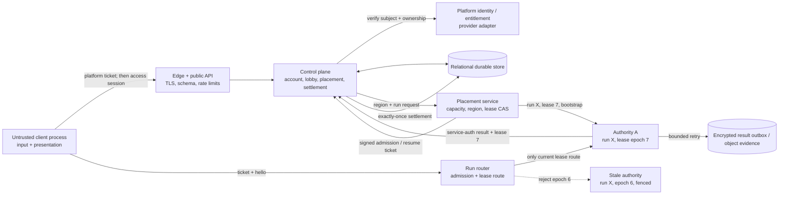

# Hosted Identity, Settlement, And Match Placement Decision

> Decision-ready Phase 5 design for `codex/v0.4-multiplayer-architecture`,
> reconciled 2026-07-14. This is a target contract and implementation plan, not
> a claim that hosted identity, a relational ledger, or fleet placement ships
> today.

## Decision

Build one provider-neutral hosted control plane that is the durable source of
truth for identity, entitlement, cloud pilots, lobby membership, placement,
and settlement. Place **one logical single-writer gameplay authority per live
match/group** in a selected region. Concurrent matches multiply that unit:
`M` live matches require `M` independently fenced writer leases, although many
authority instances may be packed onto one measured host.

The match authority is source of truth only for its live run: movement,
Ballpark bodies, contacts, inventory-in-run, signal, abilities, death,
extraction, events, and immutable result facts. It cannot mint accounts,
entitlements, durable inventory, or progression directly. A lobby leader can
choose declared lobby controls; the role confers no input, physics, profile,
result, placement, or settlement authority.

Product placement admits one through four humans. Four is the multiplayer
target; supporting one through three keeps solo/private local and undersized
invite flows functional. Eight is closed for v0.4 after the terminal
low-count staircase. S24 formed no eligible live cohort and proves no hosted
24/48/96 capacity. Database constraints, admission, routing, and allocation
must all reject a fifth product seat rather than relying on UI.

Recommended first deployment shape:

- Keep the API/control plane, relational database, and object/audit storage
  centralized and provider-neutral.
- Place a regional Node-compatible authority artifact behind an edge/router.
  The placement service assigns runs to measured worker capacity; it does not
  create one VM per match by doctrine.
- Do not use request-lifetime Vercel Functions as the live authority. Vercel
  may host static/client/control surfaces whose runtime contract fits.
- Keep a Durable Object authority as a separate Phase 6 measured spike, not a
  preselected production answer.
- Keep the current embedded/local authority and local JSON profile path
  working while relational and hosted adapters are added behind interfaces.

Greg must ratify hosted progression, provider/entitlement scope, local import,
and the remaining product policies before public implementation. The safe
technical default is an every-seat-entitled platform-ticket adapter, no LBH
passwords, no anonymous hosted guest, separate `LOCAL` and `CLOUD` economic
lineages, private Chronicle, and fail-closed authority loss.

## Non-Negotiable Boundaries

1. An identifier locates a record. A verified relationship or scoped token
   authorizes an operation.
2. No install id, device id, `clientId`, profile id, player id, IP address, or
   hardware attribute becomes a trust anchor. Do not fingerprint hardware.
3. The control plane selects membership, profile, region, authority lease, and
   capabilities before issuing a short-lived ticket. The client cannot
   self-assign them.
4. Exactly one current writer lease exists for a run. Every authority mutation,
   admission, heartbeat, checkpoint, outbox item, and result carries its lease
   id and monotonic lease epoch. A stale authority is fenced.
5. A lobby/session can survive rematches; a `run_id` cannot. Reset/rematch
   creates a new run, placement, lease epoch, event lineage, and result scope.
6. Hosted settlement accepts immutable result facts only from the authenticated
   workload holding the current lease. A shared fleet token is insufficient.
7. Clients never receive platform subjects, account ids, cloud profile ids,
   service identities, lease ids, or secrets in public state or replay.
8. Local/offline play has no account or network dependency. Local saves are
   valid local product state and untrusted evidence for the hosted economy.

## Current Repository Truth And Exact Deltas

The design extends existing contracts rather than creating a parallel game
protocol.

| Current implementation | Preserve | Hosted delta |
|---|---|---|
| `scripts/sim-runtime.cjs` creates UUID `session.id` and `runId`, owns the run, and registers `simInstanceId` with the control plane | One sim-owned run and separate session/run ids | Control plane creates durable session/run records first; authority receives a bootstrap for the assigned run and may not invent placement identity |
| `scripts/session-registry.cjs` creates `membership-*`, `local-profile-*`, `connection-*`, `connectionEpoch`, a 32-byte command credential, and monotonic command/action state | Stable membership and player id through reconnect; rotating connection/credential; independent sequences | Control plane creates run membership from authenticated session membership; remove `localProfileId` as hosted identity; persist the connection cursor/grant metadata needed for resume |
| `scripts/multiplayer-ticket-registry.cjs` issues 32-byte, 30-second, single-use admission/resume tickets bound to run, membership, player, profile, wire/capabilities, manifest, authority incarnation, and resume connection | Single use, short TTL, bounded claims, capability/manifest binding, secret-safe diagnostics | Issuer moves to trusted control plane/placement signer; add account, session membership, authority lease/epoch, client incarnation, audience, issued-at/expiry, ticket id, and key id; authority verifies signature and consumes ticket id atomically |
| `/join` accepts caller `clientId`, `profileId`, initial profile snapshot, hull, and loadout; reconnect correctly fences the old connection and preserves server state | Reconnect fencing and server-owned rehydration | Hosted admission derives player/profile/loadout from ticket + bootstrap; ignore/reject durable caller fields on every hosted join, not only reconnect |
| `multiplayer-wire-protocol` and state-pair paths bind run/membership/player/connection/capabilities | Existing v2 hello, privacy lanes, ACK/rebase, manifest negotiation, and S20 one-to-four transport | Ticket verification replaces local issuance but does not redesign gameplay frames; S20 stays the admitted path |
| `control-plane-runtime.cjs` keeps in-memory sim registration/heartbeat and unauthenticated profile/session endpoints | Separate control-plane boundary and heartbeat concept | Service-authenticated registration, placement CAS, lease deadline/epoch, drain/fence, owner authorization, request schemas, rate/resource limits, and durable rows |
| `control-plane-store.cjs` atomically renames one JSON file, stores whole profiles/runs/sessions, and idempotently applies `(runId, profileId)` result hashes | Conflict detection, retry returns prior commit, control-plane-owned durable copy | Relational result/settlement/ledger/inventory transaction; unique `(run, membership, result_version)`; current lease verification; conflict quarantine; encrypted bounded authority outbox |
| `x-lbh-service-token` can protect `/profile/outcome` when configured | Internal-only result endpoint and constant-time secret comparison | Per-workload identity and audience, short credential, current lease proof, rotation/revocation; no optional bypass in hosted mode |
| `hostClientId` controls start/reset and human host promotion | A player-legible lobby leader | Versioned `session_membership.role`; control-plane CAS promotion; no new gameplay grant when leader changes |
| Local profile normalization and control-plane bootstrap keep durable fields server-owned after bootstrap | Existing local slot/save UX and embedded authority | Add lineage/import metadata and a relational local adapter later; do not block local play on cloud services |

Legacy names remain accepted at compatibility edges during migration:
`membershipId` maps to `run_membership_id`, `connectionEpoch` maps to
`connection_epoch`, and the public runtime `playerId` remains run-scoped. Do
not overload the runtime's current `authorityIncarnation` (replication
lineage) as the placement `authority_lease_epoch`; both must be explicit.

## Trust Boundary And Placement Flow



Placement sequence:

1. The authenticated lobby leader requests a run with `session_id`, chosen map,
   supported capability set, and region preference. The control plane verifies
   all active session members, entitlements, bans, profiles, and the four-seat
   cap. It writes `run=PLACING`, immutable run memberships, public player
   aliases, and a placement request in one transaction.
2. Region selection minimizes a bounded party latency score subject to data
   residency, artifact availability, warm capacity, cost ceiling, and
   maintenance/drain status. The leader suggests a region; placement decides.
3. Placement chooses a healthy authority instance/slot and compare-and-swaps
   the next `authority_lease(run_id, lease_epoch)`. Only one row may be
   `ACTIVE`. The authority receives a service-authenticated bootstrap containing
   run config, membership/player aliases, profile/loadout snapshots, protocol
   manifest, lease id/epoch/deadline, and result schema.
4. The authority validates artifact/protocol/bootstrap, starts the run in a
   non-admitting state, then claims ready. The control plane marks placement
   `READY` and issues per-member admission tickets. It never sends one party
   bearer token.
5. The router validates ticket audience/key/expiry and current route. The
   authority verifies it again, atomically consumes `ticket_id`, derives all
   identity from its reserved claims, rotates the command grant, and sends the
   existing v2 welcome/manifest flow.
6. Heartbeats renew only the deadline of the same lease epoch and report run,
   queue, writer, memory, and drain state. They cannot transfer ownership.
7. On drain, the instance receives no new runs; live leases continue until
   result/end or explicit failure. On missed deadline/crash, placement fences
   the lease before changing routing. For v0.4 the run becomes `INTERRUPTED`;
   transparent live restore is not claimed.

## Identity Modes And Source Of Truth

| Mode | Sign-in / entitlement | Durable pilot | Live authority | Settlement and conflict rule |
|---|---|---|---|---|
| Local-only offline | None; installed build | `LOCAL` save keyed by `local_profile_id` | Embedded/local sim on that machine | Local result writes local lineage; no cloud claim |
| Local platform-backed | Platform may launch/backup but no LBH cloud session required | `LOCAL`; provider cloud file sync is backup transport, not a ledger | Embedded/local or explicit private host | Whole-save conflict UX; never merge currency/items field-by-field |
| Hosted platform | Fresh provider proof exchanges for LBH session; entitlement checked/cached by policy | `CLOUD` profile owned by internal account | Regional dedicated authority lease | Current authority result settles once in relational ledger |
| Cloud account with additional linked provider | Managed/passwordless provider only if a storefront requires it; no LBH password database | Same `CLOUD` account may have multiple verified provider identities | Same dedicated authority | Linking changes sign-in routes, not progression ownership |
| Hybrid linked install | Explicit sign-in and explicit user choice | Separate `LOCAL` lineage plus selected/new `CLOUD` profile | Local runs remain local; hosted runs use dedicated authority | Copy only safe fields by default; no bidirectional economic merge |
| Private player-hosted fallback | Platform identities/relay optional; clearly unverified | Local/unverified lineage | One visible player-hosted authority, never authority-free P2P | Cannot write verified cloud economy; host-signed result is not proof |

Hosted anonymous guests are out for MVP. An invited friend without ownership
requires an explicit provider-bound friend-pass entitlement, expiration, and
abuse policy; it is not represented by a device or install id. Local couch/LAN
guests may be ephemeral or locally durable and never imply hosted identity.

## Identity Chain

The complete chain is intentionally not one id:

```text
install -> registered device/auth session -> verified provider identity
       -> internal account + entitlement -> cloud pilot/profile
       -> party -> session + session membership -> run + run membership
       -> run-scoped player alias -> client process/incarnation
       -> connection + connection epoch + command grant
       -> authority instance + writer lease epoch
       -> body incarnation + event/action ids
       -> immutable result -> exactly-once settlement + ledger entries
```

The authoritative identifier ledger, including format, issuer, lifetime,
rotation, persistence, privacy class, and allowed log/replay/wire exposure, is
in
[`research/multiplayer-identity-data-model.md`](research/multiplayer-identity-data-model.md#identifier-taxonomy).
Mandatory distinctions are:

- `install_id` names an installation; `device_id` names a revocable account
  registration. Neither identifies hardware intrinsically.
- `local_profile_id` names an offline save lineage; `profile_id` names a cloud
  pilot. They are never aliases for each other.
- Provider identity proves a subject; entitlement proves a current grant;
  internal `account_id` joins them without exposing the provider subject.
- `client_process_id` rotates on process launch; `client_incarnation_id`
  fences a client state-machine lifetime; `connection_id` rotates per socket.
- `session_membership_id` carries lobby role; `run_membership_id` carries one
  run seat; `player_id` is the run-public alias.
- `body_incarnation_id` fences a spawned Ballpark generation. It is not a
  client or authority incarnation.
- `authority_instance_id` identifies a workload; `authority_lease_id` plus
  `lease_epoch` proves the current writer assignment.
- `result_id`, `settlement_id`, event/action ids, and idempotency keys are
  distinct retry/causality boundaries. None is an auth credential.

## Signed Admission And Resume Ticket

The hosted ticket reuses current claims and adds the missing control-plane
bindings. Prefer a signed-and-encrypted self-contained envelope so the client
only relays opaque ciphertext and the authority can validate without a public
API round trip. An opaque random token backed by a signed, mutually
authenticated control-plane-to-authority resolution is an acceptable first
implementation. A plaintext signed JWT is not: signature does not hide the
internal account/profile/lease bindings. Both forms still need a single-use
replay store. Required protected claims:

```text
iss, aud, key_id, ticket_id, kind(admission|resume), issued_at, expires_at
account_id, profile_id, session_id, session_membership_id
run_id, run_membership_id, player_id, seat_no
authority_instance_id, authority_lease_id, authority_lease_epoch
connection_epoch, client_process_id, client_incarnation_id
wire_version, capability_hash, manifest_schema, manifest_hash
```

Rules:

- TTL is 30–60 seconds and use count is one. Store only a digest/replay record
  if opaque. Never put the ticket in a URL, log, crash report, replay, event,
  snapshot, analytics payload, or support paste.
- The client does not need to inspect internal claims. The authority must match
  audience, current run/lease, reserved membership/profile/player, capability
  set, manifest, and connection epoch before consuming.
- Resume is issued only after normal account authentication and proves the same
  run membership. It rotates connection id/epoch and command grant; the old
  socket/grant is fenced before the new connection controls the body.
- A rejected malformed/wrong-audience/wrong-lease ticket is not consumed. A
  successfully verified ticket is consumed atomically before body control.
- Hosted production cannot fall back to the current local in-memory issuer or
  caller-selected profile when ticket verification is unavailable.

## Normalized Relational Model

The full logical schema is in the identity research memo. These are the
decision-critical entities and invariants:

| Entity | Primary/foreign keys | Required unique/check constraints |
|---|---|---|
| `account`, `auth_identity`, `entitlement` | Internal account; provider subject and grants reference it | unique `(provider, provider_subject)`; unique active grant per account/provider/app/type |
| `device`, `installation`, `auth_session` | Device belongs to account; install optionally belongs to device | refresh token hash unique; revoked device cannot refresh; no hardware fingerprint column |
| `profile`, `profile_revision`, `profile_progress` | Cloud pilot belongs to account | owner authorization on every query; monotonic revision; nonnegative materialized balance |
| `inventory_item`, `ledger_entry` | Items/ledger belong to profile; settlement provenance | unique occupied slot per profile; unique settlement/reason/currency posting |
| `profile_import` | Account + keyed local lineage provenance | unique `(account_id, local_profile_id_hash)`; policy and source schema required |
| `party`, `party_member` | Social grouping | one account row per party; leader transition CAS |
| `session`, `session_member` | Lobby and account/profile membership | `max_players BETWEEN 1 AND 4`; unique account and profile per session; exactly one active leader enforced transactionally |
| `run`, `run_membership` | Run belongs to session; membership references session member/profile | unique account, profile, public player alias, and seat per run; seat 0–3 only; partial unique active profile and, for recommended MVP, active account across runs |
| `authority_instance`, `run_placement`, `authority_lease` | Placement binds run to workload | unique `(run, placement_attempt)`; partial unique one selected placement and one `ACTIVE` lease per run; unique `(run, lease_epoch)` |
| `connection`, `authority_grant`, `admission_ticket` | Bound to run membership and connection epoch | one active connection/grant per membership epoch; one consumed ticket id; expiry required |
| `player_incarnation` | Body generation belongs to run membership | unique membership ordinal and observable Ballpark handle generation |
| `run_result`, `run_settlement`, `result_outbox` | Result belongs to run membership/current lease; settlement belongs to result/profile | unique `(run, membership, result_version)`; one settlement per result; unique outbox lease/result |
| `chronicle_echo` | Derived from settled result | visibility enum; expiry/anonymization; no account/provider ids in public projection |
| `ban`, `privacy_request`, `audit_event` | Account-scoped operational records | bounded scope/status/reason enums; access/retention separate from analytics |

Do not use a profile JSON blob as the mutation boundary. JSON is acceptable
only for bounded, versioned immutable payloads such as a result envelope,
loadout checkout, or revision detail. Balances, item instances, slots, leases,
results, settlements, and memberships need queryable rows and constraints.

## Public And Internal Flows

### Sign-in and entitlement

1. `POST /v1/auth/{provider}/exchange` accepts a fresh provider ticket plus
   install/client-process metadata. The backend verifies provider, audience,
   replay, and ownership through its adapter.
2. Transactionally upsert provider identity, account, entitlement observation,
   optional device/install registration, and rotating refresh family.
3. Return a short audience/scoped access token and rotating refresh token.
   Refresh secret lives in OS credential storage, never `localStorage` or the
   save file. General logs receive only pseudonymous account/session aliases.
4. Provider outage uses only a documented bounded cached-entitlement window.
   New ownership, revoked grant, ban, or uncertain account-link operations fail
   closed.

### Create, invite, join, and leader migration

1. `POST /v1/parties` and `POST /v1/sessions` derive account/profile from the
   access token. `POST /v1/sessions/{id}/invites` returns an opaque, hashed,
   expiring invite secret in the response body, never a query string.
2. `POST /v1/invites/redeem` authenticates the invitee, checks entitlement,
   ban/parental/privacy policy, seat cap, profile ownership, use count, and
   session version; it inserts a session membership idempotently.
3. Leader departure performs one transaction/CAS over session version and
   eligible memberships. Exactly one leader results. No authority grant or
   sim role changes.
4. Direct kick is not silently granted by schema. The eventual policy can be
   leader kick, vote, or future-rematch block, but is always a control-plane
   membership action with audit and no retroactive gameplay mutation.

### Placement and admission

1. `POST /v1/sessions/{id}/runs` validates leader role, all members, profiles,
   cap, map/version, and requested region, then creates run/memberships and a
   placement request.
2. Authority calls authenticated
   `POST /internal/v1/runs/{run}/claim`; CAS returns run bootstrap plus lease.
   Heartbeats carry workload identity, lease id/epoch, metrics, and deadline.
3. When ready, each member calls `POST /v1/runs/{run}/admission`. The control
   plane issues its own signed single-use ticket.
4. The client connects to the returned regional endpoint and sends the ticket
   in the existing v2 hello. The authority derives bootstrap identity, issues
   the existing command capability, and continues current manifest/S20 flow.

### Reconnect and body policy

1. On transport loss, authority closes the connection, releases held thrust
   and one-shot edges, and keeps the body live under inertia/current/hazards
   for 90 seconds. No invulnerability and no client freeze/restore.
2. Authenticated client calls `POST /v1/runs/{run}/reconnect`. Control plane
   checks active run/lease, same account/profile/membership, concurrency policy,
   reservation deadline, and ban/revocation state; it increments the connection
   epoch and issues a resume ticket.
3. Authority fences the old connection/grant, consumes resume, retains the
   existing run membership/player/body incarnation unless game rules already
   retired it, and sends a fresh baseline plus event watermark.
4. After the deadline, membership becomes abandoned under explicit run rules.
   A later join cannot resurrect the retired body generation.

### Match end, result, and exactly-once settlement

1. Authority finalizes a versioned result per human membership and hashes the
   canonical immutable payload. It writes the encrypted payload to a bounded
   local outbox before or with delivery.
2. `POST /internal/v1/runs/{run}/results` authenticates workload identity and
   verifies current lease, membership, schema, payload limits, final tick, and
   hash.
3. One transaction inserts result on unique `(run, membership,
   result_version)`, creates one settlement, posts ledger/inventory rows with
   settlement provenance, materializes profile/revision/Chronicle, and marks
   the result settled.
4. Identical retry returns the original settlement. A different hash for the
   same key is quarantined and alerts; neither is auto-selected. Client shows
   `RESULT PENDING` until commit and never receives speculative cloud credit.
5. Authority deletes/acknowledges its outbox item only after durable commit.

### Authority crash and retry

- Missing lease heartbeat causes placement to mark the lease `FENCING`, remove
  its route, reject new admission/results, and then mark it `FENCED` before any
  replacement lease can be active.
- v0.4 ends the live run as `INTERRUPTED`; it does not restore from a client
  snapshot. Already accepted/finalized results settle once. Non-final members
  receive no fabricated loss/reward except an explicit interruption policy.
- A surviving outbox delivery from the old workload requires recovery
  authorization binding the original fenced lease and exact result hash. It
  cannot resume gameplay or author a new result.
- Future signed checkpoint restore must be a separate experiment: checkpoint
  hash/event watermark, new lease epoch, deterministic replay/parity, and
  routing fence must all pass before transparent recovery is claimed.

### Local/offline import and conflict

1. Local play continues to read/write its existing local lineage. Every save
   export carries schema version, `local_profile_id`, lineage id, revision,
   modified time, and content hash; none proves hosted rewards.
2. On sign-in, show `Create cloud pilot`, `Use cloud pilot`, or `Keep local`.
   Import is explicit and idempotent by keyed local-profile provenance.
3. Safe default import copies sanitized display name, accessibility, controls,
   and owned cosmetic preferences. It does not copy EM, vault, upgrades,
   competitive stats, bans, or settlement history.
4. Simultaneous local/cloud edits never field-merge economy. Cloud remains
   authoritative; offline cloud-cache mutation forks a visibly local lineage.
   For two local copies, select/duplicate a whole lineage after showing both
   revision/time/device labels; preserve the loser until user confirmation.
5. A one-time capped `legacy_import` is possible only after Greg explicitly
   accepts contamination. Tag every resulting grant and exclude it from any
   competitive/trading surface.

### Account linking and unlinking

- Linking requires fresh proof for the currently signed-in account and the
  provider being added, explicit target-account confirmation, and uniqueness
  of provider subject. Never auto-link on matching names, devices, IPs, or
  email-like claims.
- If both provider subjects already own different cloud accounts, stop and use
  a verified support/recovery workflow. Do not merge inventories or ledgers
  automatically.
- Unlink requires recent authentication and at least one remaining recovery
  path. It revokes provider sessions/tickets but does not transfer or delete
  the account's pilots. The last identity cannot be unlinked until another
  verified path is established or deletion is requested.
- Guest-to-cloud migration applies only to a local guest lineage and follows
  the same safe import policy. Hosted anonymous guest progression does not
  exist in MVP.

### Export and deletion

- `POST /v1/me/export` requires recent auth, creates an asynchronous privacy
  request, and returns a versioned machine-readable archive of the subject's
  account/provider metadata, devices/sessions, profiles, revisions, ledger,
  inventory, private runs/Chronicle, bans/appeals, and shared-content refs. It
  excludes other players, secrets, internal anti-abuse rules, and inaccessible
  evidence.
- `DELETE /v1/me` first moves the account to `DELETING`, revokes
  access/refresh/run grants and hosted joins, interrupts any active run under
  the declared authority-loss rule, and waits a bounded final-result window.
  It then removes or irreversibly detaches identities, devices, profiles, and
  private content according to policy. Shared echoes become `Lost Pilot` and
  lose the account/profile link. Minimal lawful ban/fraud records remain
  isolated and expire.
- A non-personal deletion tombstone is replayed after backup restore and into
  downstream stores. Backups expire on schedule; restore must not resurrect a
  deleted identity.

## Multi-Device, Moderation, And Youth/Privacy Policy

Recommended multi-device policy: an account may have several registered auth
sessions, but one cloud `profile_id` may hold only one active run membership at
a time. Starting/joining from another device shows the active run and offers
resume or explicit abandon; it cannot spawn a second body or overwrite loadout.
Two different cloud pilots on one account may join different runs only if Greg
explicitly wants account sharing; the safe MVP rejects concurrent hosted runs
per account to simplify entitlement, moderation, and support.

Bans attach to internal account/provider grant and scope (`hosted_join`,
`social`, `shared_echo`, etc.) with reason, evidence, duration, appeal, and
revocation. Device/install/IP are short-lived risk evidence, never sole ban
identity. Blocks affect invites/rematch/social visibility, not authority truth.
Report payloads are bounded and cannot include arbitrary client-authored replay
as canonical evidence.

Do not collect birth date merely to have it. Before shipping social/shared
content, define supported regions/ages with counsel and platform policy. If a
minor/child account signal is lawfully available and required, minimize it to
a policy class rather than storing date of birth. Default youth-safe behavior:
private profile/run history, invite-only sessions, no public discovery or
voice, conservative display-name moderation, blocked direct contact, guardian
consent/control where required, and deletion/export appropriate to the user.
Friends/contact graph, precise location, legal name, email, voice recording,
raw input history, and hardware fingerprint stay uncollected unless a shipped
feature has a documented purpose, legal basis, access boundary, and retention.

## Failure Semantics

| Failure | User-visible result | Durable/control behavior |
|---|---|---|
| Provider verification unavailable | Local play remains; new hosted sign-in may retry | Bounded cached entitlement only for policy-approved existing session; no silent ownership grant |
| Control plane unavailable before placement | Lobby cannot start hosted run; local remains | No authority allocation; idempotent create request may retry |
| Region has no capacity | `WAITING FOR AUTHORITY`, alternate region offer, or fail | No partial lease/admission; cost/queue deadline enforced |
| Authority fails bootstrap/readiness | Placement retries another healthy slot before admission | Failed attempt fenced; same run may use higher lease epoch only before live admission |
| Client drops | Body drifts under declared 90-second rule | Membership reserved; old socket/grant fenced on resume |
| Lobby leader drops | Another eligible member becomes leader or lobby waits | Session-version CAS; no gameplay authority changes |
| Authority misses heartbeat after live | Run interrupted | Route removed, lease fenced, final results only; no client snapshot recovery |
| Result API/store unavailable | `RESULT PENDING` | Encrypted bounded outbox retries; no client credit |
| Duplicate identical result | Original result/settlement returned | Zero additional ledger/item/profile mutations |
| Conflicting result hash | Support/interruption state, never best-effort reward | Quarantine + security alert; no automatic winner |
| Profile revision conflict outside settlement | Refresh and reapply allowed domain change | CAS failure; never overwrite whole profile |
| Local/cloud save conflict | User keeps/selects/forks local lineage | Cloud economy unchanged; no field-level economic merge |
| Account deleted during lobby/run | Session revoked; run handling follows declared leave rule | New admission/result owner access denied; lawful finalized settlement/delete sequencing audited |

## Threat Review

| Threat | Required control / rejection |
|---|---|
| Change a profile/session/run id | Derive owner/membership from token; check relationship on every object operation; negative BOLA tests |
| Forge a client/install/device id | Treat as diagnostics only; no authorization, ban, entitlement, settlement, or reconnect from it |
| Replay platform or refresh ticket | TLS, audience/AppID, provider validation, replay cache, rotating/sender-bound refresh, family revocation; never log secrets |
| Reuse admission/resume ticket | Short TTL, exact audience/run/lease/capability binding, atomic one-use ticket id |
| Old authority returns after partition | Monotonic DB lease epoch, router fence, service-auth lease check on heartbeat/result, old workload cannot renew/settle |
| Two placement workers race | Transactional unique active lease + CAS; losing worker receives no valid bootstrap/admission route |
| Compromised lobby leader | Leader has lobby verbs only; server chooses membership facts, authority, outcomes, and settlement |
| Compromised match authority | Blast radius limited to its run/lease; service identity, immutable result/audit, schema/limits; it still owns that live run by design |
| Shared fleet credential stolen | Do not use one; per-workload short service identity/audience and revocation |
| Cross-recipient private-state leak | Existing owner/public schemas, run-scoped player aliases, projection tests, no serialization of account/profile/platform rows |
| Duplicate/conflicting settlement | Unique result key/hash, current lease proof, one settlement, ledger provenance, conflict quarantine |
| Local save edit/import | Separate lineage, safe-field allowlist, optional explicitly tagged capped legacy grant only |
| Multi-device duplicate body | Unique active profile/account run constraint, connection epoch rotation, stable membership and body incarnation |
| Denial of wallet via allocation/invite/export | Authenticate/rate-limit before placement, account/session quotas, bounded lists/payloads, capacity deadline, async export quota |
| Secrets or PII in telemetry | Structured allowlist/redaction at ingress; secret scanner; platform/account ids restricted; run aliases in ordinary logs |
| Hardware fingerprint / device ban creep | Schema has random registration only; prohibit hardware-derived identifiers; IP/device evidence expires and cannot solely ban |
| Deletion undone by backup | Downstream deletion ledger/tombstone and restore replay; bounded encrypted backup lifetime |

## Data Retention Recommendation

Final policy and legal basis require counsel and actual vendor/platform terms.
Initial minimization envelope:

| Data | Recommended retention |
|---|---|
| Active account/profile/progression | Account lifetime; exportable; delete/anonymize on verified request subject to documented exceptions |
| Provider ticket/access token | Transient verification only; never persist |
| Refresh session/digest | Until expiry/revocation plus 30 days minimal reuse evidence |
| Install/device registration | Account/device lifetime; remove on revoke/deletion; no fingerprint fields |
| Admission/resume ticket replay record | TTL plus at most 24 hours security evidence, then aggregate/delete |
| Live connection/routing/lease detail | Run plus 7 days; longer fleet metrics must be non-identifying aggregates |
| Private result/Chronicle/ledger | Account lifetime or per-profile deletion policy |
| Shared echo | 30 days or bounded per-seed eviction; anonymize immediately on source deletion/moderation |
| General application logs | 14 days; pseudonymous aliases, no secrets/provider subjects/raw profile |
| Raw IP if operationally required | 7 days, then delete or keyed/coarsened abuse signal |
| Security/audit events | 90 days default; 180 only for active documented case |
| Ban/appeal evidence | Ban/appeal duration plus 90 days; minimal scoped exclusion token only where justified |
| Encrypted backups | 35-day rolling expiry; deletion ledger replayed on restore |

Replays contain run id/alias, public player ids, observable body/event ids, and
explicitly authorized private-owner lanes only. They never contain account,
provider, device/install, cloud profile, connection, authority workload/lease,
ticket/grant, moderation, IP, or refresh-session data.

## Staged Implementation Plan

### Stage A — Harden current local interfaces

- Keep current public endpoints loopback/private. Add explicit hosted/local
  mode so hosted mode cannot inherit optional auth bypass.
- Version/validate request/result schemas and reject caller durable fields on
  hosted join.
- Name compatibility mappings for session/run/membership/connection without
  changing gameplay frames.
- Add adversarial fixtures for ids as locators, secret-free logs, fifth-seat
  rejection, and reconnect server-state ownership.

Exit: all current local, authority, S20 one-to-four, profile, result, and
offline tests pass; no hosted claim.

Implementation checkpoint (2026-07-14): the control-plane boundary now has an
explicit default-local/fail-closed-hosted mode, `lbh-hosted-boundary-v1`
service envelopes, exact top-level keys, recursive plain-data and byte/count
limits, duplicate-key rejection, generic external failures, service-auth on
every hosted stateful route, pseudonymous diagnostics, and named legacy-to-
hosted id mappings. The hosted service seam enforces one through four seats;
the same pure gate covers later ticket issuance and authority admission.
Public hosted profile/join/echo routes remain unavailable until Stage C can
derive owner identity; no caller flag or durable id can turn the local bypass
back on. This completes the Stage A boundary hardening slice, not hosted
identity, placement, settlement, deployment, or capacity.

### Stage B — Relational local adapter

- Put a relational repository behind the existing `LocalControlPlaneClient`
  boundary: profile revisions, inventory, ledger, result, settlement, session,
  membership, placement, and lease tables.
- Import current JSON and `lbh_profile_*` saves with dry-run report, source ids,
  content hash, and rollback copy. Keep the JSON adapter selectable until
  parity/export/delete/crash tests pass.
- Prove 100 identical deliveries mutate once, conflicting hash quarantines,
  process death at every transaction boundary, and deletion after restore.

Exit: embedded/local launch works without network; relational settlement is
transactional and reversible by backup, not client truth.

### Stage C — Hosted identity and owner authorization

- Implement provider adapter, entitlement observation, account/device auth
  sessions, token rotation/reuse response, and ownership middleware.
- Add local/cloud lineage UX, safe import, link/unlink, export/delete, retention
  jobs, and minimal moderation/ban/appeal.
- Negative-test every account/profile/session object and log surface.

Exit: authenticated users can access only their records; local mode remains
independent; Greg has ratified provider/import/Chronicle policies.

### Stage D — Placement, lease fencing, and admission

- Implement service workload identity, capacity registration, regional
  placement, writer lease CAS/deadline/drain/fence, run bootstrap, router map,
  and hosted ticket signer/replay store.
- Adapt existing runtime ticket verification and v2 welcome without creating a
  second gameplay writer or timer.
- Exercise two-placer race, old-authority return, drain, crash-before-ready,
  crash-after-admit, stale ticket, fifth seat, and multi-match isolation.

Exit: each live run has exactly one current authority lease; concurrent runs
have distinct authorities/leases; lobby leader has no gameplay power.

### Stage E — Hosted settlement and one region

- Add per-workload service auth, immutable result envelope, encrypted bounded
  outbox, relational settlement/ledger transaction, conflict quarantine, and
  `RESULT PENDING` UX.
- Deploy the same artifact to one Node-compatible region, then run the separate
  Durable Object spike. Measure packing, startup, routing, CPU/RAM/egress,
  drain, noisy neighbor, and bills before vendor commitment.
- Prove natural four-human invite/join/reconnect/result journeys and Greg's
  movement/taste gate. Do not run eight or infer S24 capacity.

Exit: hosted one-to-four path meets Phase 5/6 correctness, privacy,
performance, cost, and human-play gates with measured evidence.

## Acceptance And Red-Team Gates

- One, two, three, and four seats admit; fifth/eight reject at database,
  control plane, ticket issuance, and authority admission.
- Every concurrent match has a distinct run, placement, authority instance
  assignment, active lease, inbox/journal, resource budget, and result outbox.
- Two claimants, stale heartbeat, stale route, stale ticket, and stale result
  can never produce two current writers or two settlements.
- Change any account/profile/session/run/membership/player/connection id in a
  request: authorization does not follow the changed id.
- Deliver the identical result 100 times: one result, settlement, set of
  ledger/inventory posts, revision, and Chronicle update. Deliver a conflicting
  hash: quarantine and zero second mutation.
- Reconnect never accepts profile/hull/rig/loadout/inventory from the client,
  never duplicates a body, and fences the old connection before control.
- Leader promotion produces exactly one leader under race and no gameplay
  grant/epoch/lease change.
- Local launch/profile/run/result/Chronicle work with platform, internet,
  hosted API, and database network unavailable.
- Link/import cannot mint cloud economics under the safe policy; unlink cannot
  orphan an account; multi-device attempts cannot create a duplicate body.
- Export contains the subject's complete declared data and no other player's
  private fields. Deletion revokes access, anonymizes shared content, and
  remains effective after backup restore.
- Tickets, provider subjects, account/device/install/profile ids, service
  credentials, authority lease data, refresh/access/command secrets, and raw
  IP do not appear outside their allowlisted privacy boundary.
- Threat review must find no P1/P2/P3 open issue before a hosted alpha. A
  passing structural suite is not a production cost, WAN, human-feel, or
  privacy-policy claim.

## Greg Decisions Still Required

1. Does verified hosted progression ship in v0.4, or is the first multiplayer
   release private/local only?
2. Is the hosted MVP Steam-only with every seat entitled, or must a
   provider-bound friend pass / another storefront work at launch?
3. Ratify separate local/cloud economics and safe-fields-only import, or
   explicitly accept a capped, tagged legacy economic grant.
4. Ratify the 90-second disconnected-body rule: thrust/one-shots released,
   inertia/current/hazards/consequences continue.
5. Keep Chronicle private by default, or accept moderation/deletion work for
   lobby/seed sharing?
6. Can one account run two cloud pilots concurrently? Recommendation: no for
   MVP.
7. Choose direct leader kick, vote, or future-rematch block. Recommendation:
   proposal/vote or future-rematch block for the first public invite surface.
8. Confirm supported regions/age policy before social/shared content and
   whether any youth-account signal is required. Do not collect birth date by
   default.
9. Vendor commitment waits for the Node-compatible regional benchmark and
   same-scenario Durable Object spike. Greg chooses after evidence, not before.

## Sources And Related Decisions

- [Multiplayer identity and data model](research/multiplayer-identity-data-model.md)
  contains the official Valve, IETF, OWASP, and EU primary-source links used by
  this decision.
- [v0.4 architecture](ARCHITECTURE.md) defines per-match authority,
  presentation, overload, failure, and hosted placement boundaries.
- [v0.4 roadmap](ROADMAP.md) makes Phase 5/6 and the terminal four-player cap
  falsifiable.
- [Open decisions](OPEN-DECISIONS.md) records the product calls Greg owns.
- Current code anchors: `scripts/session-registry.cjs`,
  `scripts/multiplayer-ticket-registry.cjs`, `scripts/sim-runtime.cjs`,
  `scripts/control-plane-client.cjs`, `scripts/control-plane-runtime.cjs`, and
  `scripts/control-plane-store.cjs` plus their `tests/multiplayer-*` and
  `tests/control-plane.cjs` contracts.
