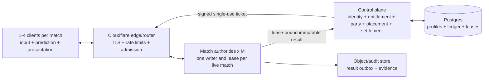

# v0.4 Multiplayer Decision Packet

> Final research and planning synthesis for
> `codex/v0.4-multiplayer-architecture`, 2026-07-14.
>
> This packet describes measured evidence, rejected directions, target
> architecture, costs, and implementation gates. It is not a claim that public
> hosted multiplayer ships today.

## Executive Decision

LBH should finish v0.4 as a **one-through-four-player authoritative product**.
The original minimum-four target is met by S20 local product evidence; the
requested maximum of eight is not. Eight is closed for v0.4 after S23, S23P,
and the terminal split-fragment experiment failed their precommitted gates.
The honest statement is therefore “four-player architecture admitted,” not
“4–8-player game complete.”

Verified play uses one dedicated logical single-writer gameplay authority
**per live match/group**. Concurrent matches each receive their own fenced
authority and writer lease. A scheduler may pack multiple isolated authorities
onto a measured host, but no two authorities may write one match and there is
never one global gameplay authority.

Use a provider-neutral central control plane for identity, entitlement, party,
placement, tickets, and durable settlement. Benchmark the current Node-shaped
authority first on Fly performance CPU. Use Cloudflare edge services plus
Postgres for the control plane and ledger; retain Hetzner CCX as the lower-cost,
higher-operations fallback. Measure DigitalOcean/ordinary containers and
Cloudflare Containers or one-Durable-Object-per-match as controlled
comparators. Keep Vercel on web/control-plane duties, not live match truth.

Preserve relay-assisted player-hosted authority for private/local continuity,
with local or visibly unverified progression. Reject true authority-free public
P2P: its determinism, partition, cheat, privacy, and settlement costs outweigh
the small hosting savings at this population.

## Evidence Verdict

| Claim | Verdict | Evidence boundary |
|---|---|---|
| One through four clients share truthful authority | **Admitted locally** | S20 is NORMAL at four, 9.80–9.85 Hz, 30,203–31,018 B/s/client mean, 32,361–32,766 B/s p95, 54.65–55.04 ms projection p95, and 0.585–0.589 authority core |
| Eight-player product | **Rejected for v0.4** | S23/S23P remain default-off; final split screen crossed its 55 ms abort at 55.9045 ms and was fully reverted |
| Hosted internet product | **Designed, not implemented** | identity/placement/settlement contract and provider costs are decision-ready; regional authority, TLS/WAN, soak, packing, and human-feel proof remain |
| H24 heavy live match | **Not proven** | synthetic component fixture exists; 24-client live cohort never admitted and raw capture never started |
| H48/H96 capacity | **Not proven** | coefficient extrapolations only, outside measured body/recipient domain |
| X96 capacity | **Modeled rejection** | fitted base writer and traffic both fail the screens |

The split-fragment implementation is absent from live source. S23 and S23P are
still executable default-off research paths and must not be mislabeled as
history-only. S20 is the admitted product path.

## Architecture



### Authority boundary

The match authority owns movement, coarse current, Ballpark bodies, contacts,
AI decisions, loot, signal, abilities, death, extraction, events, and result
facts. The client owns input sampling, immediate local presentation,
local-player prediction, remote interpolation, high-resolution ASCII fluid,
Three, UI, VFX, and audio. Irreversible consequences are never client truth.

Fleet scale is horizontal:

```text
live authorities = live matches
live matches ~= player CCU / measured average occupied seats
safeAuthoritiesPerHost = floor(measuredAuthoritiesPerHost * safetyFactor)
hosts = ceil(live matches / safeAuthoritiesPerHost) + warm/failure reserve
```

`safeAuthoritiesPerHost` is unknown until Phase 6 noisy-neighbor and soak
measurement. The economics model deliberately assumes one authority per host;
no unmeasured packing credit is taken.

### Transport and budgets

Use S20 JSON state-pair frames with negotiated Brotli-q1 for one-through-four
players. Retain transport-neutral message classes and independent bounded
queues for latest intent, reliable action, authoritative state, and events.

| Budget | Product gate |
|---|---:|
| admitted S20 four-player application downlink | 30,203–31,018 B/s/client measured mean; 32,361–32,766 B/s measured p95 |
| future compact average ceiling | <=64 KiB/s/client across state, events, and reconnect amortization |
| application queue | <=512 KiB/client, including <=256 KiB reliable subset |
| transport pressure | 256 KiB/64 KiB high/low hysteresis; replaceable state coalesces |
| persistent high pressure | disconnect only the affected recipient after 2 s; never delay the writer or healthy peers |
| movement authority | existing 15/12/10 Hz map clocks first; do not raise clocks without WAN and Greg feel evidence |
| projection/publish tails | representative p95 <50% and p99 <70% of the selected authority frame budget |
| four-player hosted cadence | every recipient >=9 Hz and match remains `NORMAL` in the Deep Field evidence profile |

Capture real WebSocket/TLS/IP overhead, ACKs, retransmits, reconnect bursts,
PPS, and regional egress in Phase 6. Application bytes are not on-wire bytes.

## P2P Decision

The detailed historical and quantitative comparison is in
[`research/p2p-history-network-budgets.md`](research/p2p-history-network-budgets.md).

| Variant | Decision | Why |
|---|---|---|
| authority-free deterministic lockstep | Reject for production | LBH is not cross-target deterministic; continuous movement consumes the lockstep delay budget; slowest-peer coupling and durable settlement remain |
| authority-free rollback mesh | bounded research only | improves local response but predicts multiple analog streams, rewinds shared consequences, and does not solve cheating or partition settlement |
| distributed per-object authority | reject at current scale | multiplies trust roots and cross-object arbitration while solving a scale LBH does not have |
| direct-IP player-host/listen server | LAN/dev only | simple, but NAT, IP exposure, host DoS, suspension, and migration are poor product defaults |
| relay-assisted player-host authority | keep as private fallback | preserves one causal sim and lowers official hosting duty; host remains trusted and progression is local/unverified |
| dedicated hosted authority | verified production recommendation | best extension of Ballpark, anti-cheat, recipient privacy, canonical outcomes, reconnect, and settlement |

Historical evidence points the same way: Age of Empires made lockstep work by
sending sparse commands and accepting slowest-peer/determinism constraints;
GGPO requires a cheap deterministic save/restore/replay kernel; Diablo exposed
the economy cost of trusting peers; Destiny's hybrid still retained a Physics
Host; Colyseus retained one primary authoritative copy per object; Donnybrook's
large result was simulated and left Internet/NAT/cheat work open.

Under the research model, an eight-peer input/hash mesh is about 165 kbit/s in
each direction per peer without voice and 473 kbit/s with full-mesh voice.
Bandwidth is not the primary blocker; the worst of 28 peer routes, NAT/relay,
determinism, cheating, partitions, privacy, and settlement are. Platform party
voice should precede built-in voice.

## Identity, Data, And Settlement

The normalized contract is in
[`HOSTED-IDENTITY-PLACEMENT-DECISION.md`](HOSTED-IDENTITY-PLACEMENT-DECISION.md)
and
[`research/multiplayer-identity-data-model.md`](research/multiplayer-identity-data-model.md).

- `install_id` and random `device_id` are diagnostic/registration identities,
  never hardware fingerprints or trust anchors.
- a provider subject proves sign-in; entitlement is a separate current grant;
  internal `account_id` prevents provider identifiers entering gameplay state.
- `local_profile_id` names a `LOCAL` save lineage; cloud `profile_id` names a
  `CLOUD` pilot. Economic progression never silently merges between them.
- `session_id` and `session_membership_id` survive rematches; every run gets a
  new `run_id`, immutable `run_membership_id`, seat, and run-public `player_id`.
- `client_process_id`, `client_incarnation_id`, `connection_id`, and
  `connection_epoch` fence process and socket lifetimes; body incarnation is a
  separate Ballpark generation fence.
- every match gets a unique `authority_instance_id`, `authority_lease_id`, and
  monotonic lease epoch. Only one lease is active; stale work is fenced at the
  router, heartbeat, ticket, checkpoint, outbox, and settlement boundaries.
- admission/resume tickets are short-lived, single-use, audience/run/lease/
  capability/manifest bound, and opaque to the client. IDs locate records;
  verified relationships and scoped tokens authorize them.
- the authority submits immutable result facts through workload identity. A
  relational transaction creates one result, settlement, ledger/inventory
  mutation, profile revision, and Chronicle update. Identical retry returns the
  existing settlement; conflicting hash quarantines. Clients never receive
  speculative cloud currency.
- local play remains functional with platform, internet, hosted API, and cloud
  database unavailable. Safe import copies display/settings/accessibility and
  cosmetics, not currency, vault, upgrades, or competitive history.
- public state/replays use run aliases only. Provider subjects, accounts,
  devices, cloud profile ids, connection/grant secrets, workload/lease ids,
  raw IP, and moderation records stay out.

## Hosted Topology And Current Provider Position

All prices below are dated official-source inputs, accessed 2026-07-14, from
[`research/2026-07-14-hosted-provider-source-ledger.md`](research/2026-07-14-hosted-provider-source-ledger.md).
They require refresh before purchase.

| Role | Position |
|---|---|
| live authority first benchmark | Fly Machines performance CPU; closest current Node/process lifecycle and $0.02/GB NA/EU egress |
| public edge/control | Cloudflare Workers/Pages; Postgres remains durable identity/ledger truth |
| operational fallback | Hetzner CCX dedicated CPU; CX shared is price-floor evidence only until jitter/noisy-neighbor proof |
| measured comparators | Cloudflare Container, one Durable Object per match, and an ordinary container such as DigitalOcean; same artifact and scenario |
| web/control only | Vercel; native WebSockets now exist, but the bounded function epoch and conflicting official limits are not an uninterrupted authority-hour |
| not first authority | Railway and Cloud Run because their documented socket/request lifetimes require continuity proof |

Do not infer match density from socket limits, vCPU count, copies sold, or a
rate card. No provider receives packing credit until the real four-player
scenario passes two-region 90-minute soaks and noisy-neighbor saturation.

## $4.99 Economics

The canonical model, formulas, source statuses, full local/hybrid/central
tables, and sensitivity rows are in
[`MULTIPLAYER-UNIT-ECONOMICS.md`](MULTIPLAYER-UNIT-ECONOMICS.md) and
[`evidence/unit-economics/`](evidence/unit-economics/). Net receipts after the
explicit refund, storefront, chargeback, and tax/VAT/FX allowances are $4.065,
$3.545, and $2.816 per copy in best/base/worst scenarios.

Four-occupied-seat Fly variable authority costs are:

| Case | $/authority-hour | $/hosted player-hour | Central cohort break-even |
|---|---:|---:|---:|
| best | $0.0590 | $0.014750 | 614 copies |
| base | $0.0693 | $0.017325 | 11,598 copies |
| worst | $0.0903 | $0.022575 | none in modeled envelope |

Central contribution after modeled operations:

| Copies | Best | Base | Worst |
|---:|---:|---:|---:|
| 1,000 | $1,537 | -$30,984 | -$1,756,030 |
| 10,000 | $37,365 | -$4,670 | -$1,763,504 |
| 100,000 | $395,644 | $258,468 | -$1,838,241 |
| 1,000,000 | $3,978,440 | $2,889,848 | -$2,585,609 |

Hybrid control plane plus player-hosted private matches contributes
$3,398/$165/-$17,813 at 1K and $4,017,321/$3,178,023/$776,383 at 1M, with
break-even at 155/949/23,407 copies. Pure local contributes
$4,020/$3,048/$696 at 1K and $4,019,966/$3,219,477/$1,614,871 at 1M. Refer to
the canonical table for every intermediate sales scale.

The central worst case is structurally loss-making, not merely launch-small.
Its $2.816 receipt/copy is below $3.646 variable operations/copy before the
84-month, $20,300/month fixed service posture and $50,000 one-time work. At one
million copies, modeled operations are $5,401,400 against $2,815,791 receipts.
Shortening the service tail alone cannot repair a negative per-copy margin;
hours, support, variable control, price/receipts, and service posture must
change. The model excludes development, marketing, corporate income tax,
publisher share, actual regional discounts, voice/TURN, and high-count modes.

## 24 / 48 / 96 Evidence

These vectors preserve one canonical gameplay writer per match. Future
internal workers may compute pure AI sensing, field tiles, broad-phase
candidates, recipient projections, or encoding from immutable tick inputs
behind deterministic barriers. They never become additional gameplay
authorities; late or wrong-revision results are discarded.

| Vector | Evidence class | writer p95/p99 or fitted base | application B/s/client | match traffic | Verdict |
|---|---|---:|---:|---:|---|
| H24 representative | **measured synthetic fixture** | 0.828 / 1.417 ms | 13,468 | 2.586 Mbit/s | component screen only; not live capacity |
| H24 dense | **measured synthetic sensitivity** | 3.417 / 4.333 ms | same schema assumption | same schema assumption | pileup sensitivity only |
| H48 | **far coefficient extrapolation** | 1.207 ms base | 26,354 | 10.120 Mbit/s | not capacity; 2.25x bodies and 2x recipients beyond measured domain |
| H96 | **far coefficient extrapolation** | 2.646 ms base | 50,150 | 38.515 Mbit/s | not capacity; 4.5x bodies and 4x recipients beyond measured domain |
| X96 | **modeled rejection** | 86.769 ms base | 118,219 | 90.792 Mbit/s | fails writer and network screens |

The proposed live H24 lane did not admit a 24-client cohort. The ordinary
adapter cap was 16 connections, the production Deep Field profile had seven
scavengers rather than 48, and no exact 400-body live fixture existed. Two
guarded eligibility attempts failed at first-client state-pair admission. The
raw command never started according to the orchestrator and `raw.json` is
absent. Therefore there is no live H24 CPU, cadence, socket, queue, TLS, or
network measurement and no basis to promote H48/H96.

## Implementation And Measurement Roadmap

1. **Four-player product completion.** Freeze S20 as the product replication
   path; make one-through-four invite/join/reconnect/result flows natural;
   reject a fifth seat at schema, control-plane, ticket, and authority layers;
   keep local/offline independent. Abort on any privacy leak, duplicate
   consequence, unbounded queue, or non-`NORMAL` four-player baseline.
2. **Greg chooses hosted progression.** Decide central verified progression,
   hybrid control plane plus private-host fallback, or local/private-only
   release. This is a product decision, not an engineering gate.
3. **Phase 5 identity, settlement, and placement.** Implement relational local
   parity, provider adapter, local/cloud lineage, lease CAS/fencing, opaque
   single-use tickets, workload identity, immutable result outbox, and
   exactly-once settlement. Abort if two claimants can write/settle, any caller
   id authorizes access, a fifth seat admits, or local play needs cloud.
4. **Phase 6 regional authority proof.** Run the same representative
   four-player scenario on Fly performance CPU first, then Hetzner CCX and
   Cloudflare Container/Durable Object or ordinary-container comparators in at
   least two regions. Capture cadence, writer p50/p95/p99, CPU/RSS/GC,
   event-loop delay, queues, application/on-wire B/s and PPS, reconnect,
   startup/drain, invoice, and errors. Require a 90-minute soak, all recipients
   >=9 Hz, `NORMAL`, <=64 KiB/s/client average, bounded queues, and no P1/P2/P3.
5. **Measure packing.** Saturate multiple independent four-player authorities
   per host with counterbalanced noisy-neighbor load. Set
   `safeAuthoritiesPerHost` only from the largest passing density times a
   declared safety factor. Abort on writer-tail regression, cross-match
   starvation, memory/egress/PPS cap, or failure-domain breach.
6. **Revisit S24 diagnostics only after the four-player host is known.** Build
   a production-valid exact H24 fixture, prove admission and privacy first, then
   run one paced live 24-client capture. Do not start H48/H96 work from the
   synthetic fit and do not select another eight-player optimization.

## Greg Product Decisions Still Required

These are independent of engineering acceptance gates:

1. Ship verified hosted progression, hybrid private-host continuity, or
   local/private-only multiplayer first?
2. Steam-only every-seat entitlement, provider-bound friend pass, or another
   storefront at launch?
3. Ratify separate LOCAL/CLOUD economics and safe-fields-only import, or accept
   a capped tagged legacy economic grant?
4. Require four humans, or allow one-to-three humans plus server-owned AI fill?
5. Ratify the 90-second disconnected-body rule: release thrust/one-shots while
   inertia, flow, hazards, and consequences continue?
6. Close late join at run start or a declared salvage/signal phase?
7. Leader kick directly, proposal/vote, or future-rematch block?
8. Keep voice out and use platform party voice first?
9. Keep Chronicle private by default, or fund sharing moderation/deletion?
10. Permit two cloud pilots on one account to run concurrently? Recommendation:
    no for MVP.
11. Which regions/ages are supported before social/shared content, and is any
    youth-account policy signal actually required?
12. Are 24/48/96 product modes, rare events, private experiments, or capacity
    probes? No implementation should infer this answer from the model.
13. After Phase 6 evidence, select the hosted authority vendor and service-tail
    promise. Do not precommit from rate cards.

## Completion Statement

The original research, comparison, architecture, costing, identity model,
high-count forecast, and staged-plan objective is complete and decision-ready.
The ideal gameplay outcome is only partially achieved: four-player local
authority is admitted; eight, hosted production, measured packing, real H24,
and public operations remain future product/implementation work.
