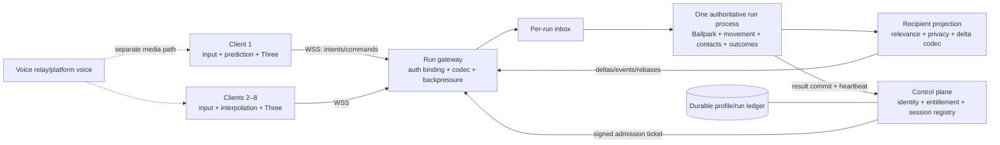
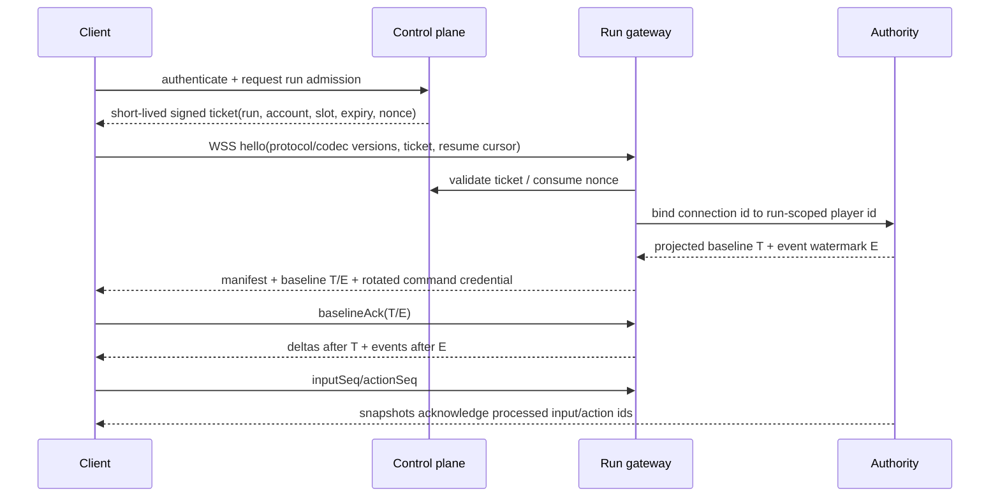

# Ballpark-Compatible 4–8 Player Architecture

> Research memo for `codex/v0.4-multiplayer-architecture`, 2026-07-10.
> This is an engineering recommendation for one 4–8 player LBH run, not an
> MMO-scale shared-world design or an implementation claim.

## Recommendation

Build a **run-scoped dedicated authority with a persistent bidirectional
client connection**. One disposable sim process owns one run. A separate
control plane authenticates players, admits them to the run, and owns durable
profiles and results. Each client predicts only its own movement, interpolates
other bodies, and reconstructs the high-resolution ASCII fluid locally from
authoritative coarse-field state and stamped disturbances.

The first internet transport should be binary WSS/WebSocket, not because TCP
is the ideal final game transport, but because it is the shortest path from the
current browser/Electron client to a persistent, authenticated, push-based
connection. WebSocket exists specifically to provide two-way communication
without repeated HTTP polling and is framed over TCP
([RFC 6455](https://www.rfc-editor.org/info/rfc6455/)). Keep the application
protocol transport-neutral so a measured head-of-line problem can later move
time-sensitive input and deltas to WebTransport/QUIC datagrams; QUIC DATAGRAM
is explicitly unreliable and non-retransmitted while sharing QUIC's security
context ([RFC 9221](https://www.rfc-editor.org/rfc/rfc9221.html)). Do not pay
that complexity cost before network emulation proves WSS inadequate.

The movement target should be a **30 Hz fixed player/contact microtick**, with
the existing world, AI, field, growth, and spawn systems remaining on explicit
lower-rate schedules. Start the first remote spike at the current 15 Hz and
run a blind 15/20/30 Hz movement comparison; 30 Hz is the recommended product
target unless measurements show that prediction plus swept contact makes a
lower rate indistinguishable. Send input intent at 30 Hz, relevant state deltas
at 15 Hz, reliable semantic events immediately, and a full rebase keyframe
about once per second or on demand.

This keeps LBH's strongest existing contracts:

- one run, one gameplay authority;
- protocol-v2 run/player identity, credentials, monotonic sequences, and
  deterministic rejection;
- Ballpark stable public ids and generation-checked private handles;
- toroidal geometry and swept authoritative contact;
- private event visibility, event watermarks, bounded history, and snapshot
  rebase;
- Three/UI/VFX/audio as presentation consumers only;
- EVE-inspired boxed player state and explicit overload/time-dilation policy.

It rejects true no-authority P2P, deterministic lockstep, and production
listen-server hosting for the primary product path. Those choices move trust,
latency, host loss, NAT, and desync costs into the most movement-sensitive part
of the game without buying anything a 4–8 player run needs.

## Target topology

The gateway may initially live in the sim process. It is a logical boundary,
not a requirement to deploy another service. The important rule is that
socket reads enqueue validated intents; they never mutate the world between
ticks. The sim drains a deterministic inbox at the start of each tick and
publishes one stamped output frame at the end.

### Authority unit

One run stays on one process. Do not shard a live 4–8 player run. The control
plane can place many independent run processes across hosts and regions, but
the movement/contact causal chain inside one run remains single-writer. This is
the useful EVE lesson: preserve a coarse, comprehensible authority boundary and
degrade its shared clock honestly under load. CCP describes Time Dilation as a
way to preserve ordering and fairness under overload rather than letting delay
become arbitrary ([Introducing Time Dilation](https://www.eveonline.com/news/view/introducing-time-dilation-tidi),
[follow-up](https://www.eveonline.com/news/view/time-dilation-hows-that-going)).

### Client roles

The client owns:

- 60 Hz input sampling and immediate local control presentation;
- 30 Hz transmission of latest continuous intent, plus immediate reliable
  one-shot actions;
- prediction of its own transform using the shared gameplay movement kernel;
- interpolation of remote entities and authoritative world bodies;
- high-resolution visual-fluid reconstruction, ASCII rendering, camera, UI,
  audio, and VFX;
- connection health, rebase, and correction presentation.

It never owns death, pickup, collision, extraction, cargo, signal, ability
success, portal residence, authoritative current, or durable writes.

## What v0.3 already provides

### Multiplayer-ready foundations

| Existing foundation | Why it survives |
|---|---|
| Separate control-plane, sim, and client processes | Already expresses durable data, disposable run, and presentation boundaries. |
| `lbh-local-v2` run id, player id, issued credential, and join ticket | Correct trust subjects; replace local tickets with control-plane-signed admission without renaming gameplay identity. |
| Independent monotonic command and input sequences | Correct basis for idempotency, latest-input selection, acknowledgements, and replay defense. |
| Ballpark stable ids, lifecycles, and toroidal spatial queries | Correct basis for recipient relevance, delta identity, despawns, and seam-safe AOI queries. |
| Server-owned fixed-step movement, coarse field, swept contacts, and outcomes | The hard authority migration is already substantially done. |
| Player brain / derived state | Avoids recomputing profile/loadout effects in the hot tick and gives reconnect a coherent player package. |
| Event journal with run/sequence/lane/visibility | Correct semantic-event and private-event foundation. |
| Snapshot ring, baseline metadata, event watermark, and rebase rules | Correct recovery foundation. |
| Explicit overload state and time scale | Correct foundation for fair run-wide degradation. |
| Multiple humans, max-player admission, leave, and host promotion | Proves the data model is no longer intrinsically single-player. |

### Local-stack illusions that must be removed

| Current behavior | Internet multiplayer problem | Target |
|---|---|---|
| One HTTP request per input and polling for snapshots/events | Request overhead, serialized input acknowledgement, no server push, and avoidable latency | One persistent WSS connection with multiplexed message types |
| `SimClient` serializes all mutations through one promise tail | A delayed request blocks newer movement and discrete actions | Latest-wins input lane; independent reliable command lane |
| Random client UUID doubles as authority player id | Device/process identity is confused with authenticated player/session identity | Stable account/profile id, ephemeral connection id, run-scoped player id |
| Shared full snapshots | Bandwidth scales with full world, not recipient need | Per-recipient projection plus baseline/delta encoding |
| Every snapshot includes every player's cargo, equipment, consumables, effects, exact signal, and portal state | Private event lanes do not prevent snapshot disclosure | Explicit public/private player schemas and privacy tests |
| Snapshot ring stores repeated full JSON bodies | Useful recovery semantics but expensive wire/storage shape | Periodic keyframe plus deltas referencing `baselineSnapshotId` |
| Snapshot cadence follows client polling | Jitter and burst behavior are client-driven | Authority publishes at fixed cadence; client acks baselines/watermarks |
| Reconnect requires the current command credential | A crashed client may lose the only resume secret; stolen long-lived secret remains powerful | Short-lived control-plane resume ticket rotates run credential |
| “Host” controls reset/start while the sim is still authoritative | Product UI privilege can be mistaken for simulation hosting | Rename conceptually to lobby leader; host loss never moves gameplay authority |
| No bounded socket-send/backpressure contract | Slow clients can grow memory or delay all later data | Per-client byte cap, delta coalescing, forced rebase, then disconnect |
| Loopback metrics without loss/jitter injection | Green tests do not establish internet feel | Deterministic network-emulation lane and multi-client soak |

The snapshot privacy defect is especially important: current event filtering is
player-aware, but the full snapshot body is shared and contains all players'
private runtime state. Recipient projection is a correctness and security gate,
not a later bandwidth optimization.

## Protocol recommendation

### Message classes

Use one schema registry and four behavioral classes:

| Class | Examples | Delivery rule |
|---|---|---|
| Latest state | movement stick, thrust, brake, held slingshot | Monotonic `inputSeq`; newer replaces older; never wait to retransmit stale intent |
| Reliable action | slingshot edge, pulse, extraction confirm, consume, inventory | Monotonic action/command id; idempotent result cache; deliver once semantically |
| Authoritative state | keyframe, delta, despawn, field revision | Stamped with run/tick/baseline; newer deltas may supersede older only when dependency permits |
| Semantic event | loot, death, extraction, signal crossing, overload mode | Reliable, ordered by global event watermark, visibility-filtered per recipient |

Keep `commandSeq` for session and inventory mutations. Let continuous movement
use `inputSeq` without consuming the serialized command stream. One-shot input
edges get their own monotonic action ids and are redundantly included until
acknowledged. This preserves the v2 identity and anti-replay model while
removing command head-of-line blocking.

Duplicate reliable commands should return the cached original result rather
than only returning `stale-command`. Cache at least the last 64 results per
player, bounded by bytes and cleared on run change. That makes retries safe
when the client cannot know whether a response was lost.

### Recipient snapshot shape

A projected baseline should contain:

- protocol/schema/codec versions, run id, snapshot id, authority tick and
  time, baseline id, last event sequence, and field revision;
- static run manifest or its content hash: seed, world scale, toroidal rules,
  wells, authored route facts, and deterministic tuning version;
- relevant public bodies with Ballpark id, incarnation, lifecycle, transform,
  velocity, compact component mask, and changed components;
- the recipient's exact private player state;
- deliberately selected observable state for other players;
- create/despawn tombstones and relevance enter/leave reason;
- overload state, effective tick/snapshot rates, and time scale.

Public rival state should default to what play can legitimately reveal:
transform, velocity, hull silhouette, alive/escaped status, observable ability
presentation, and coarse signal band if the design exposes it. Exact cargo,
loadout, consumables, fuel/delta-v, hidden cooldowns, private effects, and
portal confirmation state are owner-only unless Greg makes a game-design
decision to reveal them.

### Sequence: connect, join, and baseline

Do not enable gameplay input until the baseline is acknowledged. While a
baseline is in flight, buffer only a bounded delta window. If it overflows,
discard it and issue a newer baseline; never apply a partial history to stale
state.

### Clocks and cadence

| Contract | Recommended target | Initial falsification range |
|---|---:|---:|
| Local input sampling | 60 Hz | 60–120 Hz device sampling |
| Input transmit | 30 Hz plus immediate edges | 20/30 Hz |
| Player movement/contact microtick | 30 Hz fixed | blind compare 15/20/30 Hz |
| Coarse field and waves | 10–15 Hz | current profile vs 15 Hz |
| AI steering | 10 Hz | 5/10/15 Hz |
| AI goals/spawn/growth | 1–5 Hz | current explicit schedules |
| Relevant state delta | 15 Hz | 10/15/20 Hz |
| Full projected keyframe | 1 Hz and on recovery | 0.5/1/2 Hz |
| Render | 60 fps target | independent of authority |
| Interpolation delay | adaptive 80–150 ms | 2–3 delta intervals plus jitter |

Valve's published Source networking description is a useful comparison, not a
number to copy blindly: it describes an authoritative client/server model,
roughly 20 updates per second, prediction, and a 100 ms interpolation buffer
that can bridge one missing snapshot; it caps extrapolation at 250 ms
([Source Multiplayer Networking](https://developer.valvesoftware.com/wiki/Source_Multiplayer_Networking)).
LBH should begin near that operating envelope, then tune from its own surfing
evidence.

### Prediction and reconciliation

Predict only the local player's continuous movement. The prediction kernel
must use the same quantization, toroidal geometry, hull/brain coefficients,
input rules, and coarse-field revision as authority. It must not predict loot,
death, portal confirmation, signal thresholds, pulse hits, inventory, or
extraction.

On each authoritative delta:

1. find the acknowledged `inputSeq`;
2. restore the authoritative player state at that tick;
3. replay still-pending local inputs through the shared movement kernel;
4. measure position, velocity, and slingshot-phase error;
5. render-correct small errors over 100–200 ms;
6. hard rebase on run/baseline/field-revision mismatch, contact consequence,
   or error beyond the safety threshold.

Never smooth across death, pickup, extraction, portal exit, well contact, or
slingshot engage/release truth. Those transitions need an explicit correction
event so presentation can explain the result rather than silently dragging the
ship.

Remote players and dynamic bodies render from an interpolation history. Allow
velocity extrapolation for at most 250 ms, then freeze/fade uncertainty rather
than inventing consequences. Snapshot interpolation is intentionally less
dependent on cross-platform deterministic simulation than lockstep, but it
requires buffering and bandwidth; Glenn Fiedler's direct treatment explains
both the jitter-buffer need and the determinism trade
([Snapshot Interpolation](https://gafferongames.com/post/snapshot_interpolation/)).

## Authoritative fluid/current split

Movement skill survives only if the client predicts the same navigational
terrain that authority evaluates. The split should be:

### Authority owns

- deterministic analytic sources: wells, stars, planetoids, orbital direction;
- the coarse vector field revision and its quantized cells/chunks;
- stamped wave/disturbance descriptors with origin, start tick, phase,
  amplitude, width, decay, and lifetime;
- gameplay affordance zones and coefficients: wave catch, slingshot anchor,
  well shoulder/commitment, wreck/portal approach, and contact radii;
- all force sampling used by movement, prediction checks, AI, and contacts.

### Client reconstructs

- high-resolution fluid texture and local turbulence;
- glyph density, shimmer, interference detail, wake beauty, and post effects;
- visual interpolation between coarse field revisions;
- visual-only disturbance from remote ships and VFX events.

The client field adapter consumes the authority seed, source descriptors,
coarse chunks, and disturbances. It can add energy and detail, but it may not
move a rideable crest, danger boundary, or interaction zone away from the
authoritative one. Surf-lane highlights and invisible assists must be derived
from authoritative bands, not the decorative GPU texture.

Every field update carries `fieldRevision`, `effectiveTick`, and content hash.
Prediction is valid only against the matching revision. If the client is more
than two field revisions behind, stop replaying speculative current, continue
inertial presentation briefly, and request rebase. A debug probe should sample
the same positions on server and client and report vector/angular error. This
turns “movement feels dishonest” into a measurable contract.

Do not transmit raw fluid textures. Do not make the GPU visual field a second
authority. Do not let a visual-only wake alter collision or surfing success.

## Network budget model

These are design budgets, not observed production traffic. “Payload” is
encoded application data. “On wire” adds a planning allowance for framing,
TLS/TCP/IP acknowledgements, and imperfect batching; packet captures must
replace the allowance during spikes.

Assumed network envelope:

- good target: <=100 ms RTT, <=30 ms jitter, <=1% loss;
- supported/degraded: 100–180 ms RTT, <=60 ms jitter, 1–3% loss;
- recovery test: 250 ms RTT, 5% loss, 500 ms burst loss;
- no gameplay message depends on wall-clock equality;
- future datagram messages stay around 1,100 bytes to avoid path-fragmentation
  surprises; larger baselines are chunked.

| Direction/class | Cadence | Low | Expected | High budget |
|---|---:|---:|---:|---:|
| Client input | 30 Hz | 32 B | 48 B | 80 B payload/frame |
| Input on wire | continuous | 2 KB/s | 3.5 KB/s | 6 KB/s/client |
| Relevant delta | 15 Hz | 1.5 KiB | 3 KiB | 6 KiB/message |
| Keyframe | 1 Hz | 8 KiB | 16 KiB | 32 KiB/message |
| Events/control | bursty | 0.5 KB/s | 2 KB/s | 6 KB/s/client |
| **Total down/client** | aggregate | **~32 KB/s** | **~65 KB/s** | **~126 KB/s** |
| **Authority egress, 8 clients** | aggregate | **~256 KB/s** | **~520 KB/s** | **~1,008 KB/s** |
| **45-minute 8-player run** | egress only | **~0.69 GB** | **~1.40 GB** | **~2.72 GB** |

Formula: `run egress GB = downlink KB/s/player * players * 2700 / 1,000,000`.
The expected case is therefore `65 * 8 * 2700 / 1,000,000 = 1.404 GB`.

The current v0.3 Deep Field evidence reports a 107.88 KiB p95 full snapshot and
an estimated 0.33 MB/s snapshot transport for one recipient. Replicating that
unchanged to eight recipients would be about 2.64 MB/s and 7.13 GB over a
45-minute run, before inputs, events, framing, or voice. It is useful prototype
evidence, but not an acceptable production replication contract. Recipient
projection, static-manifest separation, quantization, component masks, and
baseline deltas should land before vendor cost optimization.

Voice must not share the sim connection or tick budget. A planning allowance
for a separate platform/voice relay is 24–48 kbit/s (3–6 KB/s) per active
speaker stream before overhead. At two simultaneous speakers, budget roughly
8–16 KB/s received per client; all-talk is a stress case. Voice is excluded
from the gameplay table and should be costed by the hosting lane.

## Relevance and privacy

Four to eight players do not require MMO-grade interest management, but they
do require recipient-specific truth.

Use these lanes:

- **global static:** run manifest, major wells, route anchors, time scale;
- **global dynamic:** collapse phase, portal availability when globally
  observable, public deaths/extractions;
- **neighborhood:** transforms and lifecycle for bodies within a toroidal AOI,
  selected through Ballpark;
- **owner:** exact player brain runtime, cargo, loadout, consumables, cooldowns,
  acknowledgements, private signal and portal interaction;
- **team/party, if later designed:** explicit membership, never inferred from
  socket or lobby host;
- **presentation:** VFX/audio hints with no gameplay authority;
- **debug:** disabled in public sessions and separately authorized.

Relevance exit is not destruction. Send `leave-interest` with lifecycle id and
retain a bounded client tombstone; a later `enter-interest` can reuse the same
public id/incarnation safely. Actual despawn carries a lifecycle reason and is
never inferred from packet silence.

## Late join and reconnect contracts

### Late join

Late join does not pause the run. Admission selects a current tick, projects a
complete relevant baseline, includes its event watermark and field revision,
then streams only later deltas after baseline acknowledgement. Target time from
ticket validation to renderable world is <=2 seconds at p95. If the run is in a
terminal or non-joinable phase, admission fails explicitly before opening a
player slot.

Spawn safety is an authority decision. A late join gets a deterministic safe
spawn and a brief server-owned grace state, not client placement. Whether
competitive runs permit late join after a cutoff is a product rule, but the
protocol remains capable of it.

### Reconnect

Keep the player entity for a 45-second grace window by default. During grace,
apply a declared policy—recommended: release thrust, retain inertia/current,
disable one-shot actions, and keep all hazards live. Do not grant invulnerability
or let a disconnected client continue stale held input.

The client obtains a short-lived, single-use resume ticket from the control
plane. The authority validates `(runId, accountId, playerId, prior connection
epoch)`, increments the epoch, rotates the command credential, returns a fresh
baseline, and invalidates the old socket. Reconnect target is <=3 seconds p95
after the new socket opens. After grace expiry, commit the declared abandon or
death rule once and reject later resume.

## Failure and recovery matrix

| Failure | Detection | Required behavior | Never do |
|---|---|---|---|
| Lobby leader disconnects | socket close/heartbeat timeout | Promote lobby privilege; sim authority is unchanged | Migrate gameplay authority to another client |
| Player-hosted authority disappears | connection loss for all peers | For private prototype, end/void run and preserve pre-run durable state | Pretend host migration is solved by electing a peer |
| Dedicated sim process crashes | missing heartbeat/process exit | Mark run interrupted, reject duplicate result commits, offer fresh run; restore profiles from last committed durable boundary | Accept client snapshot as truth |
| Duplicate reliable command | same player/epoch/command id | Return cached original result; no second mutation | Merely retry mutation or double-write result |
| Stale/out-of-order input | `inputSeq <= acceptedInputSeq` | Drop continuous state; still ack current watermark | Rewind authority for ordinary movement |
| Stale delta/baseline mismatch | missing baseline or old run/epoch | Discard dependent deltas and request projected keyframe | Patch partial state across baselines |
| Event gap | next seq exceeds expected or retention says stale | Rebase from full snapshot at watermark, then resume after it | Apply later private consequences to stale state |
| Slow client/backpressure | send queue bytes/age exceed cap | Coalesce superseded deltas; preserve reliable events; force rebase; disconnect if still slow | Grow an unbounded queue or slow the run |
| Snapshot loss/jitter | interpolation buffer underrun | Extrapolate presentation <=250 ms, then freeze/fade uncertainty | Invent contacts or outcomes |
| Credential replay/old socket | connection epoch or nonce mismatch | Reject and audit; newest validated epoch wins | Allow two live controllers for one player |
| Authority overload | tick duration/debt and queue pressure | Lower noncritical rates, reduce snapshot cadence, tighten AOI, then shared time dilation | Change physics asymmetrically per player |
| Control plane unavailable mid-run | failed heartbeats/result write | Continue bounded run on cached admission; queue one idempotent result commit; refuse new joins after lease expires | Let profile or entitlement calls enter the hot tick |
| Result commit retry | idempotency key `(runId, playerId, outcomeVersion)` | Return existing commit | Duplicate rewards/Chronicle rows |
| Client clock jump | monotonic-vs-wall discrepancy | Use server tick and local monotonic time for presentation | Order gameplay by client timestamp |

Live transparent sim failover is explicitly deferred. Correct hot recovery
requires periodic authoritative checkpoints plus an idempotent command/event
log and proof that a restored run cannot duplicate or erase consequences. For
short run-scoped sessions, fail-closed interruption is safer for v0.4 than a
false “high availability” claim. Prototype checkpoint restore only after the
core multiplayer lane is stable.

## Overload ladder

The authority measures tick p50/p95/p99, tick debt, inbox depth, per-client send
queue, serialization time, snapshot bytes, Ballpark query cost, heap growth,
and event/snapshot retention pressure.

Apply one run-wide state machine:

1. **NORMAL:** target clocks and AOI.
2. **SHED_VISUAL:** coalesce presentation events and reduce nonessential
   telemetry/debug output.
3. **SHED_BACKGROUND:** lower AI decisions, spawn/growth, and distant field
   updates without changing player contact rules.
4. **REDUCE_REPLICATION:** 15 -> 10 Hz deltas, tighter neighborhood, more
   aggressive coalescing; key events remain immediate.
5. **DILATED:** reduce shared `timeScale` (for example 1.0 -> 0.85 -> 0.70)
   while preserving fixed integration and telling every client explicitly.
6. **ABORT:** if tick debt remains unsafe or memory/backpressure crosses a hard
   bound, interrupt/void the run cleanly rather than corrupt causality.

The sim must not “degrade” by changing well force, pickup radius, slingshot
timing, or contact sweep differently for different players.

## Staged falsification plan

### Spike 0: recipient projection and codec, no new transport

- Split public, owner-private, global, and neighborhood schemas.
- Generate projected snapshots for 1, 4, and 8 clients from the same tick.
- Add static manifest hashing, component masks, quantization, deltas, and
  tombstones behind the existing HTTP route.
- Prove another player cannot receive cargo/loadout/private events.

**Gate:** 8-recipient expected delta <=3 KiB p50 and <=6 KiB p95; keyframe
<=32 KiB p95; deterministic encode/decode round-trip; no schema contains a
private field outside its lane.

### Spike 1: persistent WSS transport

- Add hello/version negotiation, ticket binding, heartbeat, per-class queues,
  binary messages, and baseline acknowledgement.
- Keep the current HTTP protocol as a diagnostic adapter during the spike.
- Drive four headless clients, then eight, through one natural run.

**Gate:** no request-per-input path; no unbounded queue; four and eight clients
agree on run/tick/body lifecycle/event watermarks; clean disconnect releases
all connection resources.

### Spike 2: network emulation and prediction

- Run a blind 15/20/30 Hz authority comparison using the same natural
  slingshot, wreck, well, and portal journey.
- Add local-player replay prediction and remote interpolation.
- Test 50/100/180/250 ms RTT, 0/1/3/5% loss, 0/30/60 ms jitter, reordering,
  and a 500 ms blackout.

**Gate:** local input-to-render <=16.7 ms p95; no predicted consequence;
correction p95 <=0.25 ship radius; fewer than one hard movement snap per ten
player-minutes in the supported envelope; every authoritative contact/outcome
matches the non-network golden fixture.

### Spike 3: authoritative fluid parity

- Version and transmit coarse-field chunks and wave descriptors.
- Run fixed server/client probes across ordinary space, wrap seams, wave
  crests, well shoulders, slingshot anchors, wrecks, and portals.
- Capture visual reconstruction alongside force-vector error.

**Gate:** gameplay force sampling is bit/quantization-equivalent for prediction
inputs; visual crests and danger bands remain within an art-approved spatial
tolerance; stale revisions force rebase and never silently continue prediction.

### Spike 4: recovery and abuse

- Kill sockets, the sim, and the control plane independently.
- Duplicate/reorder commands, replay tickets, race two reconnects, overflow
  event/snapshot retention, and throttle one client's reads.
- Run 45-minute 8-client soak plus repeated join/leave/reconnect churn.

**Gate:** exactly-once semantic outcomes under retry; old connection epoch
cannot control a player; memory and history remain bounded; slow client cannot
raise authority tick p95; fail-closed run interruption preserves durable
profile invariants.

### Spike 5: private WAN, then one hosted region

- First prove Mac mini authority to four remote-rendering clients over
  LAN/Tailscale.
- Then place the same run artifact behind one regional gateway and control
  plane; do not redesign gameplay for the vendor.
- Capture packet traces and replace all planning allowances with observed
  payload, on-wire, CPU, memory, and egress distributions.

**Gate:** 30 Hz target authority tick p95 <=20 ms and p99 <=28 ms with eight
players; no sustained tick debt >250 ms; expected gameplay downlink <=80 KB/s
per client; late join <=2 s p95; reconnect <=3 s p95; complete natural
movement/salvage/signal/extraction/death journeys remain truthful.

## Harness additions

The v0.4 harness should add:

- deterministic multi-client runner with 1/4/8 human slots;
- per-recipient schema/privacy snapshots;
- binary codec golden vectors and forward/backward compatibility fixtures;
- simulated latency, jitter, loss, duplication, reordering, bandwidth cap,
  burst blackout, and slow-reader backpressure;
- local prediction versus authority trace with input ack and field revision;
- toroidal relevance enter/leave and lifecycle-incarnation tests;
- baseline/delta/event gap/rebase matrices;
- reconnect epoch, credential rotation, ticket replay, and dual-controller
  races;
- idempotent command and durable result retry tests;
- authority process kill, control-plane outage, and bounded recovery tests;
- 45-minute 8-client soak with tick, bytes, memory, queue, correction, and
  event-retention reports;
- playable four-human and eight-human evidence, plus Greg's LAN/WAN movement
  feel gate.

Automated prediction correctness cannot approve movement feel. Greg still owns
the final verdict on whether latency, correction, surf timing, and reconstructed
fluid preserve “Movement Is the Game.”

## Rejected alternatives

### True peer-to-peer with no gameplay authority

Rejected for the primary design. LBH has contested collisions, pickup,
inventory, signal, death, extraction, and durable progression. Consensus or
conflict resolution for those facts would be more complex than one tiny run
authority, and every peer would receive information it should not necessarily
see. A malicious or divergent peer can author physics or outcomes. P2P also
adds NAT traversal, relay fallback, host membership, and denial-of-service
surface without removing the need for authentication and durable writes.

### Deterministic lockstep

Rejected. It makes progress wait on the slowest peer, requires strict
cross-platform determinism across JS/browser/Electron and every gameplay
system, exposes all commands/state to peers, and handles late join/reconnect
through expensive replay/checkpoint machinery. Fiedler notes that lockstep
waits for all players' inputs and becomes problematic as player count grows,
while floating-point determinism across platforms is hard
([Snapshot Interpolation](https://gafferongames.com/post/snapshot_interpolation/)).

### Full rollback multiplayer

Rejected as the first milestone. Rollback is excellent when the game state is
small and deterministic; LBH's world, AI, contacts, inventories, field
revisions, events, and presentation side effects make rollback scope large.
Use local movement replay reconciliation, not whole-world rollback. Revisit
only if an isolated competitive interaction proves impossible without it.

### Listen server / player host as production default

Rejected as the primary product topology. It is valuable for LAN/private
falsification and may remain an offline-friendly option, but it gives one
player latency and trust advantage, makes host loss a run loss, complicates
durable result trust, exposes the host address, and requires migration or an
explicit interruption rule. It is not “no server”; it merely makes a player's
machine the server.

### HTTP polling as the internet transport

Rejected after the diagnostic milestone. It cannot push authoritative events,
adds request/response scheduling to every input, and encourages separate
polling clocks. Preserve HTTP health/debug/profile endpoints, not the hot game
loop.

### WebRTC mesh between all clients

Rejected. An eight-player full mesh has 28 peer links, still needs signaling,
NAT traversal and relay fallback, multiplies state/privacy exposure, and does
not answer who owns gameplay truth. WebRTC could carry voice or connect a
client to a player-hosted authority, but mesh is not the sim topology.

### QUIC/WebTransport first

Deferred, not rejected forever. Unreliable datagrams avoid retransmitting
obsolete realtime state, but browser/server/runtime support and operations add
complexity. First make message classes, projection, idempotency, backpressure,
and recovery correct over WSS. Replace the lane transport only when packet
traces show reliable ordered delivery is materially harming movement.

### Replicate the full visual fluid or run it authoritatively on GPU

Rejected. It couples gameplay to browser/GPU behavior, explodes bandwidth, and
makes prediction and recovery dependent on a huge nondeterministic texture.
Transmit compact navigational truth and reconstruct art locally.

### Shard one run or adopt a full ECS/network framework now

Rejected for 4–8 players. One run process has ample conceptual scale. Ballpark
already provides the identity, lifecycle, and spatial seams replication needs.
Framework or multi-node ceremony must be justified by measured limits, not MMO
vocabulary.

## Decision summary

The strongest v0.4 path is not a new architecture. It is the completion of the
one v0.3 already points toward:

1. make snapshots recipient-specific and delta-encoded;
2. replace hot-loop HTTP with a persistent WSS connection;
3. split latest-wins input from reliable idempotent commands;
4. target 30 Hz player/contact truth, 15 Hz deltas, and 80–150 ms remote
   interpolation;
5. predict only local movement against the exact authoritative field revision;
6. keep one run on one disposable authority and keep durable state in the
   control plane;
7. fail closed on authority loss before attempting false host migration;
8. prove the design under 4- and 8-client network emulation before choosing a
   host vendor or more exotic transport.

That architecture preserves LBH's movement and ASCII-fluid identity while
making multiplayer a bounded extension of Ballpark, not a second source of
truth.

## Sources consulted

- LBH live branch: `docs/v0.3/ROADMAP.md`, `docs/v0.3/OPEN-DECISIONS.md`,
  `docs/project/LOCAL-PROTOCOL.md`, `docs/project/NETWORK-ARCHITECTURE-PLAN.md`,
  `docs/project/SIM-DECOUPLING-PLAN.md`, `docs/design/MOVEMENT.md`,
  `scripts/sim-runtime.cjs`, `scripts/sim-protocol.cjs`,
  `scripts/sim-event-journal.cjs`, `scripts/sim-snapshot-ring.cjs`, and
  `src/sim/sim-client.js`, inspected 2026-07-10.
- [RFC 6455: The WebSocket Protocol](https://www.rfc-editor.org/info/rfc6455/).
- [RFC 9221: An Unreliable Datagram Extension to QUIC](https://www.rfc-editor.org/rfc/rfc9221.html).
- Valve, [Source Multiplayer Networking](https://developer.valvesoftware.com/wiki/Source_Multiplayer_Networking).
- Glenn Fiedler, [Snapshot Interpolation](https://gafferongames.com/post/snapshot_interpolation/)
  and [Client Server Connection](https://www.gafferongames.com/post/client_server_connection/).
- Blizzard / Timothy Ford, [Overwatch Gameplay Architecture and Netcode](https://gdcvault.com/play/1024001/-Overwatch-Gameplay-Architecture-and)
  (GDC 2017), as a direct industry reference for deterministic, responsive
  networked simulation; LBH does not copy its shooter-specific implementation.
- Bungie, [Shared World Shooter: Destiny's Networked Mission Architecture](https://www.gdcvault.com/play/1022246/Shared-World-Shooter-Destiny-s)
  (GDC 2015), as a direct industry reference for the complexity of hybrid
  peer/cloud mission authority; LBH chooses the simpler one-authority run.
- CCP, [Introducing Time Dilation](https://www.eveonline.com/news/view/introducing-time-dilation-tidi)
  and [Time Dilation — How's That Going?](https://www.eveonline.com/news/view/time-dilation-hows-that-going).
