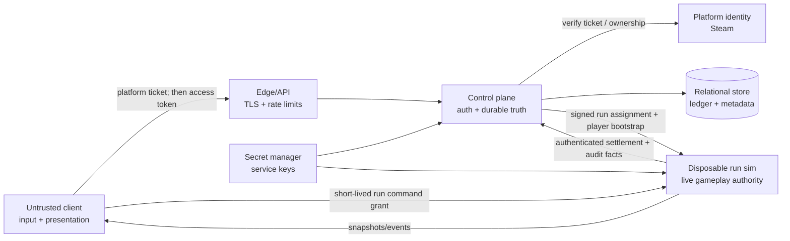
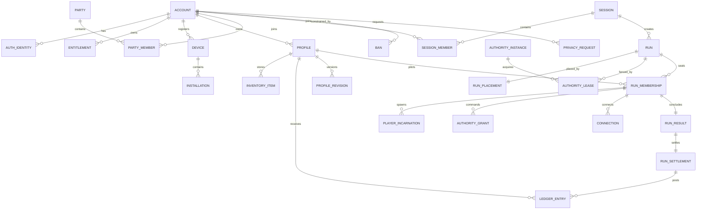
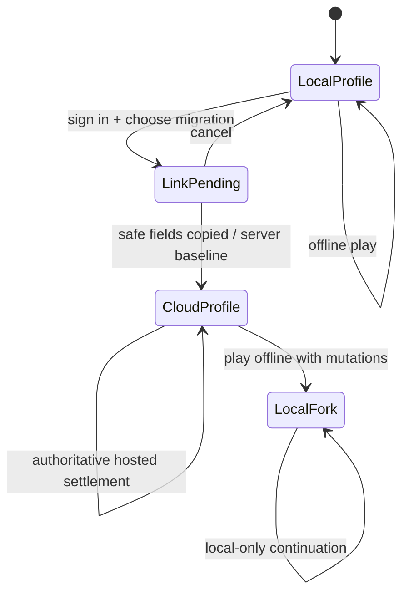
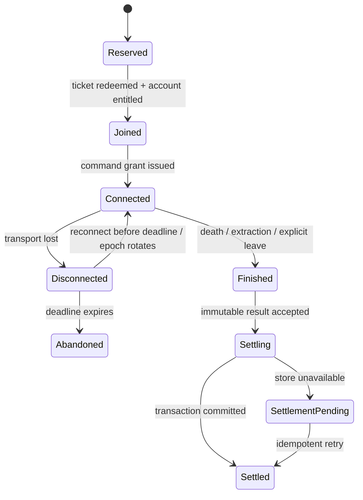

# Multiplayer Identity, Authentication, And Data Model

> Research memo for v0.4. Evidence checked 2026-07-10 and reconciled with the
> terminal low-count decision on 2026-07-14. This is an architecture
> recommendation, not an implementation claim or legal opinion. The concise
> ratification surface is
> [`../HOSTED-IDENTITY-PLACEMENT-DECISION.md`](../HOSTED-IDENTITY-PLACEMENT-DECISION.md).

## Recommendation

Keep LBH local-first, but make hosted progression server-authoritative. For the
admitted one-to-four-player product path:

1. Put hosted identity behind a narrow platform-ticket adapter. If Greg chooses
   an every-seat-entitled Steam MVP, Steam session tickets are the first
   adapter: exchange the ticket at the LBH control plane, verify it with Steam,
   map the returned SteamID to an internal account, and issue LBH-scoped
   sessions. Do not collect passwords. A storefront or friend-pass choice must
   not be silently decided by implementation convenience.
2. Keep offline profiles fully playable and clearly labeled `LOCAL`. A local profile can be linked to an account, but local currency, vault contents, upgrades, and run history are not silently merged into the authoritative online ledger. Linking creates or selects a `CLOUD` profile and may copy non-economic settings and the display name.
3. Extend the existing split: the control plane owns accounts, entitlements, profiles, progression, parties, session placement, bans, audit, and settlement; one disposable sim owns each live run; clients own presentation and input intent.
4. Replace caller-chosen `clientId` authority with server-created session/run
   memberships and a signed, short-lived admission/resume ticket. Preserve the
   implemented protocol-v2 `runId`, `playerId`, `membershipId`,
   `connectionId`/`connectionEpoch`, two monotonic sequences, event
   watermarks, snapshot rebase, and capability/manifest bindings.
5. Use a small relational database for hosted truth. Store inventory and currency as explicit records/ledger entries, not a mutable profile JSON blob. Use JSON only for versioned, bounded payloads such as loadout snapshots and run telemetry.

This is the smallest secure design for a $4.99 game. It avoids a custom password system, preserves offline play, and does not pretend a compromised local client can prove earned progression.

## Current LBH Truth And Gaps

The v0.3 architecture already has the correct coarse boundary:

- `scripts/sim-runtime.cjs` owns run truth and emits one result package per human outcome.
- `scripts/control-plane-store.cjs` owns profiles, sessions, run records, and Chronicle echoes outside the sim.
- `lbh-local-v2` scopes commands to `runId` + `playerId`, issues a command credential, uses independent command/input sequences, rotates authority on reconnect, and supports event/snapshot recovery.
- Profiles currently begin in browser `localStorage`; the control plane stores the durable copy after bootstrap.
- `applyOutcome()` writes profile and then run data to a JSON file. A repeat call can credit EM and update counters twice even though the run row is overwritten by `runId`.

Those are good local/private foundations, not internet-safe APIs. The current
runtime also has an in-memory 30-second single-use admission/resume ticket
registry bound to run, membership, player, profile, negotiated capabilities,
manifest, and (for resume) connection identity. It is a match-local protocol
primitive, not a hosted identity, placement, or durable lease service.

Current hosted blockers include:

- `/profile?profileId=...`, `/profile/save`, `/profile/outcome`, session mutation, and echo mutation have no end-user or service authentication.
- `profileId`, `clientId`, profile snapshots, run results, and whole profile objects are caller supplied. An opaque UUID reduces guessing; it does not confer authorization. OWASP identifies object-ID manipulation as the defining API object-authorization failure and requires an authorization check for every operation that uses a client-supplied object id ([OWASP API1:2023](https://owasp.org/API-Security/editions/2023/en/0xa1-broken-object-level-authorization/)).
- Command credentials are held in process memory and rotate with the
  implemented connection epoch, but remain bearer secrets without expiry,
  durable revocation, account/device session binding, or a control-plane
  authority lease.
- Writes are whole-file and non-transactional. Profile mutation, run recording, and echo persistence cannot commit atomically across crashes or concurrent sims.
- Reconnect now preserves server-owned player/profile/loadout state and ignores
  caller mutation attempts. Initial join still accepts caller-selected
  `clientId`, `profileId`, and a bootstrap snapshot at unauthenticated local
  endpoints; hosted join must resolve all durable bootstrap from the
  authenticated reservation.
- Session host/lobby leader remains represented as `hostClientId`. It needs a
  versioned session-membership role, not special account privilege.
- `/sim/register` and `/sim/heartbeat` track a caller-chosen `simInstanceId`
  in memory, with no service authentication, lease deadline, fencing token,
  drain state, placement record, or run assignment. They are health discovery,
  not production placement.
- The local service token on `/profile/outcome` authenticates a shared caller
  when configured, and `(runId, profileId)` plus a result hash makes retry
  idempotent. It does not prove workload identity, active authority lease,
  membership ownership, or atomically normalize result/settlement/ledger rows
  in a relational transaction.
- The final v0.4 low-count decision admits S20 only for one through four
  players. Eight is closed; S24 produced no eligible live cohort and is not a
  capacity claim. Hosted schema and placement must enforce `max_players <= 4`.
- Echoes include a pilot display name. They need visibility, moderation, anonymization, and deletion behavior before becoming shared hosted content.

## Trust Boundaries



Trust rules:

- The client may choose intent, display name candidates, local settings, invite codes, and which owned profile to use. It never chooses authorization, entitlement, balances, inventory, outcome, host power, or membership ownership.
- The platform proves a platform subject and ownership to the backend; it does not become LBH's database key.
- The control plane is authoritative for durable state and which sim owns a run.
- The sim is authoritative for live state and produces the only acceptable settlement facts. The control plane verifies the sim identity, run assignment, result schema, and idempotency key before committing.
- An id is a locator. A token or verified server-side relationship grants authority.
- No long-lived secret appears in snapshots, events, replay files, URLs, telemetry, crash reports, invite codes, or database plaintext.

## Identifier Taxonomy

Use UUIDv7 for new server/database identifiers: it is time-sortable for indexes
and standardized with a 48-bit Unix-millisecond time field plus random bits
([RFC 9562](https://www.rfc-editor.org/info/rfc9562/)). Continue accepting
existing UUIDv4 local profile ids during migration. UUID opacity is only
defense in depth: never infer permission, shard, provider, or trust from an id.
Tokens are 256-bit random opaque values or signed claims; they are not ids.

Privacy classes below are `PUBLIC_RUN`, `OWNER`, `INTERNAL`, `SECURITY`, and
`SECRET`. `wire` means only the specifically authorized control/gameplay wire;
it does not mean public discovery.

| Identifier | Format and issuer | Lifetime, rotation, persistence | Scope and privacy | Logs / replay / wire |
|---|---|---|---|---|
| `install_id` | UUIDv4/v7 random; installation creates | One install; resets on reinstall; local + registered metadata | Diagnostics/import correlation; `INTERNAL`; never authority or ban identity | Pseudonymized in short logs; never replay/public wire; registration wire only |
| `device_id` | UUIDv7; control plane after registration | Until device removal/account deletion; revocable; cloud | Account device/session inventory; `OWNER`/`INTERNAL`; no fingerprinting | Owner/security logs and account API only; never replay/game wire |
| `device_key_id` | UUIDv7; control plane | Key lifetime; rotate/revoke; public key cloud, private key OS credential store | Optional refresh proof-of-possession; `SECURITY`; private key is `SECRET` | Key id in security log/auth wire; never replay/game wire |
| `local_profile_id` | Existing UUIDv4 or UUIDv7; local profile store | Local lineage lifetime; never rotates; local save/export | Offline pilot key; `OWNER`; cannot authorize cloud access | Local diagnostics/save only; import sends keyed provenance hash, not raw id |
| `provider_subject` | Provider-native canonical string; verified provider | Provider account lifetime; changes only by unlink/relink; encrypted cloud | External principal; `SECURITY`; unique `(provider, subject)` | Restricted audit/auth wire only; keyed alias in general logs; never replay/game wire |
| `account_id` | UUIDv7; control plane | Cloud account lifetime; tombstoned/deleted by policy | Internal principal joining identities, entitlements, pilots; `INTERNAL` | Restricted audit/export; pseudonym in general logs; never replay/game wire |
| `entitlement_id` | UUIDv7; control plane | Grant observation lifetime; refreshed/revoked; cloud | Product/friend-pass grant; `INTERNAL`; not an auth session | Restricted audit/account response; never replay/game wire |
| `profile_id` | UUIDv7; control plane | Cloud pilot lifetime; no rotation; cloud + read cache | Durable progression owner; `OWNER`/`INTERNAL`; possession grants nothing | Owner APIs and restricted audit; never public roster/replay; bootstrap service wire only |
| `client_process_id` | UUIDv4 random; client process | One OS process launch; rotates on restart; memory/short diagnostics | Correlates transport attempts, not a person/device; `INTERNAL` | Short pseudonymous logs and admission request; never replay/snapshot |
| `client_incarnation_id` | UUIDv4 random; client | One gameplay client state machine incarnation; rotates on hard reset/reinstall of active state; memory | Fences stale client callbacks/cursors inside a process; `INTERNAL`; no gameplay authority | Short diagnostics/admission ticket claim if needed; never replay/public wire |
| `party_id` | UUIDv7; control plane | Party lifetime; cloud until expiry | Social group only; `OWNER`; no gameplay authority | Member APIs/logs; never gameplay replay; placement control wire only |
| `session_id` | UUIDv7; control plane | Lobby/rematch-container lifetime; cloud | Invite/join/region container; `OWNER` | Member APIs/control logs; optional replay metadata only if non-linkable |
| `session_membership_id` | UUIDv7; control plane | One account/profile membership in lobby; ends on leave/expiry; cloud | Leader/member role; `OWNER`/`INTERNAL`; leader has no sim power | Member control wire and audit; replay uses run alias instead |
| `run_id` | UUIDv7; control plane (existing runtime uses UUIDv4) | Exactly one sim/run lifecycle; immutable; cloud + sim | Coarse authority/settlement unit; `OWNER`/`INTERNAL` | Operational logs, authorized replay, admission/game wire |
| `run_membership_id` (`membershipId` today) | UUIDv7; control plane (runtime currently creates UUIDv4-prefixed) | One profile seat in one run; stable through reconnect; cloud + sim | Reconnect/private-state subject; `INTERNAL` | Pseudonymous ops logs and admission/game control wire; exclude public replay |
| `player_id` | Random run-scoped UUID/alias; control plane | One run; stable through reconnect; sim + run record | Public run identity; `PUBLIC_RUN`; not globally linkable | Roster, game wire, authorized replay; acceptable in run logs |
| `body_incarnation_id` | UUID/monotonic generation; authority/Ballpark | One spawned body generation; sim and bounded event history | Fences stale entity refs; `PUBLIC_RUN` only when body observable | Game wire/replay/run logs; never account mapping |
| `connection_id` | UUIDv7/random; authority/gateway | One socket; rotates every reconnect; short cloud/sim record | Transport attempt; `INTERNAL` | Short ops logs and resume/admission wire; never replay/public state |
| `connection_epoch` | Positive integer; authority lease/membership service | Monotonic per run membership; increments on reconnect; cloud + sim | Fences an older connection; `INTERNAL` | Control/game wire and ops logs; replay only if diagnostic/private |
| `authority_instance_id` | UUIDv7; placement service | One workload process/actor incarnation; durable placement record | Workload identity, not match identity; `INTERNAL` | Fleet/audit/service wire; never client replay or public roster |
| `authority_lease_id` | UUIDv7 plus monotonic `lease_epoch`; placement service | One writer lease; renews heartbeat deadline, epoch rotates on replacement; cloud + authority | Single-writer fence for one `run_id`; `SECURITY` | Restricted fleet/settlement logs and service wire; never client wire/replay |
| `admission_ticket_id` / `resume_ticket_id` | UUIDv7 `jti` inside signed token or opaque digest record; control plane | Single use, 30–60 s; rotate/reissue; digest/replay record until TTL | Binds account/profile/session/run/authority lease/connection incarnation/capabilities; id `SECURITY`, token `SECRET` | `jti` in restricted audit, token never logged/replayed/URL; token only admission wire |
| `authority_grant_id` / command secret | UUIDv7 record plus 256-bit opaque secret or signed proof; authority/control plane | Connection/reconnect-window lifetime; rotate each connection/role change; hash only | Input/action capability for one membership/epoch; id `SECURITY`, secret `SECRET` | Grant id in restricted logs/wire; secret never logs/replay/snapshot |
| `command_seq` / `input_seq` | Unsigned monotonic integer; client, accepted by authority | Per membership/grant stream; persisted through reconnect cursor as declared | Ordering/idempotency, not authentication; `PUBLIC_RUN`/`INTERNAL` | Game wire and diagnostic replay are allowed |
| `event_id` / `event_seq` / `snapshot_id` | UUIDv7 or run-local monotonic integer; authority | Run lifetime plus bounded replay/result retention | Causal recovery/idempotency keys; visibility follows event lane | Authorized game wire/replay/logs; private lane never enters public replay |
| `result_id` | UUIDv7; authority derives or control plane assigns | Immutable, one per `(run, membership, result_version)`; cloud | Final sim fact envelope; `OWNER`/`INTERNAL` | Service wire/audit/owner history; public replay receives projection only |
| `settlement_id` | UUIDv7; durable control plane | Immutable transaction boundary; cloud | Exactly-once durable mutation; `INTERNAL` | Service/audit/owner receipt; never gameplay wire/replay |
| `idempotency_key` | Client random UUID for safe public API; server-derived key for settlement | Operation retention window; cloud/cache | Retry dedupe only; never permission. Settlement key is server-derived from run/membership/version | Request/audit logs with retention; never public replay |

Public player presentation should contain only `player_id`, sanitized display name, hull/affiliation, and game-visible state. Never expose `account_id`, provider subject, device/install ids, email, IP, access/refresh tokens, command secrets, or internal moderation fields.

## Authentication, Entitlement, And Account Flows

Steam documents that a client can obtain a session ticket, a secure backend can validate it through `AuthenticateUserTicket`, and a successful response yields the 64-bit SteamID; the backend can separately check app ownership ([Steamworks authentication and ownership](https://partner.steamgames.com/doc/features/auth?l=english&language=english)). Treat identity verification and entitlement as two records even when one exchange supplies evidence for both.

### Hosted Steam account

1. Client gets a fresh Steam Web API auth ticket and sends it once to `POST /v1/auth/steam/exchange` over TLS.
2. Control plane validates ticket audience/AppID and nonce/replay state with Steam, receives SteamID, and checks ownership.
3. In one transaction, upsert `(provider=steam, provider_subject)`, internal account, entitlement observation, device/install registration, and an auth session.
4. Return a 10–15 minute audience-restricted access token plus a rotating refresh token. Store refresh token in Keychain/credential storage, not `localStorage` or a save file. Persist only its hash/family/reuse state server-side.
5. On refresh reuse, revoke the token family and require sign-in. OAuth security BCP requires public-client refresh tokens to be sender-constrained or rotated and recommends short, least-privilege, audience-restricted access tokens ([RFC 9700](https://www.rfc-editor.org/info/rfc9700/)). LBH need not expose generic OAuth to implement those session properties.

### Local-only / offline

- Create a random `local_profile_id` in the existing three-slot save system. No account, email, device fingerprint, or internet requirement.
- Local control plane/sim remain authoritative within that machine, but the save is explicitly untrusted by hosted services.
- Offline runs, vault, progression, and Chronicle stay available. Local multiplayer may use the host's local control plane with ephemeral guests, provided the UI labels host authority and save ownership.
- Steam Cloud may back up the local save as a convenience, but it is not transactional hosted truth: Steam says Auto-Cloud replicates configured files after the game exits ([Steam Cloud](https://partner.steamgames.com/doc/features/cloud?l=czech&language=english)). Concurrent/conflicting cloud files therefore need save-level conflict UX, not currency-ledger merge.

### Guest

- **Offline/local guest:** ephemeral `guest_id`, no entitlement, no durable cloud progression. The local host may persist a named couch/LAN profile locally.
- **Hosted guest for MVP:** do not allow one. Requiring an entitled Steam identity gives bans, reconnect ownership, and support a stable principal without building guest-upgrade/account-link abuse paths.
- A later friend-pass can be a distinct, expiring entitlement grant attached to a real platform identity, not an anonymous device id.

### Hybrid link / migration

1. User signs into Steam, then explicitly chooses `Create cloud pilot`, `Use existing cloud pilot`, or `Keep this slot local`.
2. Linking records `profile_import {account_id, local_profile_id_hash, source_install_id, imported_at, source_schema_version}`.
3. Safe automatic copy: sanitized name, accessibility/input/settings, cosmetic selections already entitled, and optionally aggregate history marked `legacy_local`.
4. Do not automatically copy EM, vault items, upgrades, competitive stats, bans, or run settlements. A client-controlled local save cannot prove them.
5. If Greg decides preserving all progress is worth accepting cheating in private/co-op play, make it a one-time, clearly tagged `legacy_import` grant with capped values and keep it out of leaderboards/trading. That is a product risk decision, not a cryptographic solution.
6. Cloud-to-local cache is allowed for offline presentation. Any offline mutation forks a local lineage; it does not merge back into authoritative currency/inventory.

### Other stores later

Add another `auth_identity` and `entitlement` provider adapter. Do not add LBH passwords. For a DRM-free storefront, choose either local-only play or a managed passwordless provider; prove demand before accepting email-delivery, account-recovery, bot, and support burden.

## Ownership And Source Of Truth

| Concern | Offline/local | Hosted source of truth | Conflict rule |
|---|---|---|---|
| Authentication | None | Auth/session service + verified provider identity | Provider proof maps to internal account; client id never wins. |
| Entitlement | Installed owned build/platform offline behavior | Entitlement service, provider evidence cached with observed/expiry timestamps | Hosted join fails closed when no valid grant; brief provider outage may use a bounded cached grant. |
| Profile name/settings | Local profile | Profile service | Name is validated/moderated; settings may LWW by server receipt time. |
| Currency/progression | Local save | Append-only progression ledger + materialized profile balance | Server ledger only; no bidirectional merge. |
| Vault/loadout | Local save | Inventory service/control-plane transaction | Sim checks out a loadout snapshot; only settlement returns durable changes. |
| Live movement/collision/loot/signal/death/extraction | Local sim | Assigned run sim | Sim only. No database writes on tick path. |
| Parties/invites/matchmaking | Optional local discovery | Party/session service | Membership and leader changes use version/lease checks. |
| Host privileges | Local host process | Versioned run membership role | Host can choose lobby/run controls, never mutate outcomes or other profiles. Auto-promotion is a compare-and-swap lease. |
| Run results | Local run record | Immutable sim result + atomic settlement | Unique result per run membership; repeated delivery returns prior result. |
| Chronicle | Local store | Profile run history; shared echoes are moderated projections | Owner history private. Shared echo strips account/platform identifiers and is anonymized on deletion. |
| Bans | Optional local blocklist | Moderation service | Account/provider grant scoped; device/IP are evidence, not sole identity. |
| Audit/abuse | Local logs | Security/audit service | Append-only, access-controlled, minimized, retained by policy. |

## Relational Data Model



### Core tables and constraints

Use the following logical schema. Exact SQL types may change, but constraints may not be relaxed.

```text
account(account_id PK, state, created_at, deleted_at, data_region, row_version)
auth_identity(identity_id PK, account_id FK, provider, provider_subject,
              verified_at, last_seen_at, UNIQUE(provider, provider_subject))
entitlement(entitlement_id PK, account_id FK, provider, app_id, grant_type,
            status, observed_at, valid_until, evidence_version,
            UNIQUE(account_id, provider, app_id, grant_type))
device(device_id PK, account_id FK, display_name, first_seen_at, last_seen_at, revoked_at)
installation(install_id PK, device_id FK NULL, platform, app_version, created_at, last_seen_at)
auth_session(auth_session_id PK, account_id FK, device_id FK NULL,
             refresh_family_id, refresh_token_hash, expires_at, rotated_at, revoked_at,
             UNIQUE(refresh_token_hash))

profile(profile_id PK, account_id FK, display_name, state, source,
        created_at, updated_at, row_version,
        UNIQUE(account_id, profile_id))
profile_progress(profile_id PK/FK, em_balance, hull_type, rig_levels_json,
                 lifetime_stats_json, revision, CHECK(em_balance >= 0))
inventory_item(item_instance_id PK, profile_id FK, catalog_item_id, state,
               slot_type, slot_index, acquired_settlement_id FK NULL, row_version,
               UNIQUE(profile_id, slot_type, slot_index) WHERE slot_index IS NOT NULL)
ledger_entry(ledger_entry_id PK, profile_id FK, currency, delta, balance_after,
             reason, settlement_id FK NULL, created_at,
             UNIQUE(profile_id, settlement_id, reason, currency))
profile_revision(profile_id FK, revision, changed_at, change_kind, payload_json,
                 PRIMARY KEY(profile_id, revision))
profile_import(import_id PK, account_id FK, local_profile_id_hash,
               source_install_id, source_schema_version, policy, imported_at,
               UNIQUE(account_id, local_profile_id_hash))

party(party_id PK, state, leader_account_id FK, version, expires_at)
party_member(party_id FK, account_id FK, role, joined_at,
             PRIMARY KEY(party_id, account_id))
session(session_id PK, party_id FK NULL, state, visibility, region,
        max_players CHECK(max_players BETWEEN 1 AND 4), version, created_at, expires_at)
session_member(session_membership_id PK, session_id FK, account_id FK,
               profile_id FK, role CHECK(role IN ('leader','member')), state,
               joined_at, left_at, row_version,
               UNIQUE(session_id, account_id), UNIQUE(session_id, profile_id))
run(run_id PK, session_id FK, state, map_id, seed_commitment,
    protocol_version, result_schema_version, created_at, live_at, ended_at)
run_membership(membership_id PK, run_id FK, account_id FK, profile_id FK,
               session_membership_id FK, player_id, seat_no, state,
               connection_epoch, joined_at,
               disconnected_at, reconnect_until,
               UNIQUE(run_id, account_id), UNIQUE(run_id, player_id), UNIQUE(run_id, seat_no))
player_incarnation(incarnation_id PK, membership_id FK, ordinal, body_public_id,
                   spawned_tick, retired_tick, reason,
                   UNIQUE(membership_id, ordinal))
connection(connection_id PK, membership_id FK, connection_epoch, transport,
           client_process_id, client_incarnation_id,
           opened_at, closed_at, close_reason)
authority_grant(authority_grant_id PK, membership_id FK, connection_epoch,
                secret_hash, scopes, issued_at, expires_at, revoked_at,
                last_command_seq, last_input_seq,
                UNIQUE(membership_id, connection_epoch))
admission_ticket(ticket_id PK, kind, session_id FK, run_id FK,
                 membership_id FK, account_id FK, profile_id FK,
                 authority_lease_id FK, connection_epoch,
                 client_incarnation_id, capability_hash, secret_hash,
                 issued_at, expires_at, consumed_at,
                 CHECK(kind IN ('admission','resume')))

authority_instance(authority_instance_id PK, region, host_id, workload_identity,
                   artifact_digest, state, started_at, heartbeat_at, drained_at)
run_placement(placement_id PK, run_id FK UNIQUE, requested_region,
              selected_region, authority_instance_id FK, placement_attempt,
              state, created_at, assigned_at,
              UNIQUE(run_id, placement_attempt))
authority_lease(authority_lease_id PK, run_id FK, authority_instance_id FK,
                lease_epoch, state, acquired_at, heartbeat_deadline, fenced_at,
                UNIQUE(run_id, lease_epoch))

run_result(result_id PK, run_id FK, membership_id FK, outcome, result_version,
           authority_lease_id FK, final_tick, result_hash, payload_json, received_at,
           UNIQUE(run_id, membership_id, result_version))
run_settlement(settlement_id PK, result_id FK UNIQUE, profile_id FK,
               status, profile_revision_before, profile_revision_after,
               settled_at, failure_code)
result_outbox(outbox_id PK, authority_instance_id FK, authority_lease_id FK,
              result_id, result_hash, encrypted_payload, state, attempt_count,
              next_attempt_at, created_at, acknowledged_at,
              UNIQUE(authority_lease_id, result_id))
service_identity(service_identity_id PK, workload_identity UNIQUE, state,
                 allowed_audience, created_at, revoked_at)
chronicle_echo(echo_id PK, source_result_id FK, owner_profile_id FK NULL,
               map_id, seed, public_pilot_name, payload_json, visibility,
               created_at, expires_at, anonymized_at)

ban(ban_id PK, account_id FK, provider, scope, reason_code, evidence_ref,
    starts_at, ends_at, revoked_at, appeal_state)
audit_event(audit_id PK, occurred_at, actor_type, actor_id, action,
            target_type, target_id, outcome, request_id, metadata_json)
privacy_request(request_id PK, account_id FK, kind, state, requested_at,
                verified_at, completed_at, failure_code)
```

Recommended operational indexes:

- `auth_identity(provider, provider_subject)` and `auth_session(refresh_token_hash)` for sign-in.
- `profile(account_id, state)`; every profile query still checks the authenticated account relationship.
- `run(state, created_at)`, `run_placement(selected_region, state, created_at)`,
  `authority_lease(run_id, state, heartbeat_deadline)`,
  `authority_instance(region, state, heartbeat_at)`, `session(state,
  expires_at)`, and `run_membership(account_id, state, reconnect_until)` for
  placement/reconnect.
- `run_result(run_id, membership_id)` and `run_settlement(status, settled_at)` for settlement/retry queues.
- `ledger_entry(profile_id, created_at DESC)` and `profile_revision(profile_id, revision DESC)` for Chronicle/export/conflict checks.
- `ban(account_id, scope, ends_at)` plus provider subject lookup through `auth_identity` for join checks.
- `audit_event(actor_id, occurred_at DESC)`, `audit_event(target_id, occurred_at DESC)`, and time partitioning. Keep sensitive metadata out of general analytics.
- `chronicle_echo(map_id, seed, visibility, created_at DESC)` with the existing
  maximum-eight echo policy enforced in the write transaction. This echo cap
  is unrelated to the product's four-player match cap.

## Atomic Settlement And Idempotency

The sim must never call a generic profile-save endpoint. It sends a versioned immutable result to an internal endpoint authenticated as the sim assigned to that run.

Settlement transaction:

1. Authenticate the authority workload, then verify `authority_instance_id`,
   `authority_lease_id`, monotonically current `lease_epoch`, run assignment,
   run state, result schema, membership, final outcome, payload limits, and
   result hash. A shared fleet token or merely knowing `run_id` is insufficient.
2. `INSERT run_result ... ON CONFLICT (run_id, membership_id,
   result_version)`; if the existing hash matches, return the prior settlement.
   If it differs, quarantine and audit `conflicting_result` without applying
   either version automatically.
3. Lock the profile/progression row or use `revision = expected_revision` compare-and-swap.
4. Insert `run_settlement` and all currency ledger/inventory grants with unique settlement references.
5. Materialize balance, vault, stats, run history, and eligible Chronicle echo from those immutable facts.
6. Increment profile revision and commit everything together.
7. Acknowledge only after commit. Retries are safe because the result and settlement keys are unique.

If the database is unavailable, the authority retains the final result in a
bounded encrypted durable outbox and the control plane keeps the run
`SETTLING`; the player sees `result pending`, not a fabricated balance. A
replacement authority may deliver an outbox item only with control-plane
recovery authorization that binds the original lease/result hash. Never credit
on the client and reconcile later.

## Lifecycle And State Machines





Reconnect policy for MVP: reserve the authoritative live body for 90 seconds,
release thrust and one-shot actions, and let inertia, current, hazards, and
consequences continue. Rotate `connection_id`, command secret, and
`connection_epoch` on successful reconnect. The stable run membership/player
id preserves private event lanes and sequences. A new device may reconnect
only after normal account authentication and explicit multi-device concurrency
policy; possession of `player_id` is insufficient.

Lobby-leader migration is control-plane role migration, not sim migration.
Update `(session_member.role, session.version)` with compare-and-swap. No
gameplay command epoch or privilege changes because the leader never controls
the sim. If the authoritative sim dies, MVP fences its lease and ends the run
as `interrupted`; already-final immutable results may settle once, incomplete
outcomes are void. Restoring live play from a signed checkpoint is later work
and must allocate a new authority instance/lease epoch while fencing the old
writer before routing any client.

## API Surface

Public account/control-plane API:

```text
POST   /v1/auth/steam/exchange             Steam ticket -> LBH session
POST   /v1/auth/refresh                    rotate refresh session
POST   /v1/auth/logout                     revoke this session/device
GET    /v1/me                              bounded account/session view
GET    /v1/me/devices                      list/revoke auth sessions
POST   /v1/me/export                       asynchronous export request
DELETE /v1/me                              verified deletion request

GET    /v1/profiles                        own cloud profiles
POST   /v1/profiles                        create pilot
PATCH  /v1/profiles/{profile_id}           allowlisted name/settings + If-Match revision
POST   /v1/profiles/{profile_id}/link-local create tagged import/fork
GET    /v1/profiles/{profile_id}/chronicle own run history

POST   /v1/parties                         create party
POST   /v1/parties/{party_id}/invites      leader creates opaque short invite
POST   /v1/invites/redeem                  authenticated redemption; secret in body
POST   /v1/sessions                        entitled party -> session
GET    /v1/sessions/{session_id}           authorized member view
POST   /v1/sessions/{session_id}/join      reserve session membership
POST   /v1/sessions/{session_id}/runs      leader asks control plane to place run
GET    /v1/runs/{run_id}/placement         member polls/watches placement
POST   /v1/runs/{run_id}/admission         issue one-use admission ticket
POST   /v1/runs/{run_id}/reconnect         rotate run grant for own membership
POST   /v1/runs/{run_id}/leave             own membership intent
```

Internal service API:

```text
POST /internal/v1/authorities/register       workload identity + artifact/region
POST /internal/v1/runs/{run_id}/claim        CAS assignment -> writer lease epoch
POST /internal/v1/runs/{run_id}/heartbeat    authenticated lease + health
POST /internal/v1/runs/{run_id}/drain        stop new placement; preserve live run
POST /internal/v1/runs/{run_id}/bootstrap   bounded player/loadout snapshots
POST /internal/v1/runs/{run_id}/results     immutable idempotent result
POST /internal/v1/runs/{run_id}/ended       lifecycle close
```

The streaming gameplay endpoint accepts only the run command grant and derives `membership_id`, `player_id`, scopes, and active run from it. Profile APIs derive `account_id` from the access token and enforce object ownership at every endpoint. Avoid generic `profile/save`, arbitrary field binding, admin endpoints on the public router, and secrets in query parameters.

## Threat Model And Controls

| Threat | Consequence | Minimum control |
|---|---|---|
| Change `profile_id`/`run_id` in request | Read or mutate another pilot | Account-derived row authorization on every object operation; negative authorization tests; opaque ids only as defense in depth. |
| Mass-assign profile/result JSON | Free EM/items/upgrades, fake outcome | Allowlist cosmetic/settings patches; durable mutations only through domain commands and sim settlement. |
| Steal/replay Steam ticket | Account takeover | TLS; exchange immediately; validate audience/AppID and provider response; reject replay; never log ticket. |
| Steal access/refresh token | Account/session takeover | Short access TTL, audience/scope restrictions, rotated or device-bound refresh token, OS secret storage, family revocation on reuse. |
| Steal command credential | Pilot hijack | Run-only scope, short TTL, secret hash at rest, authority epoch, sequence checks, rotate on reconnect/role change, rate limit. |
| Guess/share invite | Unauthorized join/harassment | At least 128 random bits, hash at rest, body redemption, short TTL/use count, bind to party/account when possible. |
| Replay/conflict result | Duplicate rewards or divergent history | Sim service authentication, run lease, immutable result hash, unique `(run,membership)`, atomic idempotent settlement. |
| Compromised player host | Cheats, kicks, outcome fraud | Host role controls lobby choices only. Hosted sim retains all gameplay and settlement authority. |
| Host-role race | Two hosts/reset conflict | Versioned session/membership compare-and-swap and host-scoped authority epoch. |
| Local save edit/import | Polluted online economy | Separate local/cloud lineages; no trusted economic merge; tag any approved legacy grant. |
| Reconnect with stale body | Duplicate pilot or old commands | Stable membership + new connection/grant epoch; explicit incarnation; revoke old connection/grant. |
| Public event/snapshot leaks private state | Inventory/position/privacy leak | Existing player-local lanes plus server-derived visibility; schema-based outbound projection; never serialize internal objects. |
| DDoS/resource abuse | Downtime/cost spike | Edge limits before sim allocation, per-account/session quotas, bounded payloads, invite redemption throttles, idle expiry, overload policy. |
| Account-link substitution | Attacker binds victim provider | Require fresh provider proof in same session, show target identity, prevent linking provider subject already owned, audit and recovery flow. |
| Ban evasion / false positives | Abuse or unjust exclusion | Account/provider-centered bans, evidence and appeals; device/IP are weighted signals only. Steam notes game bans require the game server to exclude banned users and can be surfaced through Steam authentication ([Steam anti-cheat and game bans](https://partner.steamgames.com/doc/features/anticheat%20?l=english)). |
| Logs/backups retain secrets or PII | Breach/privacy exposure | Structured allowlisted logging, secret redaction at ingress, restricted audit store, encryption, retention/deletion jobs, restore-time deletion ledger. |

OWASP also calls unrestricted resource consumption an API risk; for LBH, fake session allocation and unbounded history/export endpoints are direct cost attacks ([OWASP API Security Top 10 2023](https://owasp.org/API-Security/editions/2023/en/0x11-t10/)). Rate limits must apply before creating a sim, and all lists/payloads need hard bounds.

## Privacy, Export, Retention, And Deletion

Data minimization is an architecture requirement, not a later policy page. GDPR Article 5 requires personal data to be adequate, relevant, and limited to what is necessary, and Article 17 establishes erasure rights and downstream notification duties in applicable cases ([official EUR-Lex text](https://eur-lex.europa.eu/eli/reg/2016/679/art_17/oj/eng)). Exact legal bases and regional obligations need counsel before launch.

Collect for MVP:

- internal account/profile ids, SteamID/provider evidence, entitlement observations;
- display name, progression, vault/loadout, private run history;
- device/auth-session inventory sufficient for revocation;
- bounded security/audit events and moderation evidence;
- coarse region and short-lived network security data if operationally necessary.

Do not collect email, legal name, address, contacts/friend graph, voice recordings, precise location, hardware fingerprint, or raw input/replay history unless a shipped feature has a documented need and retention policy.

Initial retention proposal:

| Data | Retention |
|---|---|
| Active account/profile/progression | Account lifetime; exportable; erase/anonymize on completed request subject to documented exceptions. |
| Auth ticket/access token | Never persist ticket/access token; transient processing only. |
| Refresh session record | Until expiry/revocation plus 30 days of minimal reuse/security evidence. |
| Live connection/session routing | Live run plus 7 days; aggregate non-identifying operations metrics may remain. |
| Private run results/Chronicle | Account lifetime or user deletion; offer per-profile deletion if product permits. |
| Shared echo | 30 days or bounded per-seed eviction, whichever comes first; anonymize immediately when source account/profile is deleted or name moderated. |
| General application logs | 14 days. No secrets; pseudonymized ids where possible. |
| Security/audit events | 90 days by default; up to 180 days only for an active abuse/fraud case. |
| Raw IP | Avoid; if required for incident response, 7 days, then delete or convert to a keyed/coarsened abuse signal. |
| Ban evidence | Ban/appeal duration plus 90 days; retain only minimal non-reversible exclusion token longer when legally justified and disclosed. |
| Backups | Encrypted, access-controlled, 35-day rolling expiry; deletion tombstones replayed on restore. |

Export should be a versioned machine-readable archive containing account/provider metadata, profiles, progression ledger, inventory, run history, device/session list, bans/appeals, and shared-content references. Exclude other players' private data, service secrets, anti-abuse rules, and internal security evidence that cannot lawfully be disclosed.

Deletion flow:

1. Require recent authentication, revoke all auth/run grants, disable hosted joins, and enqueue a verified request.
2. Delete or irreversibly detach provider identity, devices, sessions, profiles, inventory, private Chronicle, and analytics identifiers within the published completion window.
3. Anonymize shared echoes and run presentation (`Lost Pilot`), while retaining non-personal aggregate gameplay facts if allowed.
4. Keep only documented minimal ban/fraud/legal records with access restrictions and expiry. A plain SteamID tombstone kept forever “just in case” is not minimization.
5. Record a non-personal deletion tombstone so backup restores and downstream stores reapply deletion; age backups out on schedule.

## Migration From v0.3

### Phase 0 — close internet-unsafe surfaces

- Keep current unauthenticated control-plane endpoints loopback/private only.
- Add explicit API versioning and schema validation.
- Remove reconnect mutation from client-supplied profile/loadout snapshots.
- Add a result id/hash and make local `applyOutcome` idempotent before changing storage.

### Phase 1 — relational local control plane

- Replace the JSON store with SQLite behind the existing control-plane client boundary.
- Add normalized profile revision, inventory, ledger, run result, settlement, membership, and authority-grant records.
- Import existing `lbh_profile_*` and control-plane JSON with an import report and preserved source ids.
- Prove crash/retry behavior, concurrent outcome delivery, export/delete, and backup/restore deletion tests.

### Phase 2 — hosted identity/control plane

- Add Steam ticket exchange, provider identity, entitlement, account, device session, and rotating refresh flow.
- Add ownership checks to every profile/session API and service authentication to sim APIs.
- Add local/cloud profile UX and the conservative migration policy.
- Keep local/offline stack fully functional when hosted services are unavailable.

### Phase 3 — one-to-four-player session identity and placement

- Introduce party, session membership, run membership, per-run public
  `player_id`, body/client incarnation, connection epoch, authority
  instance/lease epoch, and short reconnect reservation.
- Move host promotion to versioned membership roles.
- Bind event privacy, snapshot relevance, and command sequences to membership/grant, not request-body ids.
- Run adversarial tests for stolen/stale grants, cross-profile access, reconnect races, duplicate settlement, and host migration.

### Phase 4 — operations and later providers

- Add moderation/ban/appeal, deletion/export, retention jobs, support tools with least privilege, and privacy/incident runbooks.
- Add another storefront provider only through the identity/entitlement adapter and only when there is a concrete distribution need.

## MVP Acceptance Gates

- One through four separately entitled players can join one run; each has a
  stable membership/player id and rotating connection/grant identity. A fifth
  seat and every eight-seat configuration fail closed. S24 is not an admitted
  or measured hosted capacity.
- Changing any id in a profile, session, reconnect, or result request never changes authorization.
- A dropped client can reconnect within the configured window without spawning a duplicate body or accepting stale commands.
- Lobby-leader departure promotes exactly one eligible session membership
  without granting gameplay, connection, profile, or settlement authority.
- Two authority instances racing to claim one run yield one active
  `authority_lease_id`; a stale lease cannot admit, heartbeat as current,
  route, or commit a result.
- Delivering the same result 100 times produces one run result, one settlement, one set of inventory grants, and one currency/stat delta.
- Killing the control plane between result receipt and commit either commits once or retries to the same result; the client never becomes durable truth.
- Offline launch, local profiles, local sim, and local Chronicle work without network/account services.
- Linking a modified local save cannot create hosted EM/items/upgrades unless an explicit capped legacy-import policy was enabled and tagged.
- Account export is complete and another player's private fields are absent. Deletion revokes access, removes/anonymizes all mapped records, and survives backup restore.
- Logs, snapshots, events, replays, URLs, and crash reports contain no Steam tickets, refresh/access tokens, command secrets, invite secrets, raw profile snapshots, or platform subjects outside the restricted audit boundary.

## Decisions For Greg

1. **Recommended if every hosted seat is entitled:** Steam-authenticated hosted
   play for MVP; no anonymous hosted guests and no LBH passwords. Greg still
   decides whether storefront/friend-pass requirements instead require a
   different provider adapter or grant type.
2. **Recommended:** keep local and cloud progression as separate lineages. Copy settings/name on link, not economic state.
3. **Recommended:** 90–120 second reconnect reservation; disconnected bodies remain sim-owned and cannot be locally frozen or restored.
4. **Recommended:** host controls lobby/reset/kick proposals only; the dedicated authority controls all gameplay outcomes and settlement.
5. Decide whether Chronicle echoes are private-by-default or shared with the lobby/seed. Shared echoes create moderation and deletion work; private history does not.
6. Decide whether a one-time capped legacy import is worth accepting economy/leaderboard contamination. The secure default is no.

## Primary Sources

- Valve, [Steamworks: User Authentication and Ownership](https://partner.steamgames.com/doc/features/auth?l=english&language=english), accessed 2026-07-10.
- Valve, [Steamworks: Steam Cloud](https://partner.steamgames.com/doc/features/cloud?l=czech&language=english), accessed 2026-07-10.
- Valve, [Steamworks: Anti-cheat and Game Bans](https://partner.steamgames.com/doc/features/anticheat%20?l=english), accessed 2026-07-10.
- IETF, [RFC 9700: Best Current Practice for OAuth 2.0 Security](https://www.rfc-editor.org/info/rfc9700/), January 2025.
- IETF, [RFC 9562: Universally Unique IDentifiers](https://www.rfc-editor.org/info/rfc9562/), May 2024.
- OWASP, [API1:2023 Broken Object Level Authorization](https://owasp.org/API-Security/editions/2023/en/0xa1-broken-object-level-authorization/), accessed 2026-07-10.
- OWASP, [API Security Top 10 2023](https://owasp.org/API-Security/editions/2023/en/0x11-t10/), accessed 2026-07-10.
- European Union, [Regulation (EU) 2016/679, Articles 5 and 17](https://eur-lex.europa.eu/eli/reg/2016/679/art_17/oj/eng), official consolidated text accessed 2026-07-10.
